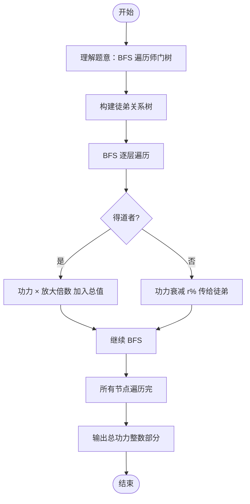

# L2-020 - 功夫传人（25 分）

- **时间限制**: 400 ms
- **内存限制**: 65536 KB
- **代码长度限制**: 16 KB

---

## 题目描述

一门武功能否传承久远并被发扬光大，是要看缘分的。一般来说，师傅传授给徒弟的武功总要打个折扣，于是越往后传，弟子们的功夫就越弱…… 直到某一支的某一代突然出现一个天分特别高的弟子（或者是吃到了灵丹、挖到了特别的秘笈），会将功夫的威力一下子放大N倍 —— 我们称这种弟子为“得道者”。

这里我们来考察某一位祖师爷门下的徒子徒孙家谱：假设家谱中的每个人只有1位师傅（除了祖师爷没有师傅）；每位师傅可以带很多徒弟；并且假设辈分严格有序，即祖师爷这门武功的每个第`i`代传人只能在第`i-1`代传人中拜1个师傅。我们假设已知祖师爷的功力值为`Z`，每向下传承一代，就会减弱`r%`，除非某一代弟子得道。现给出师门谱系关系，要求你算出所有得道者的功力总值。

### 输入格式:

输入在第一行给出3个正整数，分别是：$$N$$（$$\le 10^5$$）——整个师门的总人数（于是每个人从0到$$N-1$$编号，祖师爷的编号为0）；$$Z$$——祖师爷的功力值（不一定是整数，但起码是正数）；$$r$$ ——每传一代功夫所打的折扣百分比值（不超过100的正数）。接下来有$$N$$行，第$$i$$行（$$i=0, \cdots , N-1$$）描述编号为$$i$$的人所传的徒弟，格式为：

$$K_i$$ ID[1] ID[2] $$\cdots$$ ID[$$K_i$$]

其中$$K_i$$是徒弟的个数，后面跟的是各位徒弟的编号，数字间以空格间隔。$$K_i$$为零表示这是一位得道者，这时后面跟的一个数字表示其武功被放大的倍数。

### 输出格式:

在一行中输出所有得道者的功力总值，只保留其整数部分。题目保证输入和正确的输出都不超过$$10^{10}$$。

### 输入样例:
```in
10 18.0 1.00
3 2 3 5
1 9
1 4
1 7
0 7
2 6 1
1 8
0 9
0 4
0 3
```

### 输出样例:
```out
404
```

## 示例

### 示例 1

**输入:**
```
10 18.0 1.00
3 2 3 5
1 9
1 4
1 7
0 7
2 6 1
1 8
0 9
0 4
0 3
```

**输出:**
```
404
```

---

## 题目详解

### 一、解题思路

本题计算所有得道者的功力总值。使用 BFS 遍历师门谱系树，每传一代功力减弱 r%，得道者的功力被放大 N 倍。

1. **构建树**：用 `children` 向量存储每个师傅的徒弟列表，`is_enlightened` 标记得道者，`multiplier` 存储得道者的放大倍数。
2. **BFS 遍历**：从祖师爷（编号 0，功力 Z）开始 BFS：
   - 若当前节点是得道者：将 `power * multiplier[id]` 加入总值
   - 否则：功力衰减为 `power * (1 - r/100)`，将徒弟入队
3. **输出**：总值的整数部分。

### 二、代码流程说明

1. 读取人数 `N`、祖师爷功力 `Z`、衰减百分比 `r`
2. 对每个人：
   - 读取徒弟数 `K`
   - 若 `K == 0`：标记为得道者 `is_enlightened[i] = true`，读取放大倍数 `multiplier[i]`
   - 否则：存储徒弟列表 `children[i]`
3. BFS 初始化：入队 `(0, Z)`
4. BFS 循环：
   - 出队 `(id, power)`
   - 若 `is_enlightened[id]`：`total += power * multiplier[id]`，continue
   - 否则：`next_power = power * (1 - r/100)`，将所有徒弟入队
5. 输出 `(int)total`

### 三、代码流程图

```mermaid
flowchart TD
    A([开始]) --> B[/读取 N Z r/]
    B --> C[构建 children 树 和 is_enlightened 标记]
    C --> D[BFS 初始化 0 Z]
    D --> E{队列非空?}
    E -- 是 --> F[出队 id power]
    F --> G{is_enlightened[id]?}
    G -- 是 --> H[total += power * multiplier]
    G -- 否 --> I[next_power = power * 1-r/100]
    I --> J[所有徒弟入队]
    H --> E
    J --> E
    E -- 否 --> K[/输出 int total/]
    K --> L([结束])
```

### 四、解题流程图


