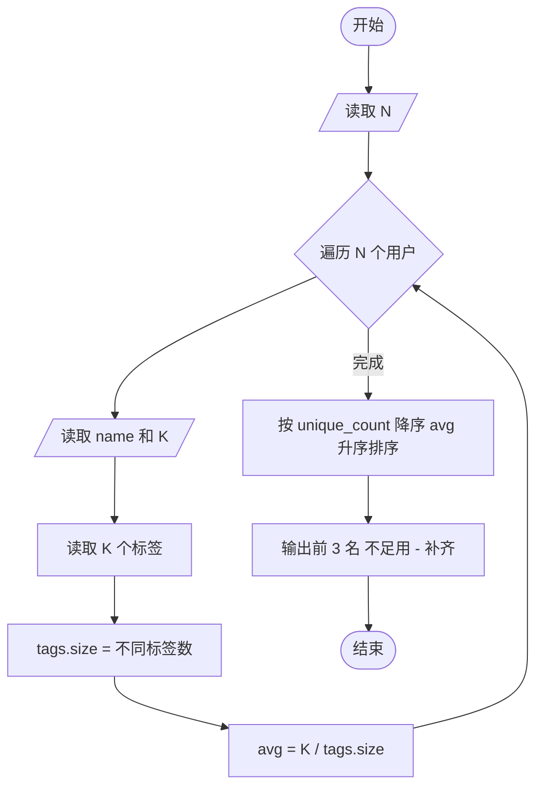
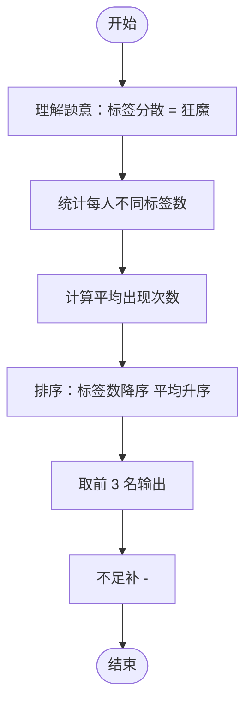

# L2-021 - 点赞狂魔（25 分）

- **时间限制**: 200 ms
- **内存限制**: 65536 KB
- **代码长度限制**: 16 KB

---

## 题目描述

微博上有个“点赞”功能，你可以为你喜欢的博文点个赞表示支持。每篇博文都有一些刻画其特性的标签，而你点赞的博文的类型，也间接刻画了你的特性。然而有这么一种人，他们会通过给自己看到的一切内容点赞来狂刷存在感，这种人就被称为“点赞狂魔”。他们点赞的标签非常分散，无法体现出明显的特性。本题就要求你写个程序，通过统计每个人点赞的不同标签的数量，找出前3名点赞狂魔。

### 输入格式:

输入在第一行给出一个正整数$$N$$（$$\le 100$$），是待统计的用户数。随后$$N$$行，每行列出一位用户的点赞标签。格式为“`Name` $$K$$ $$F_1 \cdots F_K$$”，其中`Name`是不超过8个英文小写字母的非空用户名，$$1\le K\le 1000$$，$$F_i$$（$$i=1, \cdots , K$$）是特性标签的编号，我们将所有特性标签从 1 到 $$10^7$$ 编号。数字间以空格分隔。

### 输出格式:

统计每个人点赞的不同标签的数量，找出数量最大的前3名，在一行中顺序输出他们的用户名,其间以1个空格分隔,且行末不得有多余空格。如果有并列，则输出标签出现次数平均值最小的那个，题目保证这样的用户没有并列。若不足3人，则用`-`补齐缺失，例如`mike jenny -`就表示只有2人。

### 输入样例:
```in
5
bob 11 101 102 103 104 105 106 107 108 108 107 107
peter 8 1 2 3 4 3 2 5 1
chris 12 1 2 3 4 5 6 7 8 9 1 2 3
john 10 8 7 6 5 4 3 2 1 7 5
jack 9 6 7 8 9 10 11 12 13 14
```

### 输出样例:
```out
jack chris john
```

## 示例

### 示例 1

**输入:**
```
5
bob 11 101 102 103 104 105 106 107 108 108 107 107
peter 8 1 2 3 4 3 2 5 1
chris 12 1 2 3 4 5 6 7 8 9 1 2 3
john 10 8 7 6 5 4 3 2 1 7 5
jack 9 6 7 8 9 10 11 12 13 14
```

**输出:**
```
jack chris john
```

---

## 题目详解

### 一、解题思路

本题找出点赞标签最分散的前 3 名用户（点赞狂魔）。

1. **统计不同标签数**：对每个用户，使用 `unordered_set` 存储所有点赞标签，自动去重，`tags.size()` 即为不同标签数量。
2. **计算平均出现次数**：`avg_count = K / tags.size()`（总标签数 / 不同标签数），反映标签的分散程度。
3. **排序规则**：
   - 第一优先级：不同标签数 `unique_count` 降序
   - 第二优先级：平均出现次数 `avg_count` 升序（标签越分散，平均值越小）
4. **输出**：取前 3 名，不足 3 人用 `-` 补齐。

### 二、代码流程说明

1. 读取用户数 `N`
2. 对每个用户：
   - 读取用户名 `name` 和标签数 `K`
   - 读取 `K` 个标签，存入 `unordered_set tags`
   - 记录 `unique_count = tags.size()`，`avg_count = (double)K / unique_count`
3. 按 `compare` 函数排序
4. 输出前 3 名用户名，不足用 `-` 补齐

### 三、代码流程图



### 四、解题流程图


