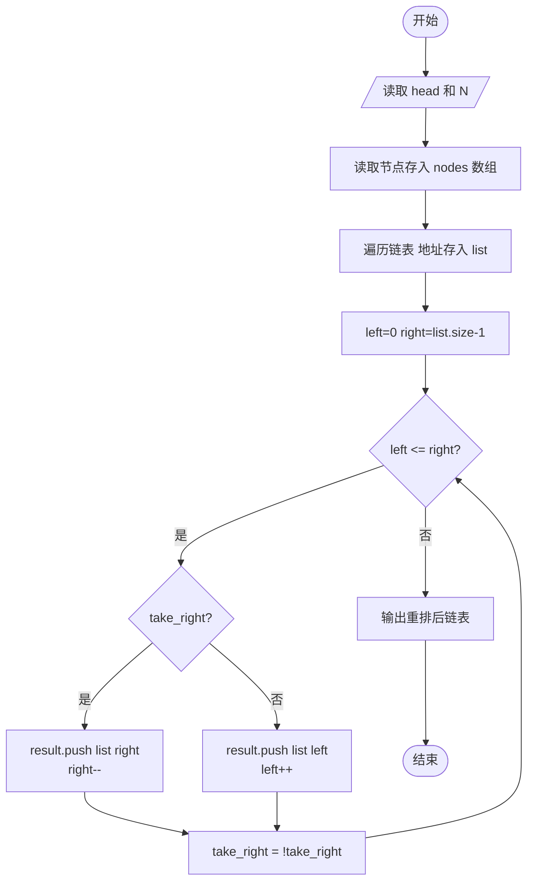
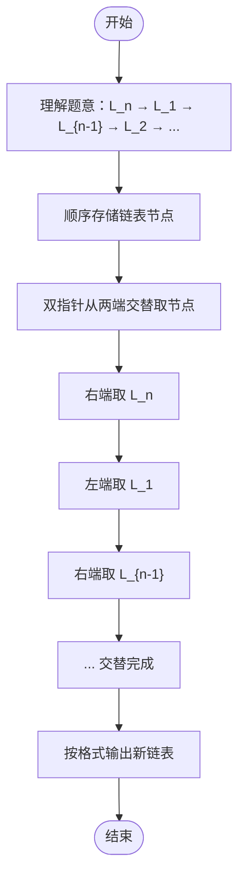

# L2-022 - 重排链表（25 分）

- **时间限制**: 500 ms
- **内存限制**: 65536 KB
- **代码长度限制**: 16 KB

---

## 题目描述

给定一个单链表 $$L_1$$→$$L_2$$→$$\cdots$$→$$L_{n-1}$$→$$L_n$$，请编写程序将链表重新排列为 $$L_n$$→$$L_1$$→$$L_{n-1}$$→$$L_2$$→$$\cdots$$。例如：给定$$L$$为1→2→3→4→5→6，则输出应该为6→1→5→2→4→3。

### 输入格式:

每个输入包含1个测试用例。每个测试用例第1行给出第1个结点的地址和结点总个数，即正整数$$N$$ ($$\le 10^5$$)。结点的地址是5位非负整数，NULL地址用$$-1$$表示。

接下来有$$N$$行，每行格式为：

```
Address Data Next
```

其中`Address`是结点地址；`Data`是该结点保存的数据，为不超过$$10^5$$的正整数；`Next`是下一结点的地址。题目保证给出的链表上至少有两个结点。

### 输出格式:

对每个测试用例，顺序输出重排后的结果链表，其上每个结点占一行，格式与输入相同。

### 输入样例:
```in
00100 6
00000 4 99999
00100 1 12309
68237 6 -1
33218 3 00000
99999 5 68237
12309 2 33218
```

### 输出样例:
```out
68237 6 00100
00100 1 99999
99999 5 12309
12309 2 00000
00000 4 33218
33218 3 -1
```

## 示例

### 示例 1

**输入:**
```
00100 6
00000 4 99999
00100 1 12309
68237 6 -1
33218 3 00000
99999 5 68237
12309 2 33218
```

**输出:**
```
68237 6 00100
00100 1 99999
99999 5 12309
12309 2 00000
00000 4 33218
33218 3 -1
```

---

## 题目详解

### 一、解题思路

本题将链表按 L_n → L_1 → L_{n-1} → L_2 → ... 的顺序重排。

1. **数组存储节点**：用数组 `nodes` 按地址存储每个节点的数据和 next 指针。
2. **顺序遍历链表**：从头结点 `head` 开始，按顺序将所有节点地址存入 `list` 向量。
3. **两端交替取节点**：使用双指针 `left` 和 `right`，交替从右端和左端取节点地址：
   - 先取 `list[right]`（最后一个节点），`right--`
   - 再取 `list[left]`（第一个节点），`left++`
   - 交替进行直到 `left > right`
4. **输出重排后的链表**：遍历结果数组，依次输出每个节点的地址、数据和 next 指针。

### 二、代码流程说明

1. 读取头结点 `head` 和节点数 `N`
2. 读取 `N` 个节点信息，按地址存入 `nodes` 数组
3. 遍历链表：从 `head` 开始，依次将地址加入 `list`
4. 初始化 `left = 0`，`right = list.size() - 1`，`take_right = true`
5. 当 `left <= right` 时：
   - 若 `take_right`：将 `list[right]` 加入结果，`right--`
   - 否则：将 `list[left]` 加入结果，`left++`
   - 切换 `take_right`
6. 遍历结果数组，按格式输出每个节点（最后一个节点 next 为 -1）

### 三、代码流程图



### 四、解题流程图


