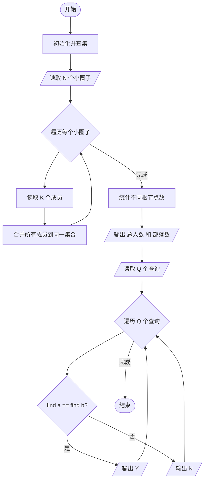
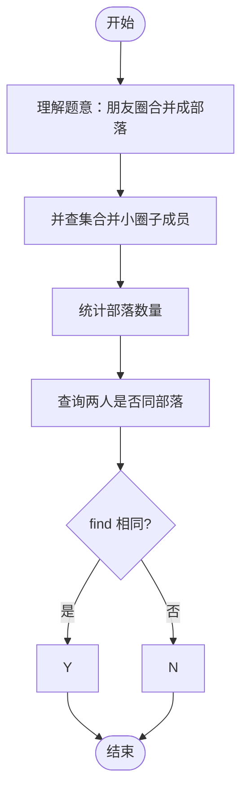

# L2-024 - 部落（25 分）

- **时间限制**: 150 ms
- **内存限制**: 65536 KB
- **代码长度限制**: 16 KB

---

## 题目描述

在一个社区里，每个人都有自己的小圈子，还可能同时属于很多不同的朋友圈。我们认为朋友的朋友都算在一个部落里，于是要请你统计一下，在一个给定社区中，到底有多少个互不相交的部落？并且检查任意两个人是否属于同一个部落。

### 输入格式:

输入在第一行给出一个正整数$$N$$（$$\le 10^4$$），是已知小圈子的个数。随后$$N$$行，每行按下列格式给出一个小圈子里的人：

$$K$$ $$P[1]$$ $$P[2]$$ $$\cdots$$ $$P[K]$$

其中$$K$$是小圈子里的人数，$$P[i]$$（$$i=1, \cdots , K$$）是小圈子里每个人的编号。这里所有人的编号从1开始连续编号，最大编号不会超过$$10^4$$。

之后一行给出一个非负整数$$Q$$（$$\le 10^4$$），是查询次数。随后$$Q$$行，每行给出一对被查询的人的编号。

### 输出格式:

首先在一行中输出这个社区的总人数、以及互不相交的部落的个数。随后对每一次查询，如果他们属于同一个部落，则在一行中输出`Y`，否则输出`N`。

### 输入样例:
```in
4
3 10 1 2
2 3 4
4 1 5 7 8
3 9 6 4
2
10 5
3 7
```

### 输出样例:
```out
10 2
Y
N
```

## 示例

### 示例 1

**输入:**
```
4
3 10 1 2
2 3 4
4 1 5 7 8
3 9 6 4
2
10 5
3 7
```

**输出:**
```
10 2
Y
N
```

---

## 题目详解

### 一、解题思路

本题使用并查集管理朋友圈，统计部落数量并查询两人是否属于同一部落。

1. **并查集合并朋友圈**：将同一小圈子的人合并到同一集合。使用路径压缩优化的 `find` 和 `unite` 操作。
2. **统计部落数**：遍历所有出现过的人员，统计不同根节点的数量即为部落数。
3. **查询**：对每对人员，若 `find(a) == find(b)` 则属于同一部落。

### 二、代码流程说明

1. 初始化并查集：`parent[i] = i`
2. 读取小圈子数 `N`
3. 对每个小圈子：
   - 读取人数 `K` 和成员列表
   - 将第一个成员与其他成员依次合并 `unite`
   - 将所有成员加入 `people_set`
4. 统计不同根节点数即为部落数
5. 输出 `people_set.size()` 和部落数
6. 读取查询数 `Q`
7. 对每个查询：检查 `find(a) == find(b)`，输出 `Y` 或 `N`

### 三、代码流程图



### 四、解题流程图


