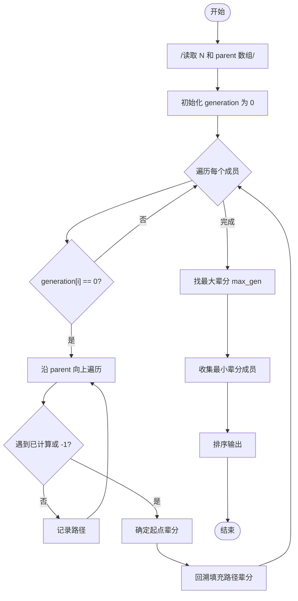
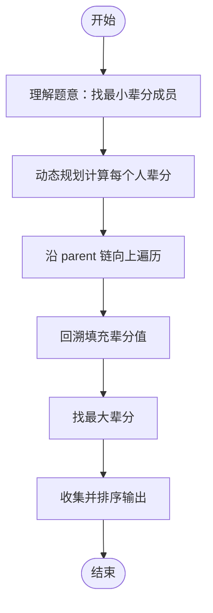

# L2-026 - 小字辈（25 分）

- **时间限制**: 400 ms
- **内存限制**: 65536 KB
- **代码长度限制**: 16 KB

---

## 题目描述

本题给定一个庞大家族的家谱，要请你给出最小一辈的名单。

### 输入格式:

输入在第一行给出家族人口总数 N（不超过 100 000 的正整数） —— 简单起见，我们把家族成员从 1 到 N 编号。随后第二行给出 N 个编号，其中第 i 个编号对应第 i 位成员的父/母。家谱中辈分最高的老祖宗对应的父/母编号为 -1。一行中的数字间以空格分隔。

### 输出格式:

首先输出最小的辈分（老祖宗的辈分为 1，以下逐级递增）。然后在第二行按递增顺序输出辈分最小的成员的编号。编号间以一个空格分隔，行首尾不得有多余空格。

### 输入样例:
```in
9
2 6 5 5 -1 5 6 4 7
```

### 输出样例:
```out
4
1 9
```

## 示例

### 示例 1

**输入:**
```
9
2 6 5 5 -1 5 6 4 7
```

**输出:**
```
4
1 9
```

---

## 题目详解

### 一、解题思路

本题找出家族中辈分最小的成员。老祖宗辈分为 1，逐级递增。

1. **动态规划计算辈分**：从每个成员开始，沿 parent 链向上遍历，直到遇到已计算过辈分的成员或老祖宗（parent = -1）。
2. **路径回溯**：遍历时记录路径，到达终点后回溯填充路径上所有成员的辈分。
3. **找最小辈分**：遍历所有人，找到最大辈分值，收集所有该辈分的成员编号。
4. **排序输出**：按编号递增排序输出。

### 二、代码流程说明

1. 读取家族人数 `N`
2. 读取每个成员的父/母编号存入 `parent` 数组
3. 初始化 `generation` 数组为 0
4. 对每个成员 `i`：
   - 若 `generation[i] == 0`：沿 parent 向上遍历，记录路径
   - 若遇到已计算过的节点或 -1，确定起点辈分
   - 回溯填充路径上所有成员的辈分
5. 遍历 `generation` 找到最大值 `max_gen`
6. 收集所有辈分等于 `max_gen` 的成员
7. 排序并输出

### 三、代码流程图



### 四、解题流程图


