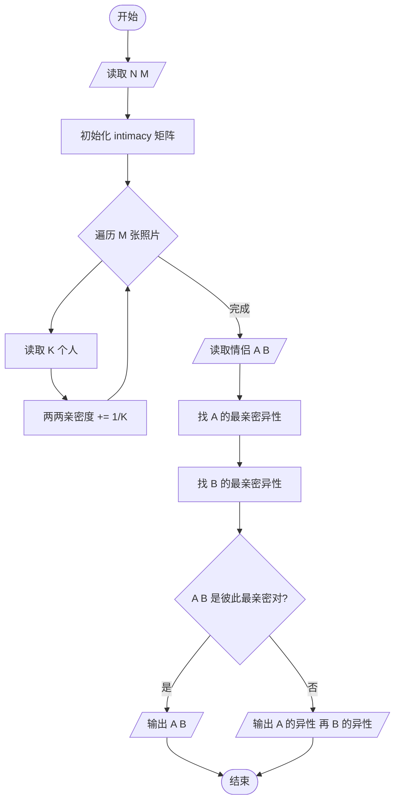
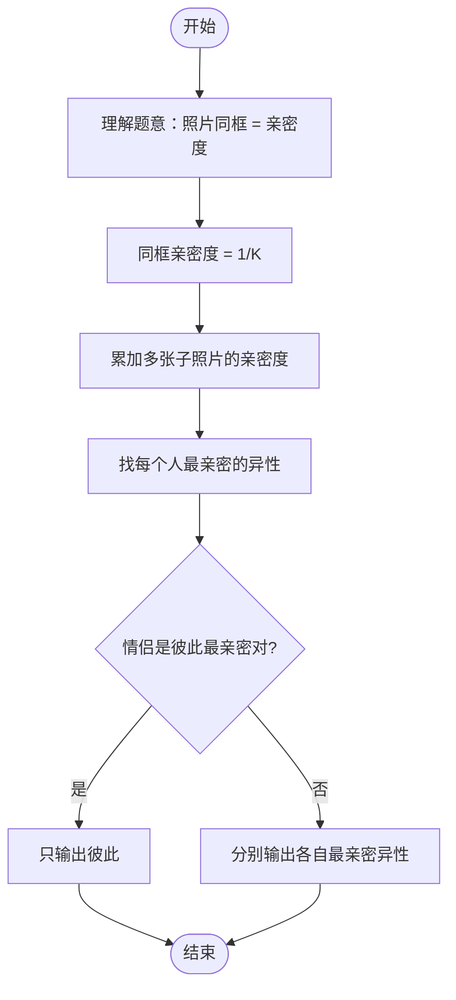

# L2-028 - 秀恩爱分得快（25 分）

- **时间限制**: 500 ms
- **内存限制**: 65536 KB
- **代码长度限制**: 16 KB

---

## 题目描述

古人云：秀恩爱，分得快。

互联网上每天都有大量人发布大量照片，我们通过分析这些照片，可以分析人与人之间的亲密度。如果一张照片上出现了 K 个人，这些人两两间的亲密度就被定义为 1/K。任意两个人如果同时出现在若干张照片里，他们之间的亲密度就是所有这些同框照片对应的亲密度之和。下面给定一批照片，请你分析一对给定的情侣，看看他们分别有没有亲密度更高的异性朋友？

### 输入格式:

输入在第一行给出 2 个正整数：N（不超过1000，为总人数——简单起见，我们把所有人从 0 到 N-1 编号。为了区分性别，我们用编号前的负号表示女性）和 M（不超过1000，为照片总数）。随后 M 行，每行给出一张照片的信息，格式如下：

```
K P[1] ... P[K]
```

其中 K（$$\le$$ 500）是该照片中出现的人数，P[1] ~ P[K] 就是这些人的编号。最后一行给出一对异性情侣的编号 A 和 B。同行数字以空格分隔。题目保证每个人只有一个性别，并且不会在同一张照片里出现多次。

### 输出格式:

首先输出 `A PA`，其中 `PA` 是与 `A` 最亲密的异性。如果 `PA` 不唯一，则按他们编号的绝对值递增输出；然后类似地输出 `B PB`。但如果 `A` 和 `B` 正是彼此亲密度最高的一对，则只输出他们的编号，无论是否还有其他人并列。

### 输入样例 1：
```in
10 4
4 -1 2 -3 4
4 2 -3 -5 -6
3 2 4 -5
3 -6 0 2
-3 2
```

### 输出样例 1：
```out
-3 2
2 -5
2 -6
```

### 输入样例 2：
```in
4 4
4 -1 2 -3 0
2 0 -3
2 2 -3
2 -1 2 
-3 2
```

### 输出样例 2：
```out
-3 2
```

## 示例

### 示例 1

**输入:**
```
10 4
4 -1 2 -3 4
4 2 -3 -5 -6
3 2 4 -5
3 -6 0 2
-3 2
```

**输出:**
```
-3 2
2 -5
2 -6
```

### 示例 2

**输入:**
```
4 4
4 -1 2 -3 0
2 0 -3
2 2 -3
2 -1 2 
-3 2
```

**输出:**
```
-3 2
```

---

## 题目详解

### 一、解题思路

本题分析照片中人物的亲密度，判断一对情侣是否有亲密度更高的异性朋友。

1. **亲密度计算**：同一张照片上 K 个人，两两间亲密度为 1/K。多张子照片的亲密度累加。
2. **存储亲密度**：用二维数组 `intimacy[N][N]` 存储所有人之间的亲密度。编号取绝对值（性别由正负号区分）。
3. **找最亲密异性**：对 A 和 B 分别遍历所有异性，找出亲密度最高的异性朋友（可能多个并列）。
4. **输出规则**：
   - 若 A 和 B 是彼此最亲密的异性对，只输出 `A B`
   - 否则分别输出 A 的最亲密异性和 B 的最亲密异性

### 二、代码流程说明

1. 读取人数 `N` 和照片数 `M`
2. 初始化 `intimacy` 二维数组为 0
3. 遍历 `M` 张照片：
   - 读取照片上的 `K` 个人
   - 两两之间亲密度增加 `1.0/K`
4. 读取情侣 `A` 和 `B`
5. 分别找 A 和 B 的最亲密异性（亲密度最高的异性，可能多个并列）
6. 按规则输出结果

### 三、代码流程图



### 四、解题流程图


