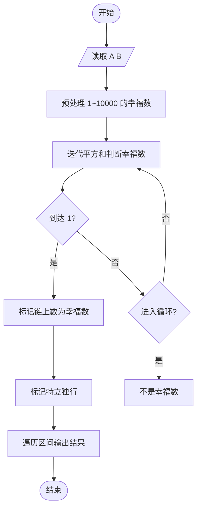
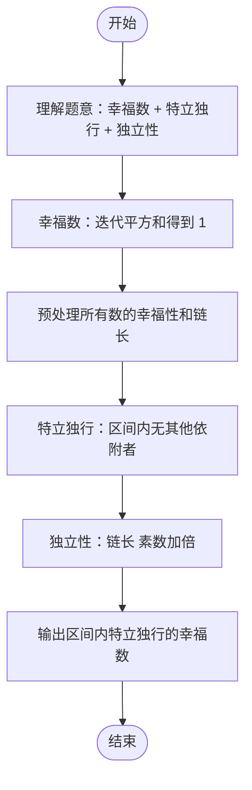

# L2-029 - 特立独行的幸福（25 分）

- **时间限制**: 400 ms
- **内存限制**: 65536 KB
- **代码长度限制**: 16 KB

---

## 题目描述

对一个十进制数的各位数字做一次平方和，称作一次迭代。如果一个十进制数能通过若干次迭代得到 1，就称该数为幸福数。1 是一个幸福数。此外，例如 19 经过 1 次迭代得到 82，2 次迭代后得到 68，3 次迭代后得到 100，最后得到 1。则 19 就是幸福数。显然，在一个幸福数迭代到 1 的过程中经过的数字都是幸福数，它们的幸福是依附于初始数字的。例如 82、68、100 的幸福是依附于 19 的。而一个**特立独行**的幸福数，是在一个有限的区间内不依附于任何其它数字的；其**独立性**就是依附于它的的幸福数的个数。如果这个数还是个素数，则其独立性加倍。例如 19 在区间[1, 100] 内就是一个特立独行的幸福数，其独立性为 $$2\times 4 = 8$$。

另一方面，如果一个大于1的数字经过数次迭代后进入了死循环，那这个数就不幸福。例如 29 迭代得到 85、89、145、42、20、4、16、37、58、89、…… 可见 89 到 58 形成了死循环，所以 29 就不幸福。

本题就要求你编写程序，列出给定区间内的所有特立独行的幸福数和它的独立性。

### 输入格式:

输入在第一行给出闭区间的两个端点：$$1<A<B\le 10^4$$。

### 输出格式:

按递增顺序列出给定闭区间 $$[A,B]$$ 内的所有特立独行的幸福数和它的独立性。每对数字占一行，数字间以 1 个空格分隔。

如果区间内没有幸福数，则在一行中输出 `SAD`。

### 输入样例 1：
```in
10 40
```

### 输出样例 1：
```out
19 8
23 6
28 3
31 4
32 3
```

### 输入样例 2：
```in
110 120
```

### 输出样例 2：
```out
SAD
```

## 示例

### 示例 1

**输入:**
```
10 40
```

**输出:**
```
19 8
23 6
28 3
31 4
32 3
```

### 示例 2

**输入:**
```
110 120
```

**输出:**
```
SAD
```

---

## 题目详解

### 一、解题思路

本题要求列出区间 [A, B] 内的特立独行的幸福数及其独立性。

1. **幸福数判定**：对一个数不断进行「各位数字平方和」迭代，若最终得到 1 则为幸福数；若进入死循环则不是。
2. **预处理**：对 1~10000 的每个数，计算其是否为幸福数以及链式长度。
3. **特立独行**：区间内的幸福数，如果它的幸福链上其他幸福数不在该区间内，则它是特立独行的。
4. **独立性**：幸福链上依附于该数的幸福数个数。若该数为素数，独立性加倍。

### 二、代码流程说明

1. 读取区间端点 `A` 和 `B`
2. 预处理：对每个数 `i` 从 1 到 10000：
   - 迭代计算平方和，记录访问过的数
   - 若到达 1，标记链上所有数为幸福数，记录链长
   - 若遇到已知结果，复用结果
3. 标记特立独行：遍历区间内的幸福数，将其链上其他区间内的数标记为非独立
4. 输出：遍历区间内的幸福数，若为特立独行则输出编号和独立性（素数加倍）

### 三、代码流程图



### 四、解题流程图


