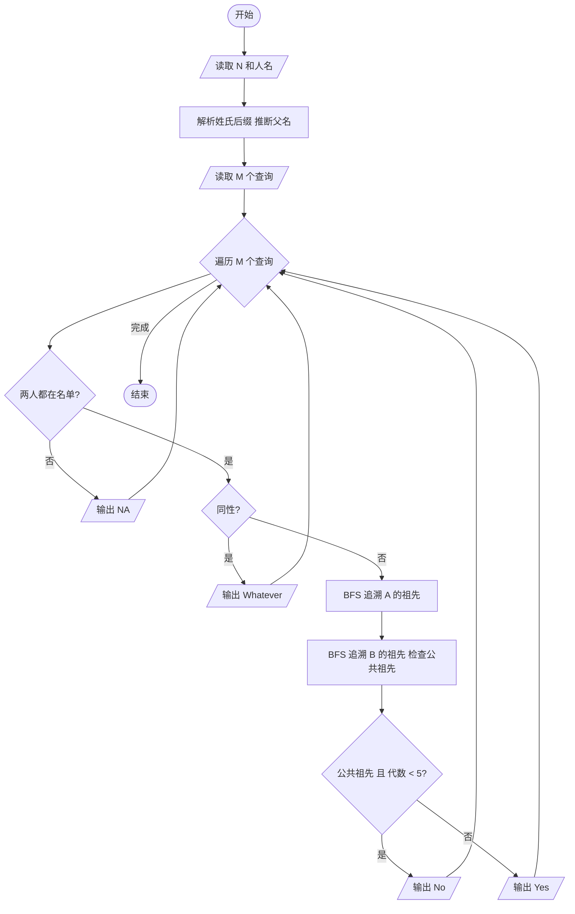
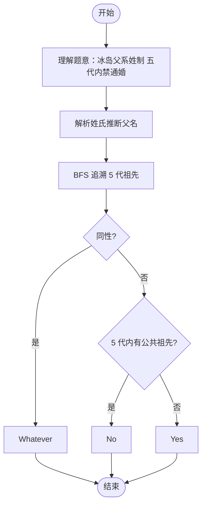

# L2-030 - 冰岛人（25 分）

- **时间限制**: 400 ms
- **内存限制**: 65536 KB
- **代码长度限制**: 16 KB

---

## 题目描述

2018年世界杯，冰岛队因1:1平了强大的阿根廷队而一战成名。好事者发现冰岛人的名字后面似乎都有个“松”（son），于是有网友科普如下：


冰岛人沿用的是维京人古老的父系姓制，孩子的姓等于父亲的名加后缀，如果是儿子就加 sson，女儿则加 sdottir。因为冰岛人口较少，为避免近亲繁衍，本地人交往前先用个 App 查一下两人祖宗若干代有无联系。本题就请你实现这个 App 的功能。

### 输入格式:

输入首先在第一行给出一个正整数 $$N$$（$$1 < N \le 10^5$$），为当地人口数。随后 $$N$$ 行，每行给出一个人名，格式为：`名 姓（带性别后缀）`，两个字符串均由不超过 20 个小写的英文字母组成。维京人后裔是可以通过姓的后缀判断其性别的，其他人则是在姓的后面加 `m` 表示男性、`f` 表示女性。题目保证给出的每个维京家族的起源人都是男性。

随后一行给出正整数 $$M$$，为查询数量。随后 $$M$$ 行，每行给出一对人名，格式为：`名1 姓1 名2 姓2`。注意：这里的`姓`是不带后缀的。四个字符串均由不超过 20 个小写的英文字母组成。

题目保证不存在两个人是同名的。

### 输出格式:

对每一个查询，根据结果在一行内显示以下信息：

- 若两人为异性，且五代以内无公共祖先，则输出 `Yes`；
- 若两人为异性，但五代以内（不包括第五代）有公共祖先，则输出 `No`；
- 若两人为同性，则输出 `Whatever`；
- 若有一人不在名单内，则输出 `NA`。

所谓“五代以内无公共祖先”是指两人的公共祖先（如果存在的话）必须比任何一方的曾祖父辈分高。

### 输入样例:
```in
15
chris smithm
adam smithm
bob adamsson
jack chrissson
bill chrissson
mike jacksson
steve billsson
tim mikesson
april mikesdottir
eric stevesson
tracy timsdottir
james ericsson
patrick jacksson
robin patricksson
will robinsson
6
tracy tim james eric
will robin tracy tim
april mike steve bill
bob adam eric steve
tracy tim tracy tim
x man april mikes
```

### 输出样例:
```out
Yes
No
No
Whatever
Whatever
NA
```

## 示例

### 示例 1

**输入:**
```
15
chris smithm
adam smithm
bob adamsson
jack chrissson
bill chrissson
mike jacksson
steve billsson
tim mikesson
april mikesdottir
eric stevesson
tracy timsdottir
james ericsson
patrick jacksson
robin patricksson
will robinsson
6
tracy tim james eric
will robin tracy tim
april mike steve bill
bob adam eric steve
tracy tim tracy tim
x man april mikes
```

**输出:**
```
Yes
No
No
Whatever
Whatever
NA
```

---

## 题目详解

### 一、解题思路

本题模拟冰岛人的父系姓制，判断两人是否可以交往。

1. **姓氏解析**：冰岛人的姓氏后缀 `sson` 表示男性、`sdottir` 表示女性，前缀为父亲的名字。其他人用 `m`/`f` 后缀。
2. **规则**：
   - 有一人不在名单：`NA`
   - 同性：`Whatever`
   - 异性且五代以内有公共祖先：`No`
   - 异性且五代以内无公共祖先：`Yes`
3. **BFS 查找祖先**：分别对两人进行 BFS，沿父系向上追溯 5 代（`gen < 5`），检查是否有公共祖先且总代数 < 5。

### 二、代码流程说明

1. 读取人数 `N`，解析每个人的姓名、性别和父亲名
2. 读取查询数 `M`
3. 对每个查询：
   - 检查两人是否都在名单中，否则输出 `NA`
   - 若同性，输出 `Whatever`
   - 对第一个人 BFS 追溯 5 代祖先，记录 `ancestor1` 映射
   - 对第二个人 BFS 追溯 5 代祖先，检查是否有公共祖先
   - 若 `ancestor1[name] + gen < 5`，标记 `found = true`
   - 输出 `No` 或 `Yes`

### 三、代码流程图



### 四、解题流程图


