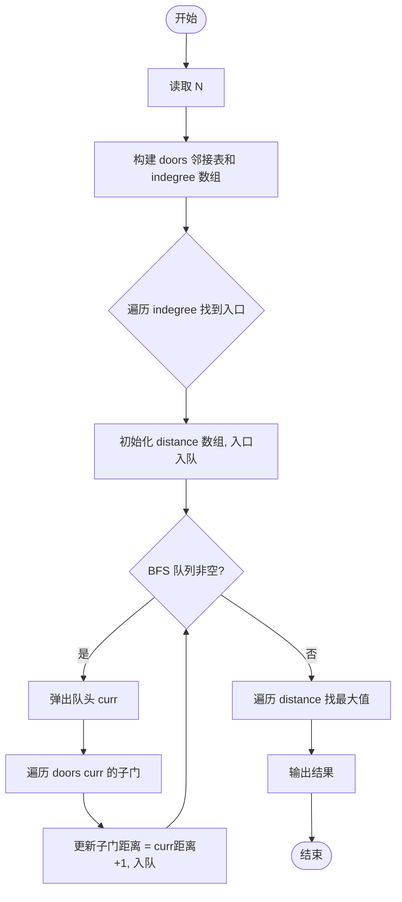
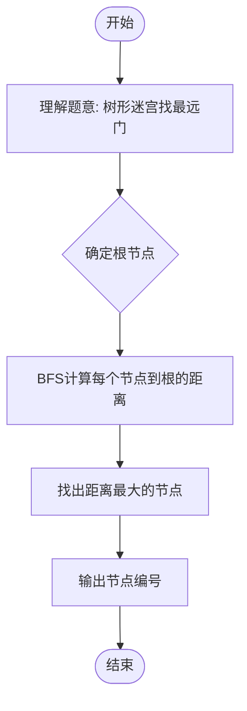

# L2-031 - 深入虎穴（25 分）

- **时间限制**: 400 ms
- **内存限制**: 65536 KB
- **代码长度限制**: 16 KB

---

## 题目描述

著名的王牌间谍 007 需要执行一次任务，获取敌方的机密情报。已知情报藏在一个地下迷宫里，迷宫只有一个入口，里面有很多条通路，每条路通向一扇门。每一扇门背后或者是一个房间，或者又有很多条路，同样是每条路通向一扇门…… 他的手里有一张表格，是其他间谍帮他收集到的情报，他们记下了每扇门的编号，以及这扇门背后的每一条通路所到达的门的编号。007 发现不存在两条路通向同一扇门。

内线告诉他，情报就藏在迷宫的最深处。但是这个迷宫太大了，他需要你的帮助 —— 请编程帮他找出距离入口最远的那扇门。

### 输入格式:

输入首先在一行中给出正整数 $$N$$（$$< 10^5$$），是门的数量。最后 $$N$$ 行，第 $$i$$ 行（$$1\le i \le N$$）按以下格式描述编号为 $$i$$ 的那扇门背后能通向的门：

```
K D[1] D[2] ... D[K]
```
其中 `K` 是通道的数量，其后是每扇门的编号。

### 输出格式:

在一行中输出距离入口最远的那扇门的编号。题目保证这样的结果是唯一的。

### 输入样例:
```in
13
3 2 3 4
2 5 6
1 7
1 8
1 9
0
2 11 10
1 13
0
0
1 12
0
0
```

### 输出样例:
```out
12
```

## 示例

### 示例 1

**输入:**
```
13
3 2 3 4
2 5 6
1 7
1 8
1 9
0
2 11 10
1 13
0
0
1 12
0
0
```

**输出:**
```
12
```

---

## 题目详解

### 一、解题思路

这道题的核心是在一个树形迷宫中找到距离入口最远的门。迷宫结构是一棵树（每个门只有一个前驱节点），入口是入度为 0 的节点。使用 BFS 从入口开始遍历整棵树，同时记录每个节点的距离（层数），最后找到距离最大的节点编号。

关键算法步骤：
1. 构建邻接表 `doors` 存储树的结构，`indegree` 数组记录每个节点的入度
2. 遍历 `indegree` 找到入度为 0 的节点作为入口 `entrance`
3. 从入口开始 BFS，每个节点的子节点距离 = 当前节点距离 + 1
4. 遍历所有节点找到距离最大的节点编号

### 二、代码流程说明

1. 读取门的数量 N
2. 读取每个门通向的子门列表，构建邻接表 `doors` 和入度数组 `indegree`
3. 遍历 `indegree` 找到入度为 0 的节点作为入口 `entrance`
4. 初始化距离数组 `distance`，将入口入队，距离设为 0
5. BFS 循环：弹出队头节点 `curr`，遍历其所有子门 `next_door`，更新距离并入队
6. 遍历所有节点找到 `distance` 最大的节点编号 `result`
7. 输出 `result`

### 三、代码流程图



### 四、解题流程图


