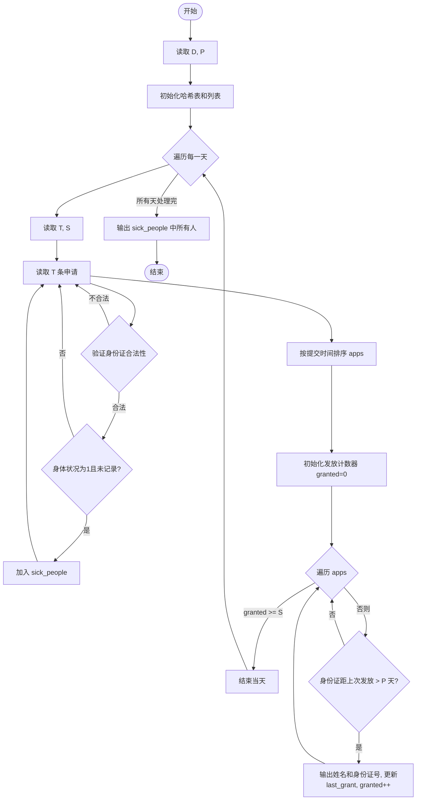
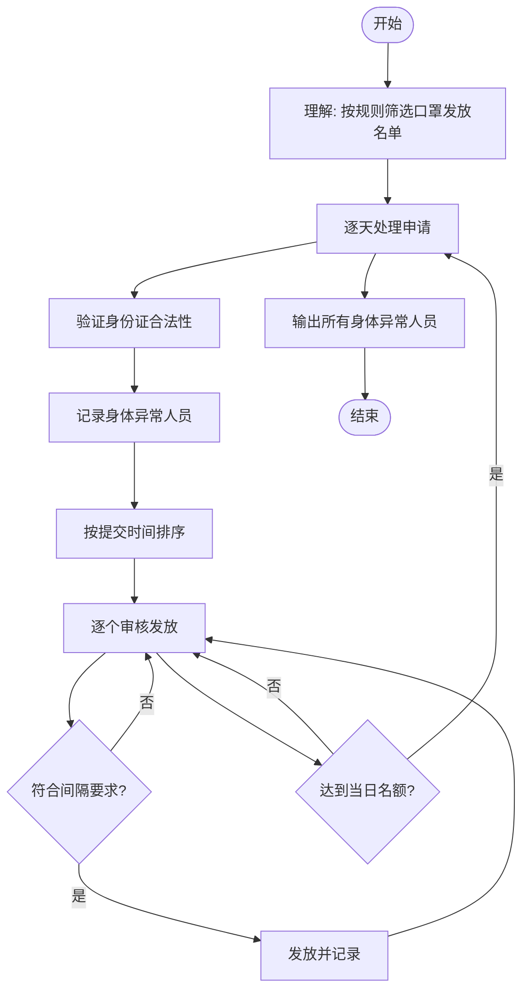

# L2-034 - 口罩发放（25 分）

- **时间限制**: 400 ms
- **内存限制**: 65536 KB
- **代码长度限制**: 16 KB

---

## 题目描述

为了抗击来势汹汹的  COVID19 新型冠状病毒，全国各地均启动了各项措施控制疫情发展，其中一个重要的环节是口罩的发放。

某市出于给市民发放口罩的需要，推出了一款小程序让市民填写信息，方便工作的开展。小程序收集了各种信息，包括市民的姓名、身份证、身体情况、提交时间等，但因为数据量太大，需要根据一定规则进行筛选和处理，请你编写程序，按照给定规则输出口罩的寄送名单。

### 输入格式:

输入第一行是两个正整数 $$D$$ 和 $$P$$（$$1 \le D, P \le 30$$），表示有 $$D$$ 天的数据，市民两次获得口罩的时间至少需要间隔 $$P$$ 天。

接下来 $$D$$ 块数据，每块给出一天的申请信息。第 $$i$$ 块数据（$$i=1, \cdots , D$$）的第一行是两个整数 $$T_i$$ 和 $$S_i$$（$$1 \le T_i \le 1000, 0 \le S_i \le 1000$$），表示在第 $$i$$ 天有 $$T_i$$ 条申请，总共有 $$S_i$$ 个口罩发放名额。随后 $$T_i$$ 行，每行给出一条申请信息，格式如下：
```
姓名 身份证号 身体情况 提交时间
```
给定数据约束如下：
* `姓名` 是一个长度不超过 10 的不包含空格的非空字符串；
* `身份证号` 是一个长度不超过 20 的非空字符串；
* `身体情况` 是 0 或者 1，0 表示自觉良好，1 表示有相关症状；
* `提交时间` 是 hh:mm，为24小时时间（由 ``00:00`` 到 ``23:59``。例如 09:08。）。注意，给定的记录的提交时间不一定有序；
* `身份证号` 各不相同，同一个身份证号被认为是同一个人，数据保证同一个身份证号姓名是相同的。

能发放口罩的记录要求如下：
* `身份证号` 必须是 18 位的**数字**（可以包含前导0）；
* 同一个身份证号若在第 $$i$$ 天申请成功，则接下来的 $$P$$ 天不能再次申请。也就是说，若第 $$i$$ 天申请成功，则等到第 $$i + P + 1$$ 天才能再次申请；
* 在上面两条都符合的情况下，按照提交时间的先后顺序发放，直至全部记录处理完毕或 $$S_i$$ 个名额用完。如果提交时间相同，则按照在列表中出现的先后顺序决定。

### 输出格式:

对于每一天的申请记录，每行输出一位得到口罩的人的姓名及身份证号，用一个空格隔开。顺序按照发放顺序确定。

在输出完发放记录后，你还需要输出有合法记录的、身体状况为 1 的申请人的姓名及身份证号，用空格隔开。顺序按照申请记录中出现的顺序确定，同一个人只需要输出一次。

### 输入样例:
```in
4 2
5 3
A 123456789012345670 1 13:58
B 123456789012345671 0 13:58
C 12345678901234567 0 13:22
D 123456789012345672 0 03:24
C 123456789012345673 0 13:59
4 3
A 123456789012345670 1 13:58
E 123456789012345674 0 13:59
C 123456789012345673 0 13:59
F F 0 14:00
1 3
E 123456789012345674 1 13:58
1 1
A 123456789012345670 0 14:11
```

### 输出样例:
```out
D 123456789012345672
A 123456789012345670
B 123456789012345671
E 123456789012345674
C 123456789012345673
A 123456789012345670
A 123456789012345670
E 123456789012345674
```

## 示例

### 示例 1

**输入:**
```
4 2
5 3
A 123456789012345670 1 13:58
B 123456789012345671 0 13:58
C 12345678901234567 0 13:22
D 123456789012345672 0 03:24
C 123456789012345673 0 13:59
4 3
A 123456789012345670 1 13:58
E 123456789012345674 0 13:59
C 123456789012345673 0 13:59
F F 0 14:00
1 3
E 123456789012345674 1 13:58
1 1
A 123456789012345670 0 14:11
```

**输出:**
```
D 123456789012345672
A 123456789012345670
B 123456789012345671
E 123456789012345674
C 123456789012345673
A 123456789012345670
A 123456789012345670
E 123456789012345674
```

---

## 题目详解

### 一、解题思路

这道题是一个筛选与排序的模拟问题，核心是按规则筛选口罩发放名单。需要处理以下规则：
1. 身份证号必须是 18 位数字（isValidID 函数验证）
2. 同一身份证号两次获得口罩需间隔至少 P 天（last_grant 哈希表记录上次发放日期）
3. 按提交时间排序发放，时间相同则按原始顺序（compareTime 排序函数）
4. 每天最多发放 S 个口罩
5. 身体状况为 1 的合法申请人在最后输出（sick_recorded 和 sick_people）

### 二、代码流程说明

1. 读取天数 D 和间隔天数 P
2. 初始化 last_grant 哈希表（记录身份证号到上次发放天数的映射），sick_recorded 集合，sick_people 列表
3. 对每一天：读取申请数 T 和口罩数 S
4. 读取每条申请，验证身份证合法性；若合法且身体状况为 1 且未记录过，加入 sick_people
5. 将合法申请存入 apps 向量，按提交时间升序排序
6. 遍历排序后的申请，若当前身份证距上次发放超过 P 天则发放，输出姓名和身份证号，更新 last_grant
7. 发放数量达到 S 时停止
8. 所有天处理完后，按出现顺序输出所有身体状况为 1 的申请人

### 三、代码流程图



### 四、解题流程图


