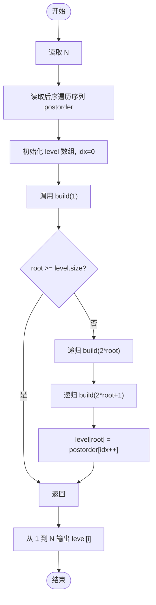
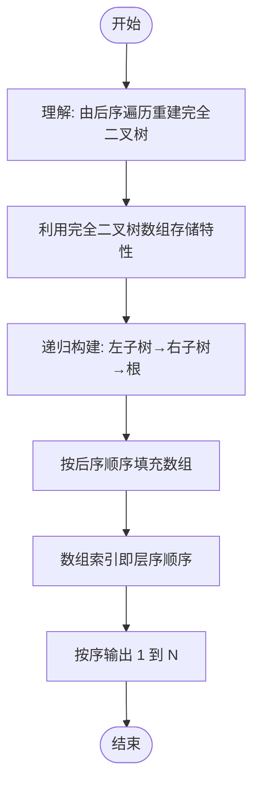

# L2-035 - 完全二叉树的层序遍历（25 分）

- **时间限制**: 400 ms
- **内存限制**: 65536 KB
- **代码长度限制**: 16 KB

---

## 题目描述

一个二叉树，如果每一个层的结点数都达到最大值，则这个二叉树就是**完美二叉树**。对于深度为 $$D$$ 的，有 $$N$$ 个结点的二叉树，若其结点对应于相同深度完美二叉树的层序遍历的前 $$N$$ 个结点，这样的树就是**完全二叉树**。

给定一棵完全二叉树的后序遍历，请你给出这棵树的层序遍历结果。

### 输入格式:

输入在第一行中给出正整数 $$N$$（$$\le 30$$），即树中结点个数。第二行给出后序遍历序列，为 $$N$$ 个不超过 100 的正整数。同一行中所有数字都以空格分隔。

### 输出格式:

在一行中输出该树的层序遍历序列。所有数字都以 1 个空格分隔，行首尾不得有多余空格。

### 输入样例:
```in
8
91 71 2 34 10 15 55 18
```

### 输出样例:
```out
18 34 55 71 2 10 15 91
```

## 示例

### 示例 1

**输入:**
```
8
91 71 2 34 10 15 55 18
```

**输出:**
```
18 34 55 71 2 10 15 91
```

---

## 题目详解

### 一、解题思路

这道题要求根据完全二叉树的后序遍历重建树，并输出层序遍历结果。完全二叉树的特点是：节点按层序编号（从 1 开始），第 i 个节点的左子节点是 2i，右子节点是 2i+1。

核心算法是利用完全二叉树的数组存储特性进行递归构建：
1. 使用数组 level 存储完全二叉树（索引从 1 开始）
2. 后序遍历的顺序是：左子树 → 右子树 → 根节点
3. 递归构建时，先递归构建左子树 uild(2*root)，再构建右子树 uild(2*root+1)，最后将当前后序元素赋值给 level[root]
4. 由于是完全二叉树，数组索引天然对应层序遍历顺序，最后直接按索引 1 到 N 输出即可

### 二、代码流程说明

1. 读取节点数 N
2. 读取后序遍历序列 postorder 到数组
3. 初始化 level 数组（大小 N+1，索引从 1 使用）
4. 初始化索引 idx = 0（用于遍历 postorder）
5. 调用 uild(1, postorder, idx, level) 递归构建：
   - 若 root >= level.size()，返回
   - 递归调用 uild(2*root, ...) 构建左子树
   - 递归调用 uild(2*root+1, ...) 构建右子树
   - level[root] = postorder[idx++] 赋值根节点
6. 从索引 1 到 N 依次输出 level[i]，空格分隔

### 三、代码流程图



### 四、解题流程图


