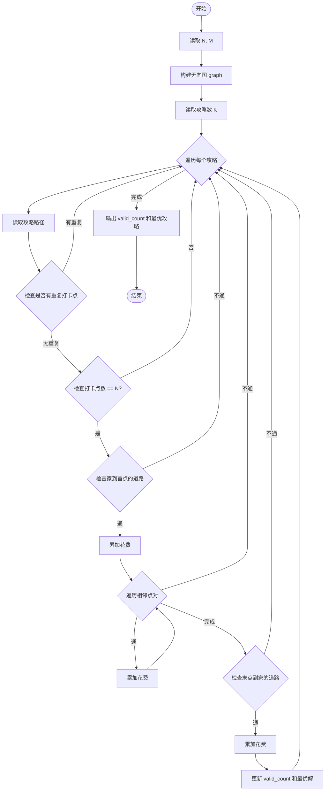
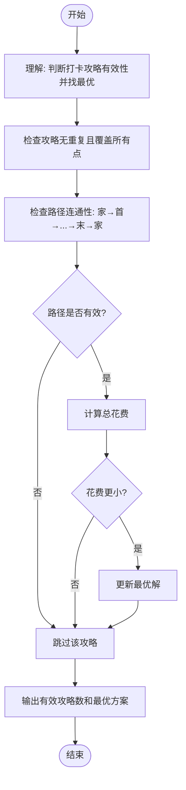

# L2-036 - 网红点打卡攻略（25 分）

- **时间限制**: 400 ms
- **内存限制**: 65536 KB
- **代码长度限制**: 16 KB

---

## 题目描述

一个旅游景点，如果被带火了的话，就被称为“网红点”。大家来网红点游玩，俗称“打卡”。在各个网红点打卡的快（省）乐（钱）方法称为“攻略”。你的任务就是从一大堆攻略中，找出那个能在每个网红点打卡仅一次、并且路上花费最少的攻略。

### 输入格式:

首先第一行给出两个正整数：网红点的个数 $$N$$（$$1 < N\le 200$$）和网红点之间通路的条数 $$M$$。随后 $$M$$ 行，每行给出有通路的两个网红点、以及这条路上的旅行花费（为正整数），格式为“网红点1 网红点2 费用”，其中网红点从 1 到 $$N$$ 编号；同时也给出你家到某些网红点的花费，格式相同，其中你家的编号固定为 `0`。

再下一行给出一个正整数 $$K$$，是待检验的攻略的数量。随后 $$K$$ 行，每行给出一条待检攻略，格式为：

$$n$$ $$V_1$$ $$V_2$$ $$\cdots$$ $$V_n$$

其中 $$n (\le 200)$$ 是攻略中的网红点数，$$V_i$$ 是路径上的网红点编号。这里假设你从家里出发，从 $$V_1$$ 开始打卡，最后从 $$V_n$$ 回家。

### 输出格式:

在第一行输出满足要求的攻略的个数。

在第二行中，首先输出那个能在每个网红点打卡仅一次、并且路上花费最少的攻略的序号（从 1 开始），然后输出这个攻略的总路费，其间以一个空格分隔。如果这样的攻略不唯一，则输出序号最小的那个。

题目保证至少存在一个有效攻略，并且总路费不超过 $$10^9$$。

### 输入样例:
```in
6 13
0 5 2
6 2 2
6 0 1
3 4 2
1 5 2
2 5 1
3 1 1
4 1 2
1 6 1
6 3 2
1 2 1
4 5 3
2 0 2
7
6 5 1 4 3 6 2
6 5 2 1 6 3 4
8 6 2 1 6 3 4 5 2
3 2 1 5
6 6 1 3 4 5 2
7 6 2 1 3 4 5 2
6 5 2 1 4 3 6
```

### 输出样例:
```out
3
5 11
```

## 示例

### 示例 1

**输入:**
```
6 13
0 5 2
6 2 2
6 0 1
3 4 2
1 5 2
2 5 1
3 1 1
4 1 2
1 6 1
6 3 2
1 2 1
4 5 3
2 0 2
7
6 5 1 4 3 6 2
6 5 2 1 6 3 4
8 6 2 1 6 3 4 5 2
3 2 1 5
6 6 1 3 4 5 2
7 6 2 1 3 4 5 2
6 5 2 1 4 3 6
```

**输出:**
```
3
5 11
```

---

## 题目详解

### 一、解题思路

这道题要求判断网红打卡攻略是否有效，并找出花费最少的有效攻略。有效攻略需满足：每个网红点打卡仅一次、能从家（0号点）出发并回到家。核心是对每个攻略逐一验证有效性并计算总花费。

关键算法：
1. 使用 unordered_map 存储无向图的邻接表，记录道路及花费
2. 对每个攻略：用 unordered_set 检查是否有重复打卡点
3. 检查是否打卡了全部 N 个网红点
4. 检查路径连通性：家→第一个点、相邻点之间、最后一个点→家是否都有道路
5. 计算总花费，更新最优解（花费最小，花费相同选序号最小）

### 二、代码流程说明

1. 读取网红点数 N 和道路数 M
2. 构建无向图 graph（邻接表），双向存储道路花费
3. 读取攻略数 K
4. 对每个攻略：读取路径，用 isited 集合检查是否有重复点
5. 检查是否打卡了全部 N 个点（isited.size() == N）
6. 检查从家（0）到路径第一个点是否有道路
7. 遍历路径相邻点对，检查道路连通性并累加花费
8. 检查路径最后一个点到家（0）是否有道路并累加花费
9. 若有效，alid_count++，更新最小花费和最优序号

### 三、代码流程图



### 四、解题流程图

