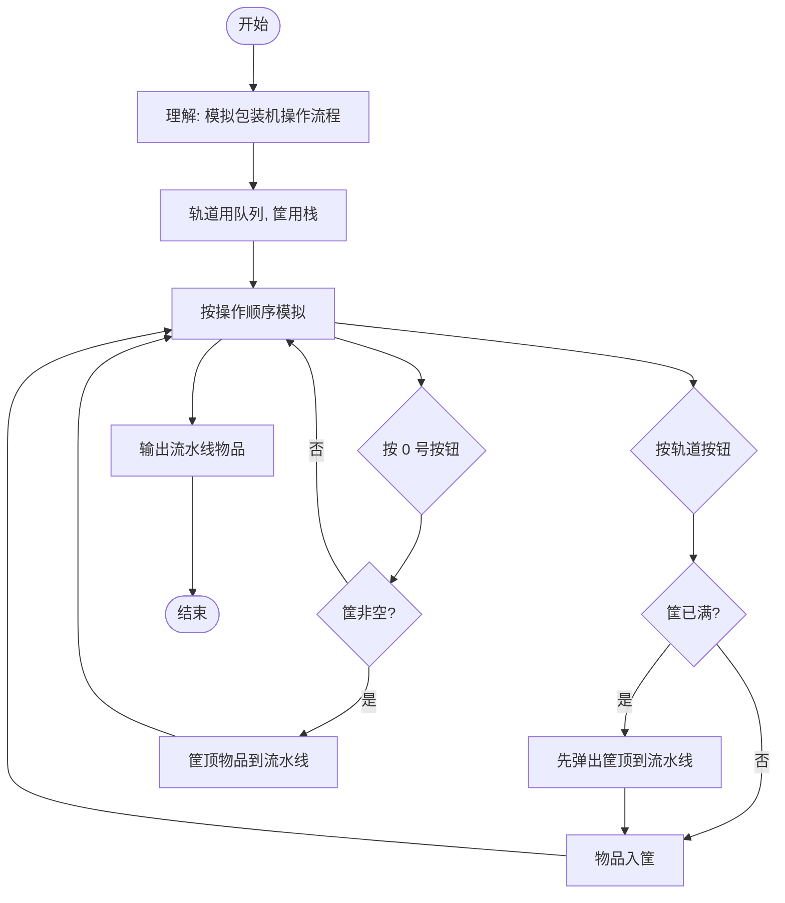

# L2-037 - 包装机（25 分）

- **时间限制**: 400 ms
- **内存限制**: 65536 KB
- **代码长度限制**: 16 KB

---

## 题目描述

一种自动包装机的结构如图 1 所示。首先机器中有 $$N$$ 条轨道，放置了一些物品。轨道下面有一个筐。当某条轨道的按钮被按下时，活塞向左推动，将轨道尽头的一件物品推落筐中。当 0 号按钮被按下时，机械手将抓取筐顶部的一件物品，放到流水线上。图 2 显示了顺序按下按钮 3、2、3、0、1、2、0 后包装机的状态。


图1 自动包装机的结构


图 2 顺序按下按钮 3、2、3、0、1、2、0 后包装机的状态

一种特殊情况是，因为筐的容量是有限的，当筐已经满了，但仍然有某条轨道的按钮被按下时，系统应强制启动 0 号键，先从筐里抓出一件物品，再将对应轨道的物品推落。此外，如果轨道已经空了，再按对应的按钮不会发生任何事；同样的，如果筐是空的，按 0 号按钮也不会发生任何事。

现给定一系列按钮操作，请你依次列出流水线上的物品。

### 输入格式:

输入第一行给出 3 个正整数 $$N$$（$$\le 100$$）、$$M$$（$$\le 1000$$）和 $$S_{max}$$（$$\le 100$$），分别为轨道的条数（于是轨道从 1 到 $$N$$ 编号）、每条轨道初始放置的物品数量、以及筐的最大容量。随后 $$N$$ 行，每行给出 $$M$$ 个英文大写字母，表示每条轨道的初始物品摆放。

最后一行给出一系列数字，顺序对应被按下的按钮编号，直到 $$-1$$ 标志输入结束，这个数字不要处理。数字间以空格分隔。题目保证至少会取出一件物品放在流水线上。

### 输出格式:

在一行中顺序输出流水线上的物品，不得有任何空格。

### 输入样例:
```in
3 4 4
GPLT
PATA
OMSA
3 2 3 0 1 2 0 2 2 0 -1
```

### 输出样例:
```out
MATA
```

## 示例

### 示例 1

**输入:**
```
3 4 4
GPLT
PATA
OMSA
3 2 3 0 1 2 0 2 2 0 -1
```

**输出:**
```
MATA
```

---

## 题目详解

### 一、解题思路

这道题要求模拟自动包装机的操作过程。包装机有 N 条轨道（存放物品）、一个筐（栈结构，容量有限）和一条流水线。核心是按按钮操作顺序模拟物品从轨道→筐→流水线的转移过程。

关键规则：
1. 按轨道按钮（1~N）：将该轨道尽头的物品推入筐
2. 若筐已满，先将筐顶物品放到流水线，再推入新物品
3. 按 0 号按钮：将筐顶物品放到流水线
4. 轨道空或筐空时对应操作无效，不报错

### 二、代码流程说明

1. 读取轨道数 N、每轨物品数 M、筐最大容量 Smax
2. 读取每条轨道的物品序列，存入 	racks[i]（队列）
3. 初始化筐 asket（栈），结果字符串 
esult
4. 循环读取操作编号 op，直到 -1：
5. op == 0：若筐非空，将筐顶字符追加到 
esult 并弹出
6. op != 0：若轨道 op 非空：
   - 若筐已满（asket.size() >= Smax），先将筐顶物品放到 
esult
   - 将轨道尽头物品推入筐，轨道弹出一个
7. 输出 
esult（流水线上的物品序列）

### 三、代码流程图

```mermaid
flowchart TD
    A([开始]) --> B[读取 N, M, Smax]
    B --> C[读取 N 条轨道物品到 tracks 队列]
    C --> D[初始化 basket 栈, result 字符串]
    D --> E{循环读取操作 op}
    E -- op == -1 --> L[输出 result]
    E -- op == 0 --> F{筐非空?}
    F -- 是 --> G[result += basket.top(), 弹出筐顶]
    F -- 否 --> E
    G --> E
    E -- op > 0 --> H{轨道 op 非空?}
    H -- 否 --> E
    H -- 是 --> I{筐已满?}
    I -- 是 --> J[result += basket.top(), 弹出筐顶]
    I -- 否 --> K[轨道物品推入筐, 轨道弹出]
    J --> K
    K --> E
    L --> M([结束])
```

### 四、解题流程图

