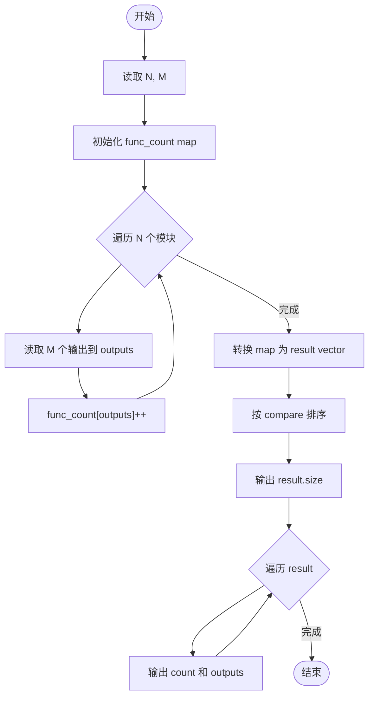
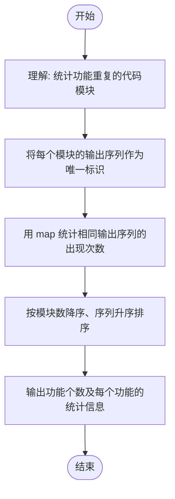

# L2-039 - 清点代码库（25 分）

- **时间限制**: 500 ms
- **内存限制**: 65536 KB
- **代码长度限制**: 16 KB

---

## 题目描述


上图转自新浪微博：“阿里代码库有几亿行代码，但其中有很多功能重复的代码，比如单单快排就被重写了几百遍。请设计一个程序，能够将代码库中所有功能重复的代码找出。各位大佬有啥想法，我当时就懵了，然后就挂了。。。”

这里我们把问题简化一下：首先假设两个功能模块如果接受同样的输入，总是给出同样的输出，则它们就是功能重复的；其次我们把每个模块的输出都简化为一个整数（在 **int** 范围内）。于是我们可以设计一系列输入，检查所有功能模块的对应输出，从而查出功能重复的代码。你的任务就是设计并实现这个简化问题的解决方案。

### 输入格式:

输入在第一行中给出 2 个正整数，依次为 $$N$$（$$\le 10^4$$）和 $$M$$（$$\le 10^2$$），对应功能模块的个数和系列测试输入的个数。

随后 $$N$$ 行，每行给出一个功能模块的 $$M$$ 个对应输出，数字间以空格分隔。

### 输出格式:

首先在第一行输出不同功能的个数 $$K$$。随后 $$K$$ 行，每行给出具有这个功能的模块的个数，以及这个功能的对应输出。数字间以 1 个空格分隔，行首尾不得有多余空格。输出首先按模块个数非递增顺序，如果有并列，则按输出序列的递增序给出。

注：所谓数列 { $$A_1$$, ..., $$A_M$$ } 比 { $$B_1$$, ..., $$B_M$$ } 大，是指存在 $$1\le i <M$$，使得 $$A_1=B_1$$，...，$$A_i=B_i$$ 成立，且 $$A_{i+1} > B_{i+1}$$。

### 输入样例:
```in
7 3
35 28 74
-1 -1 22
28 74 35
-1 -1 22
11 66 0
35 28 74
35 28 74
```

### 输出样例:
```out
4
3 35 28 74
2 -1 -1 22
1 11 66 0
1 28 74 35
```

## 示例

### 示例 1

**输入:**
```
7 3
35 28 74
-1 -1 22
28 74 35
-1 -1 22
11 66 0
35 28 74
35 28 74
```

**输出:**
```
4
3 35 28 74
2 -1 -1 22
1 11 66 0
1 28 74 35
```

---

## 题目详解

### 一、解题思路

这道题要求统计代码库中功能重复的模块。两个模块功能相同当且仅当它们对所有测试输入产生相同的输出序列。核心思路是将每个模块的输出序列作为键，用 map 统计出现次数，然后按要求排序输出。

关键算法：
1. 使用 map<vector<int>, int> 将每个模块的 M 个输出作为键，自动统计相同输出序列的模块数
2. 将 map 转换为 vector<Func>，Func 包含 count（模块数）和 outputs（输出序列）
3. 自定义排序：先按 count 降序，count 相同则按 outputs 字典序升序
4. 输出不同功能的个数 K，再依次输出每个功能的模块数和输出序列

### 二、代码流程说明

1. 读取模块数 N 和测试输入数 M
2. 初始化 map<vector<int>, int> func_count
3. 对每个模块：读取 M 个输出值存入 outputs 向量，unc_count[outputs]++
4. 将 map 转换为 ector<Func> result，每个元素包含 count 和 outputs
5. 使用 compare 函数排序：count 降序，outputs 字典序升序
6. 输出 
esult.size()（不同功能个数）
7. 遍历 result，输出每个功能的 count 和 outputs

### 三、代码流程图



### 四、解题流程图


