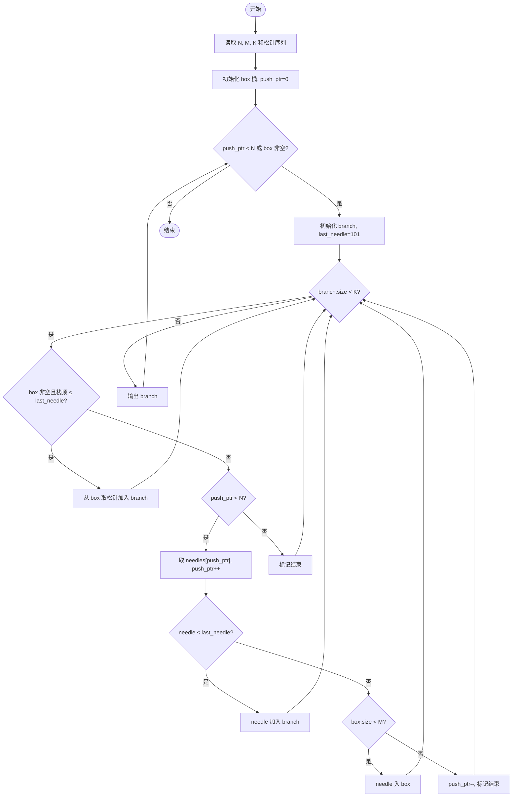
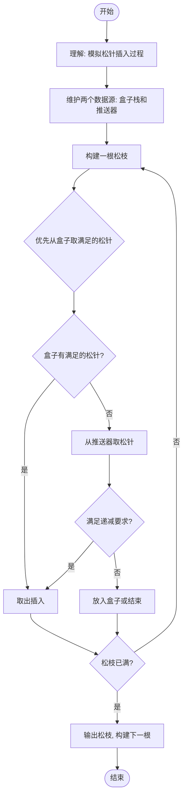

# L2-041 - 插松枝（25 分）

- **时间限制**: 400 ms
- **内存限制**: 65536 KB
- **代码长度限制**: 16 KB

---

## 题目描述


人造松枝加工场的工人需要将各种尺寸的塑料松针插到松枝干上，做成大大小小的松枝。他们的工作流程（并不）是这样的：

- 每人手边有一只小盒子，初始状态为空。
- 每人面前有用不完的松枝干和一个推送器，每次推送一片随机型号的松针片。
- 工人首先捡起一根空的松枝干，从小盒子里摸出最上面的一片松针 —— 如果小盒子是空的，就从推送器上取一片松针。将这片松针插到枝干的最下面。
- 工人在插后面的松针时，需要保证，每一步插到一根非空松枝干上的松针片，不能比前一步插上的松针片大。如果小盒子中最上面的松针满足要求，就取之插好；否则去推送器上取一片。如果推送器上拿到的仍然不满足要求，就把拿到的这片堆放到小盒子里，继续去推送器上取下一片。注意这里假设小盒子里的松针片是按放入的顺序堆叠起来的，工人每次只能取出最上面（即最后放入）的一片。
- 当下列三种情况之一发生时，工人会结束手里的松枝制作，开始做下一个：

（1）小盒子已经满了，但推送器上取到的松针仍然不满足要求。此时将手中的松枝放到成品篮里，推送器上取到的松针压回推送器，开始下一根松枝的制作。

（2）小盒子中最上面的松针不满足要求，但推送器上已经没有松针了。此时将手中的松枝放到成品篮里，开始下一根松枝的制作。

（3）手中的松枝干上已经插满了松针，将之放到成品篮里，开始下一根松枝的制作。

现在给定推送器上顺序传过来的 $$N$$ 片松针的大小，以及小盒子和松枝的容量，请你编写程序自动列出每根成品松枝的信息。

### 输入格式:

输入在第一行中给出 3 个正整数：$$N$$（$$\le 10^3$$），为推送器上松针片的数量；$$M$$（$$\le 20$$）为小盒子能存放的松针片的最大数量；$$K$$（$$\le 5$$）为一根松枝干上能插的松针片的最大数量。

随后一行给出 $$N$$ 个不超过 $$100$$ 的正整数，为推送器上顺序推出的松针片的大小。

### 输出格式:

每支松枝成品的信息占一行，顺序给出自底向上每片松针的大小。数字间以 1 个空格分隔，行首尾不得有多余空格。

### 输入样例:
```in
8 3 4
20 25 15 18 20 18 8 5
```

### 输出样例:
```out
20 15
20 18 18 8
25 5
```

## 示例

### 示例 1

**输入:**
```
8 3 4
20 25 15 18 20 18 8 5
```

**输出:**
```
20 15
20 18 18 8
25 5
```

---

## 题目详解

### 一、解题思路

这道题要求模拟插松枝的过程。工人将推送器上的松针按顺序插到松枝干上，每次插入的松针不能比前一根大。工人先尝试从小盒子（栈）取，不行再从推送器取。若推送器取出的也不满足要求，则放入小盒子。

关键规则：
1. 每根松枝最多插 K 片松针，按从下到上递减顺序
2. 优先从盒子取（栈顶 ≤ 上一片时可取）
3. 盒子不满足时从推送器取，不满足的放入盒子
4. 盒子满且推送器也不满足时结束当前松枝
5. 推送器空且盒子不满足时结束当前松枝

### 二、代码流程说明

1. 读取松针数 N、小盒子容量 M、松枝容量 K
2. 读取推送器上 N 片松针的尺寸到 
eedles 数组
3. 初始化小盒子 ox（栈），推送器指针 push_ptr = 0
4. 外层循环（构建松枝）：当 push_ptr < N 或 ox 非空
5. 初始化当前松枝 ranch，last_needle = 101（最大值+1）
6. 内层循环（插松针）：当 ranch.size() < K
7. 若盒子非空且栈顶 ≤ last_needle：从盒子取松针插入
8. 否则从推送器取：若 
eedle ≤ last_needle，插入松枝；否则放入盒子（若未满）
9. 三种结束条件：盒子满+推送器不满足、盒子空+推送器空、松枝已满
10. 输出当前松枝，继续下一根

### 三、代码流程图



### 四、解题流程图


