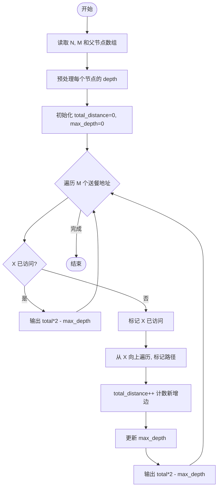
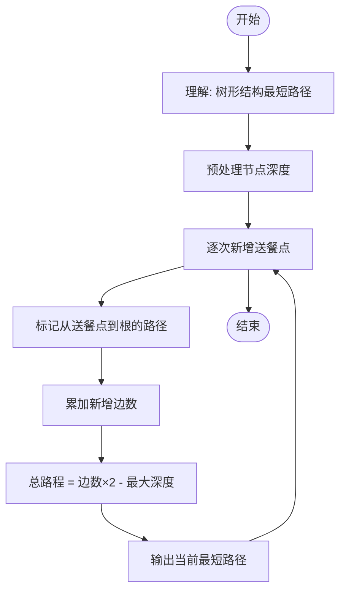

# L2-043 - 龙龙送外卖（25 分）

- **时间限制**: 400 ms
- **内存限制**: 65536 KB
- **代码长度限制**: 16 KB

---

## 题目描述

龙龙是“饱了呀”外卖软件的注册骑手，负责送帕特小区的外卖。帕特小区的构造非常特别，都是双向道路且没有构成环 —— 你可以简单地认为小区的路构成了一棵树，根结点是外卖站，树上的结点就是要送餐的地址。

每到中午 12 点，帕特小区就进入了点餐高峰。一开始，只有一两个地方点外卖，龙龙简单就送好了；但随着大数据的分析，龙龙被派了更多的单子，也就送得越来越累……

看着一大堆订单，龙龙想知道，从外卖站出发，访问所有点了外卖的地方至少一次（这样才能把外卖送到）所需的最短路程的距离到底是多少？每次新增一个点外卖的地址，他就想估算一遍整体工作量，这样他就可以搞明白新增一个地址给他带来了多少负担。

### 输入格式:

输入第一行是两个数 $N$ 和 $M$ ($2 \le N \le 10^5$, $1 \le M \le  10^5$)，分别对应树上节点的个数（包括外卖站），以及新增的送餐地址的个数。

接下来首先是一行 $N$ 个数，第 $i$ 个数表示第 $i$ 个点的双亲节点的编号。节点编号从 1 到 $N$，外卖站的双亲编号定义为 $-1$。

接下来有 $M$ 行，每行给出一个新增的送餐地点的编号 $X_i$。保证送餐地点中不会有外卖站，但地点有可能会重复。

为了方便计算，我们可以假设龙龙一开始一个地址的外卖都不用送，两个相邻的地点之间的路径长度统一设为 1，且从外卖站出发可以访问到所有地点。

注意：所有送餐地址可以按任意顺序访问，***且完成送餐后无需返回外卖站***。

### 输出格式:

对于每个新增的地点，在一行内输出题目需要求的最短路程的距离。

### 输入样例:
```in
7 4
-1 1 1 1 2 2 3
5
6
2
4
```

### 输出样例:
```out
2
4
4
6
```

## 示例

### 示例 1

**输入:**
```
7 4
-1 1 1 1 2 2 3
5
6
2
4
```

**输出:**
```
2
4
4
6
```

---

## 题目详解

### 一、解题思路

这道题要求在树形小区中计算从外卖站出发访问所有送餐点的最短路径。每次新增一个送餐地址，输出当前最短总路程。关键公式：**总路程 = 所有边被走过的次数 × 2 - 最长路径深度**（因为完成后无需返回外卖站，省去了最长路径的返回距离）。

核心算法：
1. 预处理每个节点的深度（到外卖站的距离）
2. 每次新增送餐地址 X，从 X 向上遍历到外卖站，标记路径上的节点为已访问
3. 新增的距离 = 新增的边数（每个新增节点贡献 1 条边）
4. 维护 max_depth（已送餐点的最大深度）
5. 答案 = 	otal_distance * 2 - max_depth

### 二、代码流程说明

1. 读取节点数 N 和送餐单数 M
2. 读取每个节点的父节点 
eal_parent，外卖站（根节点）的父节点为 -1（转为 0）
3. 预处理每个节点的深度 depth[i]：从节点向上遍历到根，计数
4. 初始化 	otal_distance = 0，max_depth = 0
5. 对每个送餐地址 X：
   - 若 X 已访问，直接输出 	otal_distance * 2 - max_depth
   - 标记 X 为已访问
   - 从 X 向上遍历，若父节点未访问则标记并 	otal_distance++
   - 	otal_distance++（X 到其父节点的边）
   - 更新 max_depth = max(max_depth, depth[X])
   - 输出 	otal_distance * 2 - max_depth

### 三、代码流程图



### 四、解题流程图

