# L2-044 - 大众情人（25 分）

- **时间限制**: 400 ms
- **内存限制**: 65536 KB
- **代码长度限制**: 16 KB

---

## 题目描述


人与人之间总有一点距离感。我们假定两个人之间的亲密程度跟他们之间的距离感成反比，并且距离感是单向的。例如小蓝对小红患了单相思，从小蓝的眼中看去，他和小红之间的距离为 1，只差一层窗户纸；但在小红的眼里，她和小蓝之间的距离为 108000，差了十万八千里…… 另外，我们进一步假定，距离感在认识的人之间是可传递的。例如小绿觉得自己跟小蓝之间的距离为 2，则即使小绿并不直接认识小红，我们也默认小绿早晚会认识小红，并且因为跟小蓝很亲近的关系，小绿会觉得自己跟小红之间的距离为 1+2=3。当然这带来一个问题，如果小绿本来也认识小红，或者他通过其他人也能认识小红，但通过不同渠道推导出来的距离感不一样，该怎么算呢？我们在这里做个简单定义，就将小绿对小红的距离感定义为所有推导出来的距离感的最小值。

一个人的异性缘不是由最喜欢他/她的那个异性决定的，而是由对他/她最无感的那个异性决定的。我们记一个人 $$i$$ 在一个异性 $$j$$ 眼中的距离感为 $$D_{ij}$$；将 $$i$$ 的“异性缘”定义为 $$1/\max_{j\in S(i)} \{ D_{ij}\}$$，其中 $$S(i)$$ 是相对于 $$i$$ 的所有异性的集合。那么“大众情人”就是异性缘最好（值最大）的那个人。

本题就请你从给定的一批人与人之间的距离感中分别找出两个性别中的“大众情人”。

### 输入格式:

输入在第一行中给出一个正整数 $$N$$（$$\le 500$$），为总人数。于是我们默认所有人从 1 到 $$N$$ 编号。

随后 $$N$$ 行，第 $$i$$ 行描述了编号为 $$i$$ 的人与其他人的关系，格式为：

```
性别 K 朋友1:距离1 朋友2:距离2 …… 朋友K:距离K
```

其中 `性别` 是这个人的性别，`F` 表示女性，`M` 表示男性；`K`（$$<N$$ 的非负整数）为这个人直接认识的朋友数；随后给出的是这 `K` 个朋友的编号、以及这个人对该朋友的距离感。距离感是不超过 $$10^6$$ 的正整数。

题目保证给出的关系中一定两种性别的人都有，不会出现重复给出的关系，并且每个人的朋友中都不包含自己。

### 输出格式:

第一行给出自身为女性的“大众情人”的编号，第二行给出自身为男性的“大众情人”的编号。如果存在并列，则按编号递增的顺序输出所有。数字间以一个空格分隔，行首尾不得有多余空格。

### 输入样例:
```in
6
F 1 4:1
F 2 1:3 4:10
F 2 4:2 2:2
M 2 5:1 3:2
M 2 2:2 6:2
M 2 3:1 2:5
```

### 输出样例:
```out
2 3
4
```

## 示例

### 示例 1

**输入:**
```
6
F 1 4:1
F 2 1:3 4:10
F 2 4:2 2:2
M 2 5:1 3:2
M 2 2:2 6:2
M 2 3:1 2:5
```

**输出:**
```
2 3
4
```

---

## 题目详解

### 一、解题思路

这道题要求找出男女"大众情人"——异性缘最好的人。异性缘定义为 1 / max(该人到所有异性的距离感)。距离感可传递（最短路），所以需要用 Dijkstra 计算每个人到其他所有人的最短距离。

核心算法：
1. 使用 Dijkstra 算法从每个节点出发计算到所有其他节点的最短距离
2. 对每个人 i，找到其到所有异性的最大距离 max_dist
3. 异性缘 = 1.0 / max_dist
4. 分别找出女性和男性中异性缘最高的人，并列时输出所有

### 二、代码流程说明

1. 读取总人数 N
2. 读取每个人的性别和朋友关系，构建邻接表 graph
3. 对每个人 i（1 到 N）：
   - 使用 Dijkstra 计算从 i 到所有节点的最短距离 dist
   - 若 i 为女性：找到到所有男性的最大距离 max_dist，计算 emale_score[i] = 1.0 / max_dist
   - 若 i 为男性：找到到所有女性的最大距离 max_dist，计算 male_score[i] = 1.0 / max_dist
4. 找出 max_female 和 max_male（最大异性缘）
5. 遍历所有人，收集异性缘等于最大值的候选人
6. 排序后输出女性候选人、男性候选人

### 三、代码流程图

```mermaid
flowchart TD
    A([开始]) --> B[读取 N, 构建邻接表]
    B --> C{对每个人 i 执行 Dijkstra}
    C --> D[从 i 开始计算最短距离 dist]
    D --> E{i 的性别?}
    E -- 女性 --> F[找所有男性的 max_dist]
    E -- 男性 --> G[找所有女性的 max_dist]
    F --> H[female_score[i] = 1/max_dist]
    G --> I[male_score[i] = 1/max_dist]
    H --> C
    I --> C
    C -- 完成 --> J[找 max_female 和 max_male]
    J --> K[收集候选人]
    K --> L[排序并输出]
    L --> M([结束])
```

### 四、解题流程图

```mermaid
flowchart TD
    A([开始]) --> B[理解: 找异性缘最好的人]
    B --> C[用 Dijkstra 计算最短距离]
    C --> D[每人到异性的最大距离]
    D --> E[异性缘 = 1/最大距离]
    E --> F[分别找出男女最高异性缘]
    F --> G[输出所有并列冠军]
    G --> H([结束])
```

