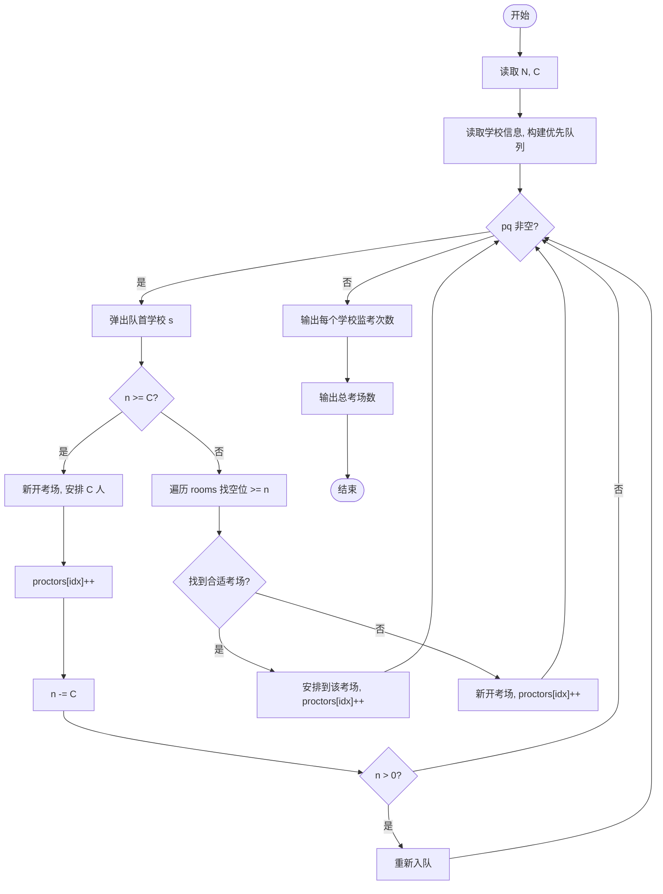
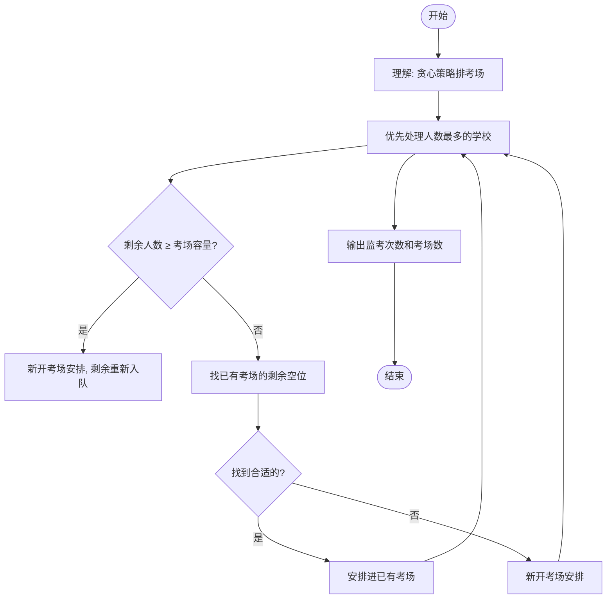

# L2-046 - 天梯赛的赛场安排（25 分）

- **时间限制**: 400 ms
- **内存限制**: 65536 KB
- **代码长度限制**: 16 KB

---

## 题目描述


天梯赛使用 OMS 监考系统，需要将参赛队员安排到系统中的虚拟赛场里，并为每个赛场分配一位监考老师。每位监考老师需要联系自己赛场内队员对应的教练们，以便发放比赛账号。为了尽可能减少教练和监考的沟通负担，我们要求赛场的安排满足以下条件：

* 每位监考老师负责的赛场里，队员人数不得超过赛场规定容量 $C$；
* 每位教练需要联系的监考人数尽可能少 —— 这里假设每所参赛学校只有一位负责联系的教练，且每个赛场的监考老师都不相同。

为此我们设计了多轮次排座算法，按照尚未安排赛场的队员人数从大到小的顺序，每一轮对当前未安排的人数最多的学校进行处理。记当前待处理的学校未安排人数为 $n$：

* 如果 $n\ge C$，则新开一个赛场，将 $C$ 位队员安排进去。剩下的人继续按人数规模排队，等待下一轮处理；
* 如果 $n<C$，则寻找剩余空位数大于等于 $n$ 的编号最小的赛场，将队员安排进去；
* 如果 $n<C$，且找不到任何非空的、剩余空位数大于等于 $n$ 的赛场了，则新开一个赛场，将队员安排进去。

由于近年来天梯赛的参赛人数快速增长，2023年超过了 480 所学校 1.6 万人，所以我们必须写个程序来处理赛场安排问题。

### 输入格式:

输入第一行给出两个正整数 $N$ 和 $C$，分别为参赛学校数量和每个赛场的规定容量，其中 $0<N\le 5000$，$10\le C \le 50$。随后 $N$ 行，每行给出一个学校的缩写（为长度不超过 6 的非空小写英文字母串）和该校参赛人数（不超过 500 的正整数），其间以空格分隔。题目保证每所学校只有一条记录。

### 输出格式:

按照输入的顺序，对每一所参赛高校，在一行中输出学校缩写和该校需要联系的监考人数，其间以 1 空格分隔。\
最后在一行中输出系统中应该开设多少个赛场。

### 输入样例:
```in
10 30
zju 30
hdu 93
pku 39
hbu 42
sjtu 21
abdu 10
xjtu 36
nnu 15
hnu 168
hsnu 20
```

### 输出样例:
```out
zju 1
hdu 4
pku 2
hbu 2
sjtu 1
abdu 1
xjtu 2
nnu 1
hnu 6
hsnu 1
16
```

## 示例

### 示例 1

**输入:**
```
10 30
zju 30
hdu 93
pku 39
hbu 42
sjtu 21
abdu 10
xjtu 36
nnu 15
hnu 168
hsnu 20
```

**输出:**
```
zju 1
hdu 4
pku 2
hbu 2
sjtu 1
abdu 1
xjtu 2
nnu 1
hnu 6
hsnu 1
16
```

---

## 题目详解

### 一、解题思路

这道题要求按照多轮次排座算法安排天梯赛的赛场。有 N 个学校，每个学校有一定数量的选手需要安排到容量为 C 的赛场中。每轮选择人数最多的学校优先处理：如果剩余人数 ≥ C，则新开一个考场安排 C 人；如果 < C，则尝试找剩余空位足够的编号最小的考场，找不到则新开考场。

核心算法：
1. 使用优先队列 priority_queue 按人数降序（编号升序为次）排序学校
2. 用 
ooms 数组维护各考场的已用座位数
3. 每轮队首学校：
   - 若剩余人数 ≥ C：新开考场，安排 C 人，剩余人数重新入队
   - 若 < C：在已有考场中找剩余空位 ≥ 人数的（从编号最小开始），找到则安排；找不到则新开考场
4. 输出每个学校的监考次数和总考场数

### 二、代码流程说明

1. 读取学校数 N 和考场容量 C
2. 读取每个学校的名称和选手数，构建 School 结构体（名称、人数、索引）
3. 将所有学校压入优先队列 pq（按人数降序，索引升序）
4. 初始化 
ooms 数组（考场已用座位），proctors 数组（监考次数）
5. 循环处理：
   - 弹出队首学校 s
   - 若 
 >= C：新开考场 
ooms.push_back(C)，proctors[idx]++，
 -= C，若 
 > 0 重新入队
   - 否则：遍历 
ooms 找剩余空位 ≥ n 的考场，安排并 proctors[idx]++；找不到则新开考场
6. 输出每个学校的名称和监考次数
7. 输出总考场数 
ooms.size()

### 三、代码流程图



### 四、解题流程图


