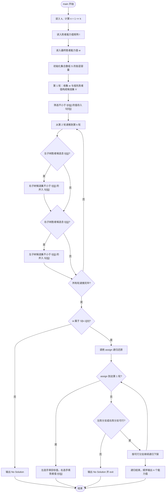
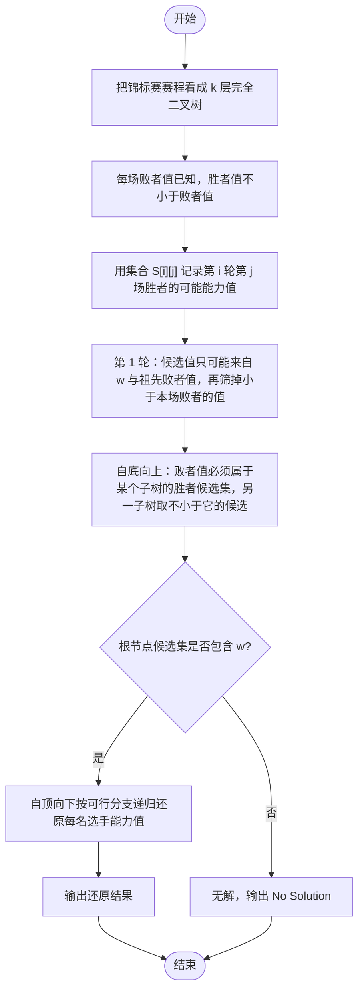

# L2-047 - 锦标赛（25 分）

- **时间限制**: 400 ms
- **内存限制**: 65536 KB
- **代码长度限制**: 16 KB

---

## 题目描述

有 $2^k$ 名选手将要参加一场锦标赛。锦标赛共有 $k$ 轮，其中第 $i$ 轮的比赛共有 $2^{k - i}$ 场，每场比赛恰有两名选手参加并从中产生一名胜者。每场比赛的安排如下：

* 对于第 $1$ 轮的第 $j$ 场比赛，由第 $(2j - 1)$ 名选手对抗第 $2j$ 名选手。
* 对于第 $i$ 轮的第 $j$ 场比赛（$i > 1$），由第 $(i - 1)$ 轮第 $(2j - 1)$ 场比赛的胜者对抗第 $(i - 1)$ 轮第 $2j$ 场比赛的胜者。

第 $k$ 轮唯一一场比赛的胜者就是整个锦标赛的最终胜者。\
举个例子，假如共有 $8$ 名选手参加锦标赛，则比赛的安排如下：

* 第 $1$ 轮共 $4$ 场比赛：选手 $1$ vs 选手 $2$，选手 $3$ vs 选手 $4$，选手 $5$ vs 选手 $6$，选手 $7$ vs 选手 $8$。
* 第 $2$ 轮共 $2$ 场比赛：第 $1$ 轮第 $1$ 场的胜者 vs 第 $1$ 轮第 $2$ 场的胜者，第 $1$ 轮第 $3$ 场的胜者 vs 第 $1$ 轮第 $4$ 场的胜者。
* 第 $3$ 轮共 $1$ 场比赛：第 $2$ 轮第 $1$ 场的胜者 vs 第 $2$ 轮第 $2$ 场的胜者。

已知每一名选手都有一个能力值，其中第 $i$ 名选手的能力值为 $a_i$。在一场比赛中，若两名选手的能力值不同，则能力值较大的选手一定会打败能力值较小的选手；若两名选手的能力值相同，则两名选手都有可能成为胜者。

令 $l_{i, j}$ 表示第 $i$ 轮第 $j$ 场比赛 **败者** 的能力值，令 $w$ 表示整个锦标赛最终胜者的能力值。给定所有满足 $1 \le i \le k$ 且 $1 \le j \le 2^{k - i}$ 的 $l_{i, j}$ 以及 $w$，请还原出 $a_1, a_2, \cdots, a_n$。

### 输入格式:

第一行输入一个整数 $k$（$1 \le k \le 18$）表示锦标赛的轮数。\
对于接下来 $k$ 行，第 $i$ 行输入 $2^{k - i}$ 个整数 $l_{i, 1}, l_{i, 2}, \cdots, l_{i, 2^{k - i}}$（$1 \le l_{i, j} \le 10^9$），其中 $l_{i, j}$ 表示第 $i$ 轮第 $j$ 场比赛 **败者** 的能力值。\
接下来一行输入一个整数 $w$（$1 \le w \le 10^9$）表示锦标赛最终胜者的能力值。

### 输出格式:

输出一行 $n$ 个由单个空格分隔的整数 $a_1, a_2, \cdots, a_n$，其中 $a_i$ 表示第 $i$ 名选手的能力值。如果有多种合法答案，请输出任意一种。如果无法还原出能够满足输入数据的答案，输出一行 `No Solution`。\
请勿在行末输出多余空格。

### 输入样例 1：
```in
3
4 5 8 5
7 6
8
9
```

### 输出样例 1：
```out
7 4 8 5 9 8 6 5
```

### 输入样例 2：
```in
2
5 8
3
9
```

### 输出样例 2：
```out
No Solution
```

## 示例

### 示例 1

**输入:**
```
3
4 5 8 5
7 6
8
9
```

**输出:**
```
7 4 8 5 9 8 6 5
```

### 示例 2

**输入:**
```
2
5 8
3
9
```

**输出:**
```
No Solution
```

---

## 题目详解

### 一、解题思路

锦标赛的赛程天然构成一棵 k 层完全二叉树：第 i 轮第 j 场（代码中索引从 0 开始）由第 i-1 轮第 2j 场与第 2j+1 场的胜者对决。每场比赛的败者能力值已经给定为 `l[i][j]`，胜者能力值必须不小于败者值。本题的核心是：从根（最终冠军）出发，利用集合递推所有可能的胜者能力值，再自顶向下还原每名选手的能力值。

关键观察：任意一个子树最终晋级到更高层的选手，其能力值只可能来自两类值——最终冠军的能力值 `w`，或者它在上方某场祖先比赛中落败时记录的败者值 `l`。因此定义集合 `S[i][j]` 表示第 i 轮第 j 场胜者所有可能的能力值，构造方法如下：

1. 第 1 轮（代码第 0 层）：对每场比赛 j，候选值集合 V = {w} ∪ {所有祖先轮败者值}，再筛掉小于 `l[0][j]` 的值存入 `S[0][j]`（胜者值不小于本场败者值）。
2. 自底向上递推：第 i 轮第 j 场的败者值 `l[i][j]` 必须恰好等于左、右两个子树中某一个胜者的能力值（即该值必须出现在 `S[i-1][left]` 或 `S[i-1][right]` 中）。若左子树能败（`l[i][j] ∈ S[i-1][left]`），则右子树胜者的能力值 `v`（来自 `S[i-1][right]` 且 `v >= l[i][j]`）就可以成为本场胜者候选；右子树能败时对称处理。
3. 可行性判断：最终冠军值 `w` 必须出现在根节点候选集 `S[k-1][0]` 中，否则输出 `No Solution`。
4. 还原：用递归函数 `assign(i, j, target_value)` 要求第 i 轮第 j 场的胜者能力值恰为 `target_value`。到达第 1 轮时直接填两名选手（胜者为 `target_value`，败者为 `l[0][j]`）；否则根据"左败/右败"两种可行分支继续向下递归，最终得到叶子顺序（选手编号 1~n）的能力值数组并输出。

### 二、代码流程说明

1. 读入轮数 `k`，计算选手总数 `n = 1 << k`。
2. 定义败者能力值矩阵 `l`：第 i 行大小为 `1 << (k - i - 1)`，逐行读入 `l[i][j]`。
3. 读入最终胜者能力值 `w`。
4. 定义集合数组 `S`，为每一层每一场比赛分配一个 `set<int>`。
5. 构造第 1 轮候选集：对 j 从 0 到 `(1 << (k-1)) - 1`，用集合 `V` 先放入 `w`，再对 i 从 1 到 k-1 计算 `j_idx = j / (1 << i)`，把祖先轮败者值 `l[i][j_idx]` 加入 `V`；最后把 `V` 中不小于 `l[0][j]` 的值插入 `S[0][j]`。
6. 自底向上递推：对 i 从 1 到 k-1、j 从 0 到 `(1 << (k - i - 1)) - 1`，取 `left = 2 * j`、`right = 2 * j + 1`：
   - 计算 `left_can_lose = S[i-1][left].count(l[i][j]) > 0` 与 `right_can_lose = S[i-1][right].count(l[i][j]) > 0`。
   - 若 `left_can_lose`，把 `S[i-1][right]` 中不小于 `l[i][j]` 的 `v` 插入 `S[i][j]`。
   - 若 `right_can_lose`，把 `S[i-1][left]` 中不小于 `l[i][j]` 的 `v` 插入 `S[i][j]`。
7. 检查 `S[k-1][0].count(w)`：若为 0，输出 `No Solution` 并返回。
8. 定义结果数组 `result(n, -1)` 与递归函数 `assign(i, j, target_value)`：
   - 基线条件 `i == 0`：令 `result[2*j] = target_value`、`result[2*j+1] = l[0][j]`。
   - 递归条件：判断左败分支 `S[i-1][left].count(l[i][j]) && S[i-1][right].count(target_value) && target_value >= l[i][j]`，以及右败分支的对称条件。
   - 若两个分支都不可行，输出 `No Solution` 并 `exit(0)`；若左败分支可行，递归 `assign(i-1, left, l[i][j])` 与 `assign(i-1, right, target_value)`，否则走右败分支。
9. 调用 `assign(k-1, 0, w)` 从根节点开始还原。
10. 顺序输出 `result` 数组，数字间以单个空格分隔、行末无多余空格，最后 `return 0`。

### 三、代码流程图



### 四、解题流程图


