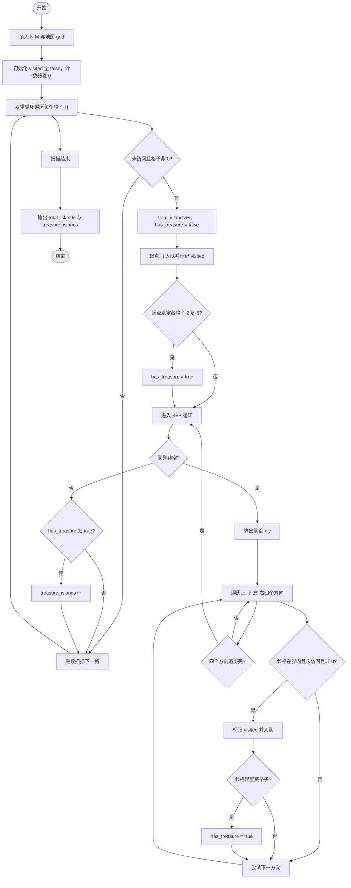
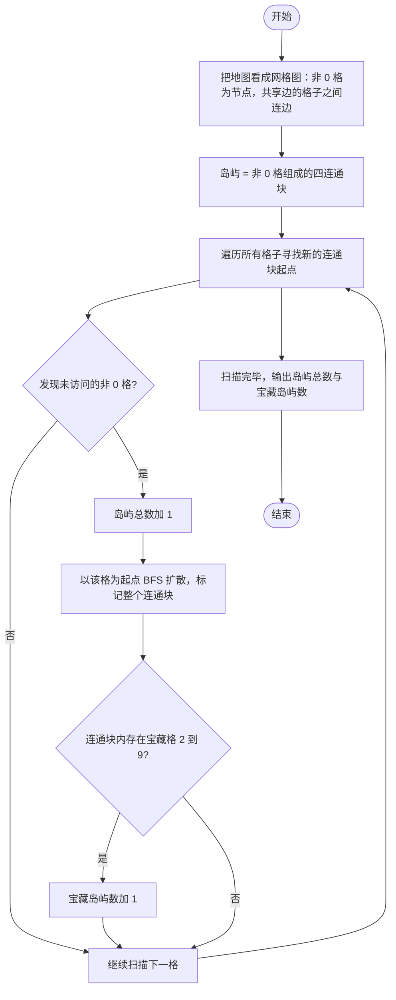

# L2-048 - 寻宝图（25 分）

- **时间限制**: 400 ms
- **内存限制**: 65536 KB
- **代码长度限制**: 16 KB

---

## 题目描述

给定一幅地图，其中有水域，有陆地。被水域完全环绕的陆地是岛屿。有些岛屿上埋藏有宝藏，这些有宝藏的点也被标记出来了。本题就请你统计一下，给定的地图上一共有多少岛屿，其中有多少是有宝藏的岛屿。

### 输入格式:

输入第一行给出 2 个正整数 $N$ 和 $M$（$1 < N\times M\le 10^5$），是地图的尺寸，表示地图由 $N$ 行 $M$ 列格子构成。随后 $N$ 行，每行给出 $M$ 位个位数，其中 `0` 表示水域，`1` 表示陆地，`2`\-`9` 表示宝藏。\
注意：两个格子共享一条边时，才是“相邻”的。宝藏都埋在陆地上。默认地图外围全是水域。

### 输出格式:

在一行中输出 2 个整数，分别是岛屿的总数量和有宝藏的岛屿的数量。

### 输入样例:
```in
10 11
01000000151
11000000111
00110000811
00110100010
00000000000
00000111000
00114111000
00110010000
00019000010
00120000001
```

### 输出样例:
```out
7 2
```

## 示例

### 示例 1

**输入:**
```
10 11
01000000151
11000000111
00110000811
00110100010
00000000000
00000111000
00114111000
00110010000
00019000010
00120000001
```

**输出:**
```
7 2
```

---

## 题目详解

### 一、解题思路

本题是典型的连通块（岛屿）计数问题。把地图看作网格图：`0` 表示水域，非 `0` 的格子（`1`~`9`）表示陆地，其中 `2`~`9` 还表示埋有宝藏。上下左右相邻的非 `0` 格子属于同一座岛屿，因此每座岛屿就是一个由非 `0` 格子组成的四连通分量。解题过程：

1. 用一个 `visited` 二维数组记录每个格子是否已被访问。
2. 双重循环遍历整张地图，一旦遇到"未访问且非 `0`"的格子，就说明发现了一座新岛屿，`total_islands` 加 1。
3. 以该格子为起点做 BFS（广度优先搜索）：把它入队并标记访问，然后不断弹出队首格子，向上下左右四个方向扩展，把所有相邻的、未访问的、非 `0` 的格子都标记访问并入队，从而把整座岛屿的所有格子一次走完。
4. 在 BFS 过程中，只要发现某个格子是 `2`~`9` 中的宝藏格子，就把本岛屿的标志 `has_treasure` 置为 true。
5. BFS 结束后，若 `has_treasure` 为 true，则 `treasure_islands` 加 1。
6. 最终输出岛屿总数 `total_islands` 和宝藏岛屿数 `treasure_islands`。

由于每个格子最多入队一次，算法总复杂度为 O(N×M)，可以满足 $N\times M\le 10^5$ 的数据规模。

### 二、代码流程说明

1. 读入地图尺寸 `N`、`M`，再逐行读入 N 个字符串存入 `grid`。
2. 初始化 `visited` 二维数组全为 false，计数器 `total_islands = 0`、`treasure_islands = 0`。
3. 定义方向数组 `dx[] = {-1, 1, 0, 0}`、`dy[] = {0, 0, -1, 1}`，表示上、下、左、右四个移动方向。
4. 双重循环 `for (i = 0; i < N; i++)` 与 `for (j = 0; j < M; j++)` 扫描每个格子。
5. 若当前格子满足 `!visited[i][j] && grid[i][j] != '0'`：
   - `total_islands++`，初始化 `has_treasure = false`；
   - 建一个空队列 `q`，将 `(i, j)` 入队并标记 `visited[i][j] = true`；
   - 若 `grid[i][j]` 在 `'2'` 到 `'9'` 之间，则 `has_treasure = true`。
6. 进入 `while (!q.empty())` 的 BFS 循环：弹出队首 `(x, y)`，遍历 d 从 0 到 3 的四个方向：
   - 计算 `nx = x + dx[d]`、`ny = y + dy[d]`；
   - 若 `nx、ny` 在地图范围内、且 `!visited[nx][ny]`、且 `grid[nx][ny] != '0'`，则标记 `visited[nx][ny] = true`，若是宝藏格子则 `has_treasure = true`，并把 `(nx, ny)` 入队。
7. BFS 结束（队列为空）后，若 `has_treasure` 为 true，则 `treasure_islands++`。
8. 双重循环扫描完毕，输出 `total_islands` 与 `treasure_islands`，`return 0` 结束。

### 三、代码流程图



### 四、解题流程图


