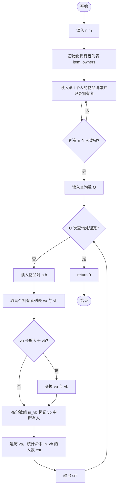
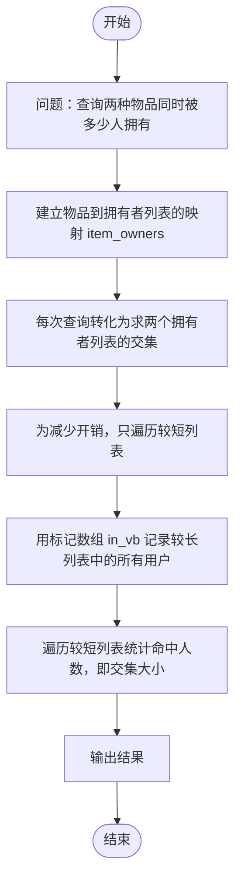

# L2-049 - 鱼与熊掌（25 分）

- **时间限制**: 400 ms
- **内存限制**: 65536 KB
- **代码长度限制**: 16 KB

---

## 题目描述


《孟子 · 告子上》有名言：“鱼，我所欲也，熊掌，亦我所欲也；二者不可得兼，舍鱼而取熊掌者也。”但这世界上还是有一些人可以做到鱼与熊掌兼得的。
给定 $n$ 个人对 $m$ 种物品的拥有关系。对其中任意一对物品种类（例如“鱼与熊掌”），请你统计有多少人能够兼得？

### 输入格式:

输入首先在第一行给出 2 个正整数，分别是：$n$（$\le 10^5$）为总人数（所有人从 1 到 $n$ 编号）、$m$（$2\le m \le 10^5$）为物品种类的总数（所有物品种类从 1 到 $m$ 编号）。
随后 $n$ 行，第 $i$ 行（$1\le i \le n$）给出编号为 $i$ 的人所拥有的物品种类清单，格式为：
```
K M[1] M[2] ... M[K]
```
其中 `K`（$\le 10^3$）是该人拥有的物品种类数量，后面的 `M[*]` 是物品种类的编号。题目保证每个人的物品种类清单中都没有重复给出的种类。
最后是查询信息：首先在一行中给出查询总量 $Q$（$\le 100$），随后 $Q$ 行，每行给出一对物品种类编号，其间以空格分隔。题目保证物品种类编号都是合法存在的。

### 输出格式:

对每一次查询，在一行中输出两种物品兼得的人数。

### 输入样例:
```in
4 8
3 4 1 8
4 7 1 8 4
5 6 5 1 2 3
4 3 2 4 8
3
2 3
7 6
8 4
```

### 输出样例:
```out
2
0
3
```

## 示例

### 示例 1

**输入:**
```
4 8
3 4 1 8
4 7 1 8 4
5 6 5 1 2 3
4 3 2 4 8
3
2 3
7 6
8 4
```

**输出:**
```
2
0
3
```

---

## 题目详解

### 一、解题思路

本题要回答的是：对每次查询的一对物品种类 `(a, b)`，统计有多少人**同时**拥有这两种物品。核心做法是建立"物品 → 拥有者列表"的倒排索引：

1. 读入所有人的物品清单，对每种物品 `item`，把所有拥有它的用户编号存入 `item_owners[item]` 列表。
2. 每次查询 `(a, b)` 就转化为求两个拥有者列表 `item_owners[a]` 与 `item_owners[b]` 的**交集大小**。
3. 直接求交集需要对两个列表分别遍历。为了减少开销，代码先把较长的列表中的所有人用布尔数组 `in_vb` 标记，再只遍历较短的列表统计"命中"人数，从而得到交集大小。
4. 由于每人的物品清单没有重复，同一人不会在同一个列表中重复出现，因此交集统计不会重复计数。

复杂度方面：每次查询的时间为 O(较长列表长度 + 较短列表长度)，整体 O(总物品拥有关系数 + Q×n)，可满足 $n\le 10^5$、$Q\le 100$ 的数据规模。

### 二、代码流程说明

1. 读入人数 `n` 与物品种类数 `m`，定义 `item_owners` 为大小为 `m + 1` 的 `vector<vector<int>>`，下标对应物品编号。
2. 循环 `i` 从 1 到 `n` 读入每个人的清单：先读入该人拥有的物品种类数 `k`，再循环读入 `k` 个物品编号 `item`，并把人的编号 `i` 追加到 `item_owners[item]`。
3. 读入查询总数 `Q`。
4. 在 `while (Q--)` 循环中依次处理每次查询：
   - 读入物品种类 `a`、`b`，取引用 `va = item_owners[a]`、`vb = item_owners[b]`。
   - 初始化计数器 `cnt = 0`。
   - 若 `va.size() > vb.size()`，交换 `va` 与 `vb`，保证后续遍历的是较短列表。
   - 定义布尔数组 `in_vb`（大小为 `n + 1`），把 `vb` 中所有用户编号标记为 true。
   - 遍历 `va` 中的每个用户编号 `x`，若 `in_vb[x]` 为 true，则 `cnt++`。
   - 输出 `cnt`。
5. 所有查询处理完毕后 `return 0`。

### 三、代码流程图



### 四、解题流程图


