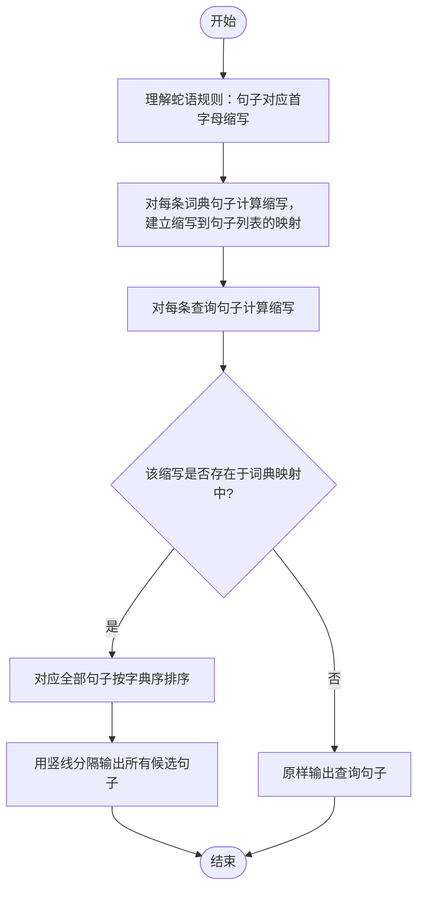

# L2-050 - 懂蛇语（25 分）

- **时间限制**: 400 ms
- **内存限制**: 65536 KB
- **代码长度限制**: 16 KB

---

## 题目描述


在《一年一度喜剧大赛》第二季中有一部作品叫《警察和我之蛇我其谁》，其中“毒蛇帮”内部用了一种加密语言，称为“蛇语”。蛇语的规则是，在说一句话 A 时，首先提取 A 的每个字的首字母，然后把整句话替换为另一句话 B，B 中每个字的首字母与 A 中提取出的字母依次相同。例如二当家说“九点下班哈”，对应首字母缩写是 `JDXBH`，他们解释为实际想说的是“京东新百货”……
本题就请你写一个蛇语的自动翻译工具，将输入的蛇语转换为实际要表达的句子。

### 输入格式:

输入第一行给出一个正整数 $$N$$（$$\le 10^5$$），为蛇语词典中句子的个数。随后 $$N$$ 行，每行用汉语拼音给出一句话。每句话由小写英文字母和空格组成，每个字的拼音由不超过 6 个小写英文字母组成，两个字的拼音之间用空格分隔。题目保证每句话总长度不超过 50 个字符，用回车结尾。注意：回车不算句中字符。
随后在一行中给出一个正整数 $$M$$（$$\le 10^3$$），为查询次数。后面跟 $$M$$ 行，每行用汉语拼音给出需要查询的一句话，格式同上。

### 输出格式:

对每一句查询，在一行中输出其对应的句子。如果句子不唯一，则按整句的字母序输出，句子间用 `|` 分隔。如果查不到，则将输入的句子原样输出。
注意：输出句子时，必须保持句中所有字符不变，包括空格。

### 输入样例:
```in
8
yong yuan de shen
yong yuan de she
jing dong xin bai huo
she yu wo ye hui shuo yi dian dian
liang wei bu yao chong dong
yi  dian dian
ni hui shuo she yu a
yong yuan de sha
7
jiu dian xia ban ha
shao ye wu ya he shui you dian duo
liu wan bu yao ci dao
ni hai shi su yan a
yao diao deng
sha ye ting bu jian
y y d s
```

### 输出样例:
```out
jing dong xin bai huo
she yu wo ye hui shuo yi dian dian
liang wei bu yao chong dong
ni hui shuo she yu a
yi  dian dian
sha ye ting bu jian
yong yuan de sha|yong yuan de she|yong yuan de shen
```

## 示例

### 示例 1

**输入:**
```
8
yong yuan de shen
yong yuan de she
jing dong xin bai huo
she yu wo ye hui shuo yi dian dian
liang wei bu yao chong dong
yi  dian dian
ni hui shuo she yu a
yong yuan de sha
7
jiu dian xia ban ha
shao ye wu ya he shui you dian duo
liu wan bu yao ci dao
ni hai shi su yan a
yao diao deng
sha ye ting bu jian
y y d s
```

**输出:**
```
jing dong xin bai huo
she yu wo ye hui shuo yi dian dian
liang wei bu yao chong dong
ni hui shuo she yu a
yi  dian dian
sha ye ting bu jian
yong yuan de sha|yong yuan de she|yong yuan de shen
```

---

## 题目详解

### 一、解题思路

蛇语的本质是"句子 ↔ 首字母缩写"的映射关系：一句话中每个字（拼音单词）的首字母依次拼接，就得到该句的缩写。例如 `jiu dian xia ban ha` 的缩写是 `JDXBH`。因此翻译问题转化为：已知一批词典句子，查询时给出一个句子，找出词典中与它缩写相同的所有句子。

算法分为两个阶段：

1. **建字典**：对 N 条词典句子，逐行用 `istringstream` 按空白拆分单词，把每个单词的首字母拼接成缩写 `abbrev`，再将句子原文存进 `dict[abbrev]` 对应的列表。由于使用 `unordered_map<string, vector<string>>`，同一缩写的多条句子会存进同一个列表。
2. **处理查询**：对每条查询句子同样计算缩写，若该缩写存在于字典中，则取出列表按字典序 `sort` 排序后用 `|` 分隔输出；若不存在，则把查询句子原样输出。

注意两点：读数字后要用 `cin.ignore()` 消化换行符，保证 `getline` 能正确读入整行；句子中的空格必须原样保留，因此直接以整行字符串为单位存储和输出。

### 二、代码流程说明

1. 读入词典句子数 `N`，调用 `cin.ignore()` 丢弃上一行输入末尾的换行符。
2. 定义缩写到句子的映射 `dict`：`unordered_map<string, vector<string>>`。
3. 循环 N 次建立词典：
   - `getline(cin, line)` 读入整句词典句子；
   - 用 `istringstream iss(line)` 拆分：先读第一个单词 `first`，取 `first[0]` 加入 `abbrev`；
   - 在 `while (iss >> word)` 循环中依次取后续每个单词的首字母拼入 `abbrev`；
   - 执行 `dict[abbrev].push_back(line)` 把原文存入对应缩写列表。
4. 读入查询次数 `M`，再次 `cin.ignore()`。
5. 循环 M 次处理查询：
   - `getline` 读入查询句子 `line`，用同样的方法计算其缩写 `abbrev`；
   - 若 `dict.count(abbrev)` 非 0：取引用 `matches = dict[abbrev]`，调用 `sort` 按字典序排序，再用 `|` 分隔依次输出全部句子，最后换行；
   - 否则：原样输出 `line`。
6. 所有查询处理完毕，`return 0`。

### 三、代码流程图

```mermaid
flowchart TD
    A([开始]) --> B[读入 N 并消化换行符]
    B --> C[定义缩写到句子的字典 dict]
    C --> D[读入一行词典句子 line]
    D --> E[用 istringstream 拆分单词]
    E --> F[拼接每个单词首字母得到缩写 abbrev]
    F --> G[把 line 存入 dict[abbrev]]
    G --> H{N 条词典句子读完?}
    H -- 否 --> D
    H -- 是 --> I[读入 M 并消化换行符]
    I --> J[读入一行查询句子 line]
    J --> K[同样计算其缩写 abbrev]
    K --> L{dict 中存在该缩写?}
    L -- 否 --> M[原样输出查询句子]
    L -- 是 --> N[取出 matches 列表并排序]
    N --> O[用 | 分隔输出所有匹配句子]
    M --> P{M 条查询处理完?}
    O --> P
    P -- 否 --> J
    P -- 是 --> Q[return 0]
    Q --> R([结束])
```

### 四、解题流程图


