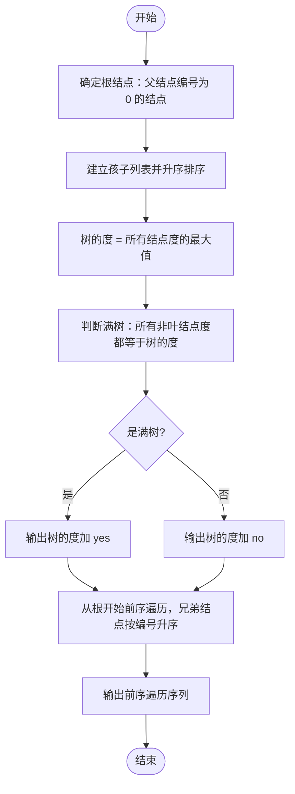

# L2-051 - 满树的遍历（25 分）

- **时间限制**: 400 ms
- **内存限制**: 65536 KB
- **代码长度限制**: 16 KB

---

## 题目描述

一棵“$k$ 阶满树”是指树中所有非叶结点的度都是 $k$ 的树。给定一棵树，你需要判断其是否为 $k$ 阶满树，并输出其前序遍历序列。

注：树中结点的度是其拥有的子树的个数，而树的度是树内各结点的度的最大值。

### 输入格式:

输入首先在第一行给出一个正整数 $n$（$\le 10^5$），是树中结点的个数。于是设所有结点从 1 到 $n$ 编号。
随后 $n$ 行，第 $i$ 行（$1\le i \le n$）给出第 $i$ 个结点的父结点编号。根结点没有父结点，则对应的父结点编号为 `0`。题目保证给出的是一棵合法多叉树，只有唯一根结点。

### 输出格式:

首先在一行中输出该树的度。如果输入的树是 $k$ 阶满树，则加 1 个空格后输出 `yes`，否则输出 `no`。最后在第二行输出该树的前序遍历序列，数字间以 1 个空格分隔，行首尾不得有多余空格。
注意：兄弟结点按编号升序访问。

### 输入样例 1：
```in
7
6
5
5
6
6
0
5
```

### 输出样例 1：
```out
3 yes
6 1 4 5 2 3 7
```

### 输入样例 2：
```in
7
6
5
5
6
6
0
4
```

### 输出样例 2：
```out
3 no
6 1 4 7 5 2 3
```

## 示例

### 示例 1

**输入:**
```
7
6
5
5
6
6
0
5
```

**输出:**
```
3 yes
6 1 4 5 2 3 7
```

### 示例 2

**输入:**
```
7
6
5
5
6
6
0
4
```

**输出:**
```
3 no
6 1 4 7 5 2 3
```

---

## 题目详解

### 一、解题思路

本题分两步：判断树是否为 k 阶满树，并输出其前序遍历序列。

1. **建树**：输入给的是每个结点的父结点编号，父结点为 0 的结点就是根结点。用 `children` 邻接表存储树结构，把每个结点挂到其父结点的孩子列表中。
2. **求树的度**：结点的度 = 它的孩子个数。树的度是所有结点度的最大值，即 `children[i].size()` 的最大值 `max_degree`。
3. **判断满树**：k 阶满树要求所有非叶结点（有孩子的结点）的度都等于 k。因此只需检查：任何一个非叶结点的孩子数如果不等于 `max_degree`，则该树不是满树（`is_full_kary = false`）。
4. **前序遍历**：题目要求兄弟结点按编号升序访问，所以先把每个结点的孩子列表升序排序，再用显式栈模拟递归：从根开始，弹出栈顶结点并加入前序序列，然后把它的孩子**逆序**压栈（利用栈的后进先出特性，先压入大编号，之后弹出时就能按编号升序输出），最终得到前序遍历序列。
5. **输出**：第一行输出树的度以及 `yes`/`no`，第二行输出前序遍历序列。

### 二、代码流程说明

1. 读入结点总数 `n`，定义 `children` 为大小为 `n + 1` 的 `vector<vector<int>>`，并初始化 `root = 0`。
2. 循环 `i` 从 1 到 `n`：读入第 `i` 个结点的父结点编号 `p`；若 `p == 0`，记录 `root = i`；否则执行 `children[p].push_back(i)`。
3. 对每个结点的孩子列表调用 `sort` 升序排序，保证兄弟结点按编号升序访问。
4. 遍历所有结点，用 `max_degree = max(max_degree, children[i].size())` 求出树的度。
5. 令 `is_full_kary = true`，遍历所有结点：若 `children[i]` 非空且其大小不等于 `max_degree`，则置 `is_full_kary = false` 并跳出循环。
6. 用栈做前序遍历：把 `root` 压入栈 `st`；`while (!st.empty())` 循环中，弹出栈顶 `u` 并加入 `preorder`，再从 `children[u].size() - 1` 到 0 逆序将孩子压栈。
7. 输出 `max_degree`，若 `is_full_kary` 为 true 输出 ` yes`，否则输出 ` no`，然后换行。
8. 输出 `preorder` 前序序列，数字间以单个空格分隔、行首尾无多余空格，换行后 `return 0`。

### 三、代码流程图

```mermaid
flowchart TD
    A([开始]) --> B[读入 n]
    B --> C[循环读入第 i 个结点的父结点 p]
    C --> D{p 等于 0?}
    D -- 是 --> E[记录 root = i]
    D -- 否 --> F[把 i 加入 children[p]]
    E --> G{所有 n 个结点处理完?}
    F --> G
    G -- 否 --> C
    G -- 是 --> H[对每个结点的孩子列表升序排序]
    H --> I[遍历所有结点求孩子数最大值 max_degree]
    I --> J[遍历检查每个非叶结点的度数]
    J --> K{存在非叶结点度数不等于 max_degree?}
    K -- 是 --> L[is_full_kary = false]
    K -- 否 --> M[is_full_kary 保持 true]
    L --> N[把根结点 root 压入栈]
    M --> N
    N --> O{栈非空?}
    O -- 是 --> P[弹出栈顶 u，加入前序序列 preorder]
    P --> Q[把 u 的孩子逆序压栈]
    Q --> O
    O -- 否 --> R[输出 max_degree 与 yes 或 no]
    R --> S[输出 preorder 前序遍历序列]
    S --> T([结束])
```

### 四、解题流程图


