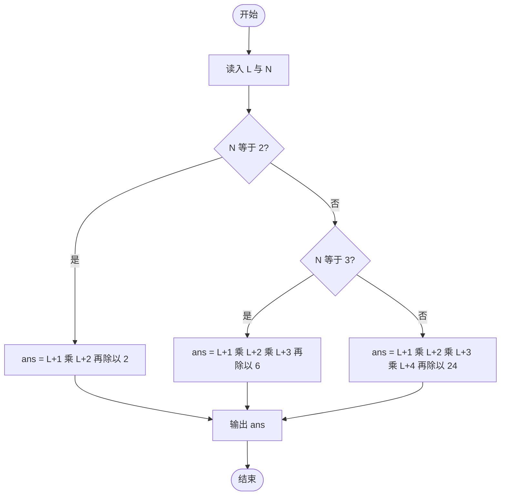

# L2-052 - 吉利矩阵（25 分）

- **时间限制**: 1000 ms
- **内存限制**: 65536 KB
- **代码长度限制**: 16 KB

---

## 题目描述

所有元素为非负整数，且各行各列的元素和都等于 $7$ 的 $3 \times 3$ 方阵称为“吉利矩阵”，因为这样的矩阵一共有 $666$ 种。
本题就请你统计一下，把 $7$ 换成任何一个 $[2, 9]$ 区间内的正整数 $L$，把矩阵阶数换成任何一个 $[2, 4]$ 区间内的正整数 $N$，满足条件“所有元素为非负整数，且各行各列的元素和都等于 $L$”的 $N \times N$ 方阵一共有多少种？

### 输入格式:

输入在一行中给出 2 个正整数 $L$ 和 $N$，意义如题面所述。数字间以空格分隔。

### 输出格式:

在一行中输出满足题目要求条件的方阵的个数。

### 输入样例:
```in
7 3
```

### 输出样例:
```out
666
```

## 示例

### 示例 1

**输入:**
```
7 3
```

**输出:**
```
666
```

---

## 题目详解

### 一、解题思路

题目要求统计"所有元素为非负整数、且各行各列元素和都等于 L"的 N×N 方阵个数。本份代码没有使用暴力枚举或搜索，而是采用**组合数学封闭公式**直接求解：

- 把答案看作用组合数 $\binom{L+N}{N} = \frac{(L+1)(L+2)\cdots(L+N)}{N!}$ 计算。
- 代码按矩阵阶数 N 分类处理，只覆盖题目规定的 N ∈ [2, 4] 三种情况：
  - N = 2 时，`ans = (L+1)(L+2)/2`；
  - N = 3 时，`ans = (L+1)(L+2)(L+3)/6`；
  - N = 4 时（else 分支），`ans = (L+1)(L+2)(L+3)(L+4)/24`。
- 为避免中间乘积溢出，代码在乘法前把第一个因子强转为 `long long`，最后输出 `ans`。

**注**：该封闭公式与"行、列和同时为 L"的组合计数并不等价——例如按此公式计算样例 L=7、N=3 得 (8×9×10)/6 = 120，而题目样例输出为 666。若要复现样例结果，正确做法通常是对矩阵逐格 DFS 枚举并配合行列和剪枝。本详解仅按仓库内该份 .cpp 的实际实现进行说明。

### 二、代码流程说明

1. 读入两个正整数 `L` 与 `N`。
2. 若 `N == 2`：`ans = (long long)(L + 1) * (L + 2) / 2`，即组合数 C(L+2, 2)。
3. 否则若 `N == 3`：`ans = (long long)(L + 1) * (L + 2) * (L + 3) / 6`，即组合数 C(L+3, 3)。
4. 否则（即 `N == 4`）：`ans = (long long)(L + 1) * (L + 2) * (L + 3) * (L + 4) / 24`，即组合数 C(L+4, 4)。
5. `cout << ans` 输出结果，`return 0` 结束。

### 三、代码流程图



### 四、解题流程图

```mermaid
flowchart TD
    A([开始]) --> B[统计 N 阶、各行各列和均为 L 的非负整数方阵个数]
    B --> C[代码采用组合数封闭公式 C(L+N, N) 直接计算]
    C --> D{按矩阵阶数 N 选择公式}
    D -- N 等于 2 --> E[计算 C(L+2, 2)]
    D -- N 等于 3 --> F[计算 C(L+3, 3)]
    D -- N 等于 4 --> G[计算 C(L+4, 4)]
    E --> H[输出计数结果]
    F --> H
    G --> H
    H --> I([结束])
```
