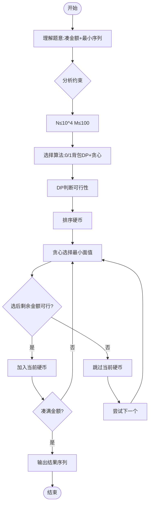

# L3-001 - 凑零钱（30 分）

- **时间限制**: 300 ms
- **内存限制**: 65536 KB
- **代码长度限制**: 16 KB

---

## 题目描述

韩梅梅喜欢满宇宙到处逛街。现在她逛到了一家火星店里，发现这家店有个特别的规矩：你可以用任何星球的硬币付钱，但是绝不找零，当然也不能欠债。韩梅梅手边有 $$10^4$$ 枚来自各个星球的硬币，需要请你帮她盘算一下，是否可能精确凑出要付的款额。

### 输入格式:

输入第一行给出两个正整数：$$N$$（$$\le 10^4$$）是硬币的总个数，$$M$$（$$\le 10^2$$）是韩梅梅要付的款额。第二行给出 $$N$$ 枚硬币的正整数面值。数字间以空格分隔。

### 输出格式:

在一行中输出硬币的面值 $$V_1 \le V_2 \le \cdots \le V_k$$，满足条件 $$V_1 + V_2 + ... + V_k = M$$。数字间以 1 个空格分隔，行首尾不得有多余空格。若解不唯一，则输出最小序列。若无解，则输出 `No Solution`。

注：我们说序列{ $$A[1], A[2], \cdots$$ }比{ $$B[1], B[2], \cdots$$ }“小”，是指存在 $$k \ge 1$$ 使得 $$A[i]=B[i]$$ 对所有 $$i < k$$ 成立，并且 $$A[k] < B[k]$$。

### 输入样例 1：
```in
8 9
5 9 8 7 2 3 4 1
```

### 输出样例 1：
```out
1 3 5
```

### 输入样例 2：
```in
4 8
7 2 4 3
```

### 输出样例 2：
```out
No Solution
```

## 示例

### 示例 1

**输入:**
```
8 9
5 9 8 7 2 3 4 1
```

**输出:**
```
1 3 5
```

### 示例 2

**输入:**
```
4 8
7 2 4 3
```

**输出:**
```
No Solution
```

---

## 题目详解

### 一、解题思路

本题是一个0/1背包变种问题，目标是凑出金额M且输出字典序最小的硬币组合。核心思路：

1. **动态规划判断可行性**：用布尔数组`dp[j]`表示凑出金额j是否可行。初始`dp[0]=true`，对每个硬币逆序更新（0/1背包标准做法）。
2. **贪心策略构造最小序列**：由于要求最小序列（字典序），先将硬币升序排序，然后从小到大尝试选取硬币。若选取当前硬币后剩余金额仍可凑出（即`dp[remain-coin[i]]`为true），则选择该硬币。
3. **关键优化**：金额M≤100很小，硬币N≤10^4，时间复杂度O(N×M)完全可接受。

### 二、代码流程说明

1. 读取整数N和M，分别表示硬币个数和目标金额
2. 读取N个硬币面值存入数组`coin[]`
3. 对`coin[]`进行升序排序
4. 初始化布尔数组`dp[M+1]`，`dp[0]=true`，其余为`false`
5. 遍历每个硬币`coin[i]`，从M到`coin[i]`逆序更新：`dp[j] = dp[j] || dp[j-coin[i]]`
6. 若`dp[M]`为`false`，输出"No Solution"并结束
7. 初始化结果列表`ans`，剩余金额`remain = M`
8. 从小到大遍历排序后的硬币，若`dp[remain - coin[i]]`为`true`，将`coin[i]`加入`ans`，`remain -= coin[i]`
9. 当`remain == 0`时结束
10. 输出`ans`中所有硬币面值

### 三、代码流程图

```mermaid
flowchart TD
    A([开始]) --> B[/读取N, M/]
    B --> C[/读取N个硬币面值/]
    C --> D[升序排序硬币]
    D --> E[初始化dp数组 dp[0]=true]
    E --> F{遍历每个硬币}
    F --> G[从M到coin[i]逆序更新dp]
    G --> H{还有更多硬币?}
    H -- 是 --> F
    H -- 否 --> I{dp[M]为true?}
    I -- 否 --> J[/输出No Solution/]
    J --> K([结束])
    I -- 是 --> L[初始化ans列表 remain=M]
    L --> M{遍历排序后硬币}
    M --> N{dp[remain-coin[i]]为true?}
    N -- 是 --> O[coin[i]加入ans remain-=coin[i]]
    O --> P{remain==0?}
    P -- 否 --> M
    P -- 是 --> Q[/输出ans/]
    N -- 否 --> M
    Q --> K
```

### 四、解题流程图



### 示例 3

**输入:**
```
8 9
5 9 8 7 2 3 4 1
```

**输出:**
```
1 3 5
```

### 示例 4

**输入:**
```
4 8
7 2 4 3
```

**输出:**
```
No Solution
```
