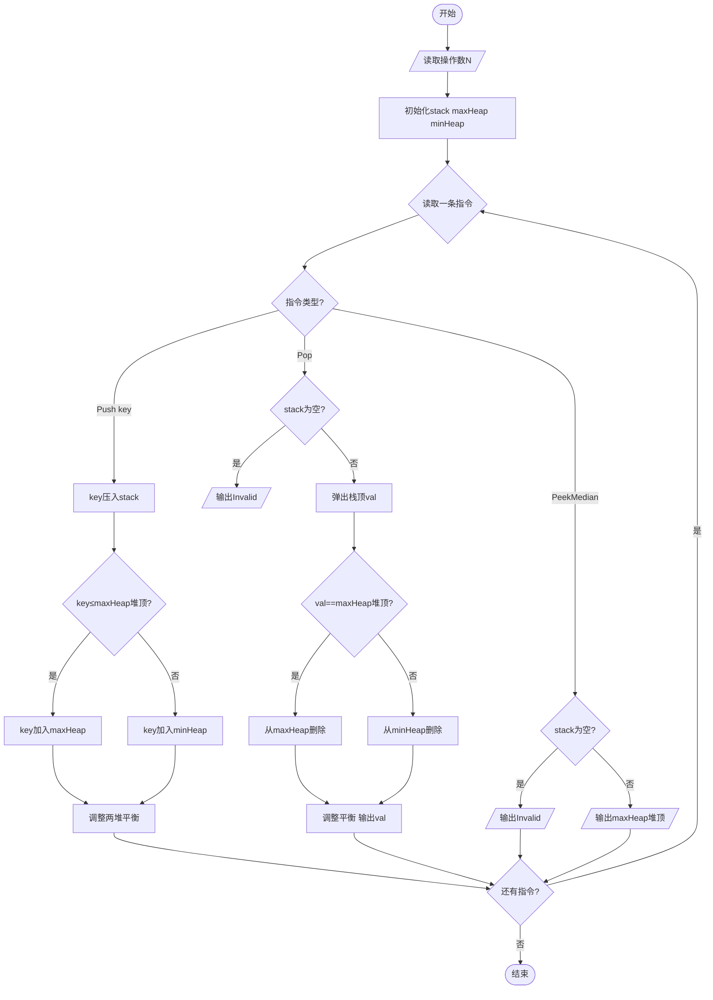
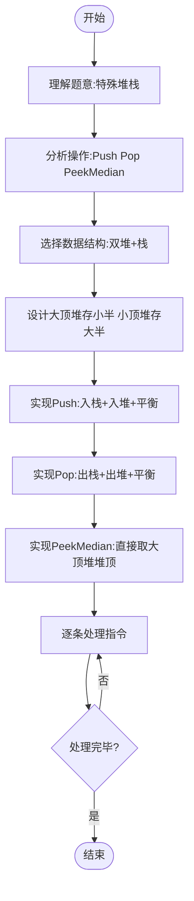

# L3-002 - 特殊堆栈（30 分）

- **时间限制**: 400 ms
- **内存限制**: 65536 KB
- **代码长度限制**: 16 KB

---

## 题目描述

堆栈是一种经典的后进先出的线性结构，相关的操作主要有“入栈”（在堆栈顶插入一个元素）和“出栈”（将栈顶元素返回并从堆栈中删除）。本题要求你实现另一个附加的操作：“取中值”——即返回所有堆栈中元素键值的中值。给定 N 个元素，如果 N 是偶数，则中值定义为第 N/2 小元；若是奇数，则为第 (N+1)/2 小元。

### 输入格式:

输入的第一行是正整数 N（$$\le 10^5$$）。随后 N 行，每行给出一句指令，为以下 3 种之一：

```
Push key
Pop
PeekMedian
```

其中 `key` 是不超过 $$10^5$$ 的正整数；`Push` 表示“入栈”；`Pop` 表示“出栈”；`PeekMedian` 表示“取中值”。

### 输出格式:

对每个 `Push` 操作，将 `key` 插入堆栈，无需输出；对每个 `Pop` 或 `PeekMedian` 操作，在一行中输出相应的返回值。若操作非法，则对应输出 `Invalid`。

### 输入样例:
```in
17
Pop
PeekMedian
Push 3
PeekMedian
Push 2
PeekMedian
Push 1
PeekMedian
Pop
Pop
Push 5
Push 4
PeekMedian
Pop
Pop
Pop
Pop
```

### 输出样例:
```out
Invalid
Invalid
3
2
2
1
2
4
4
5
3
Invalid
```

## 示例

### 示例 1

**输入:**
```
17
Pop
PeekMedian
Push 3
PeekMedian
Push 2
PeekMedian
Push 1
PeekMedian
Pop
Pop
Push 5
Push 4
PeekMedian
Pop
Pop
Pop
Pop
```

**输出:**
```
Invalid
Invalid
3
2
2
1
2
4
4
5
3
Invalid
```

---

## 题目详解

### 一、解题思路

本题要求实现一个特殊堆栈，支持Push、Pop和PeekMedian（取中值）三种操作。关键在于高效实现取中值操作。

核心思路：使用**两个堆**配合一个主栈：
1. 主栈`stack`存储所有元素，支持Push和Pop
2. 大顶堆`maxHeap`存储较小的一半元素（堆顶即为中值）
3. 小顶堆`minHeap`存储较大的一半元素
4. 维持平衡：两个堆的大小差不超过1，且`maxHeap`堆顶≤`minHeap`堆顶
5. Push时根据值与中值的比较插入相应堆并调整平衡
6. Pop时弹出栈顶元素，若弹出的是堆中元素则同步调整堆
7. PeekMedian直接返回`maxHeap`堆顶（偶数个元素时取第N/2小，即大顶堆堆顶）

时间复杂度：Push和PeekMedian为O(log N)，Pop最坏O(N)。

### 二、代码流程说明

1. 读取操作数N
2. 初始化主栈`stack`、大顶堆`maxHeap`、小顶堆`minHeap`
3. 对每条指令进行判断：
4. 若为`Push key`：将key压入`stack`，若key≤`maxHeap`堆顶或`maxHeap`为空则加入`maxHeap`，否则加入`minHeap`，然后调整两堆平衡
5. 若为`Pop`：若`stack`为空则输出`Invalid`，否则弹出栈顶`val`，若`val`等于`maxHeap`堆顶则从`maxHeap`删除，否则从`minHeap`删除，调整平衡，输出`val`
6. 若为`PeekMedian`：若`stack`为空则输出`Invalid`，否则输出`maxHeap`堆顶
7. 循环处理所有指令

### 三、代码流程图



### 四、解题流程图


Invalid
Invalid
3
2
2
1
2
4
4
5
3
Invalid
```
