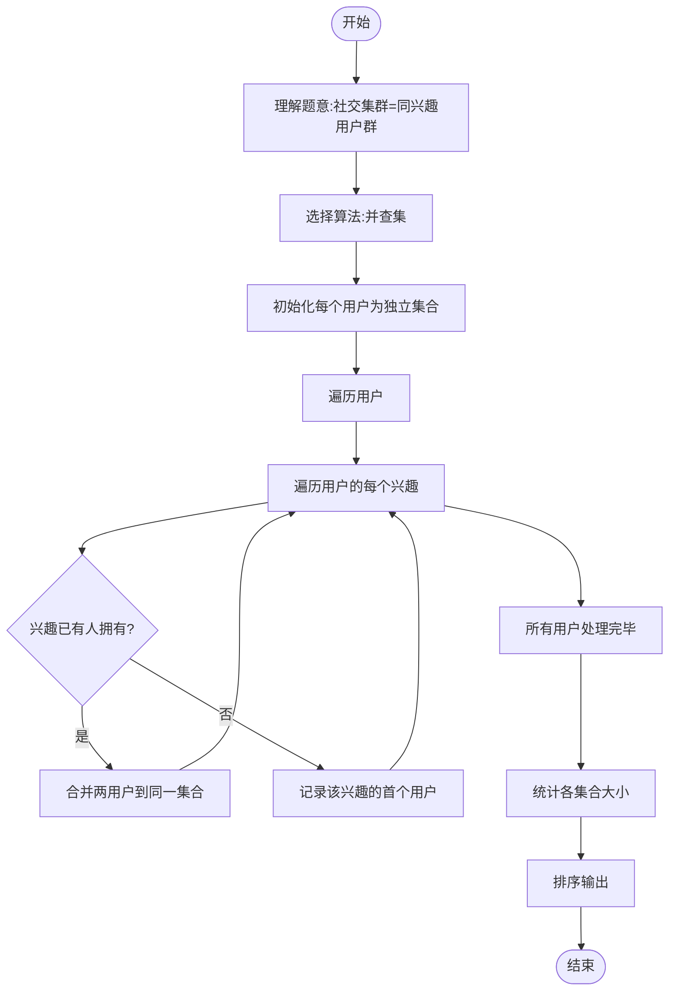

# L3-003 - 社交集群（30 分）

- **时间限制**: 1200 ms
- **内存限制**: 65536 KB
- **代码长度限制**: 16 KB

---

## 题目描述

当你在社交网络平台注册时，一般总是被要求填写你的个人兴趣爱好，以便找到具有相同兴趣爱好的潜在的朋友。一个“社交集群”是指部分兴趣爱好相同的人的集合。你需要找出所有的社交集群。

### 输入格式:

输入在第一行给出一个正整数 N（$$\le 1000$$），为社交网络平台注册的所有用户的人数。于是这些人从 1 到 N 编号。随后 N 行，每行按以下格式给出一个人的兴趣爱好列表：

$$K_i$$: $$h_i[1]$$ $$h_i[2]$$ ... $$h_i[K_i]$$

其中$$K_i (>0)$$是兴趣爱好的个数，$$h_i[j]$$是第$$j$$个兴趣爱好的编号，为区间 [1, 1000] 内的整数。

### 输出格式:

首先在一行中输出不同的社交集群的个数。随后第二行按非增序输出每个集群中的人数。数字间以一个空格分隔，行末不得有多余空格。

### 输入样例:
```in
8
3: 2 7 10
1: 4
2: 5 3
1: 4
1: 3
1: 4
4: 6 8 1 5
1: 4
```

### 输出样例:
```out
3
4 3 1
```

## 示例

### 示例 1

**输入:**
```
8
3: 2 7 10
1: 4
2: 5 3
1: 4
1: 3
1: 4
4: 6 8 1 5
1: 4
```

**输出:**
```
3
4 3 1
```

---

## 题目详解

### 一、解题思路

本题要求找出社交网络中的"社交集群"——即兴趣爱好相同的用户群体。核心算法是**并查集（Union-Find）**：

1. 将每个用户视为一个独立的集合
2. 若两个用户有共同的兴趣爱好，则将他们合并到同一集合
3. 关键技巧：对每个兴趣爱好h，记录第一个拥有该爱好的用户，后续拥有相同爱好的用户直接与该用户合并
4. 最后统计所有集合的大小，按非增序输出

### 二、代码流程说明

1. 读取用户数N
2. 初始化并查集，每个用户自成一个集合，`fa[i]=i`，`size[i]=1`
3. 初始化`interest`数组，`interest[h]`记录第一个拥有兴趣h的用户编号
4. 遍历每个用户i：
5. 读取该用户的兴趣爱好列表
6. 对每个兴趣h：若`interest[h]`已存在，将用户i与`interest[h]`合并；否则`interest[h]=i`
7. 遍历所有用户，通过`find`操作找到其所在集合的根
8. 统计每个根集合的大小
9. 将所有非零集合大小排序（非增序）
10. 输出集群个数和各集群人数

### 三、代码流程图

```mermaid
flowchart TD
    A([开始]) --> B[/读取用户数N/]
    B --> C[初始化并查集 fa[i]=i size[i]=1]
    C --> D[初始化interest数组]
    D --> E{遍历每个用户i}
    E --> F[/读取用户i的兴趣列表/]
    F --> G{遍历每个兴趣h}
    G --> H{interest[h]已存在?}
    H -- 是 --> I[合并用户i与interest[h]]
    H -- 否 --> J[interest[h]=i]
    I --> G
    J --> G
    G --> K{还有更多用户?}
    K -- 是 --> E
    K -- 否 --> L[统计各集合大小]
    L --> M[非增序排序]
    M --> N[/输出集群个数和人数/]
    N --> O([结束])
```

### 四、解题流程图


