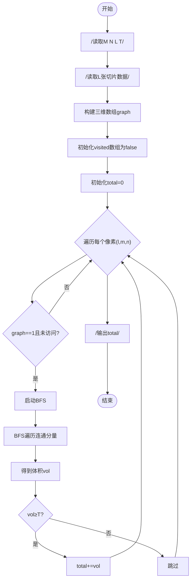
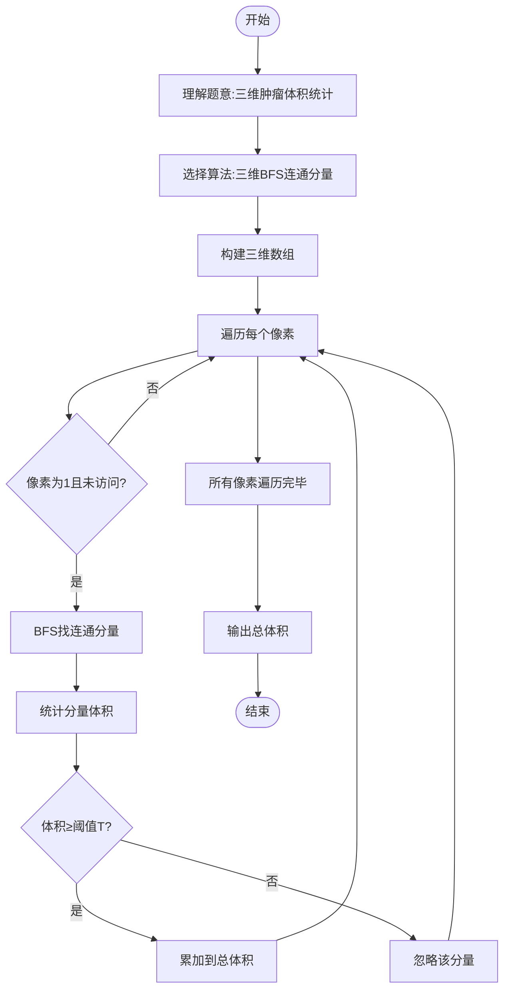

# L3-004 - 肿瘤诊断（30 分）

- **时间限制**: 600 ms
- **内存限制**: 65536 KB
- **代码长度限制**: 16 KB

---

## 题目描述

在诊断肿瘤疾病时，计算肿瘤体积是很重要的一环。给定病灶扫描切片中标注出的疑似肿瘤区域，请你计算肿瘤的体积。

### 输入格式:

输入第一行给出4个正整数：$$M$$、$$N$$、$$L$$、$$T$$，其中$$M$$和$$N$$是每张切片的尺寸（即每张切片是一个$$M\times N$$的像素矩阵。最大分辨率是$$1286\times 128$$）；$$L$$（$$\le 60$$）是切片的张数；$$T$$是一个整数阈值（若疑似肿瘤的连通体体积小于$$T$$，则该小块忽略不计）。

最后给出$$L$$张切片。每张用一个由0和1组成的$$M\times N$$的矩阵表示，其中1表示疑似肿瘤的像素，0表示正常像素。由于切片厚度可以认为是一个常数，于是我们只要数连通体中1的个数就可以得到体积了。麻烦的是，可能存在多个肿瘤，这时我们只统计那些体积不小于$$T$$的。两个像素被认为是“连通的”，如果它们有一个共同的切面，如下图所示，所有6个红色的像素都与蓝色的像素连通。


### 输出格式:

在一行中输出肿瘤的总体积。

### 输入样例:
```in
3 4 5 2
1 1 1 1
1 1 1 1
1 1 1 1
0 0 1 1
0 0 1 1
0 0 1 1
1 0 1 1
0 1 0 0
0 0 0 0
1 0 1 1
0 0 0 0
0 0 0 0
0 0 0 1
0 0 0 1
1 0 0 0
```

### 输出样例:
```out
26
```

## 示例

### 示例 1

**输入:**
```
3 4 5 2
1 1 1 1
1 1 1 1
1 1 1 1
0 0 1 1
0 0 1 1
0 0 1 1
1 0 1 1
0 1 0 0
0 0 0 0
1 0 1 1
0 0 0 0
0 0 0 0
0 0 0 1
0 0 0 1
1 0 0 0
```

**输出:**
```
26
```

---

## 题目详解

### 一、解题思路

本题是三维连通分量问题，需要在L张切片组成的三维矩阵中找出所有肿瘤区域（值为1的连通分量），统计体积≥阈值T的连通分量的总体积。

核心算法：**三维BFS（广度优先搜索）**
1. 将L张M×N的切片堆叠成一个三维数组`[L][M][N]`
2. 对每个值为1且未访问的像素点进行BFS/DFS，找出其所在的连通分量
3. 连通规则：两个像素点有一个共同面（六连通：上、下、左、右、前、后）
4. 每个连通分量中1的个数即为肿瘤体积
5. 只累加体积≥T的连通分量

### 二、代码流程说明

1. 读取M、N、L、T，分别表示切片行数、列数、张数和体积阈值
2. 读取L张切片数据，存入三维数组`graph[l][m][n]`
3. 初始化三维visited数组，全部为`false`
4. 遍历每个切片的每个像素`(l, m, n)`：
5. 若`graph[l][m][n]==1`且`visited[l][m][n]==false`，则启动BFS
6. BFS使用队列，将起点入队并标记已访问
7. 对队列中每个元素，检查6个方向的相邻像素是否连通且未访问
8. BFS结束后得到连通分量的体积`vol`
9. 若`vol ≥ T`，将`vol`累加到总体积`total`
10. 遍历完成后输出`total`

### 三、代码流程图



### 四、解题流程图


