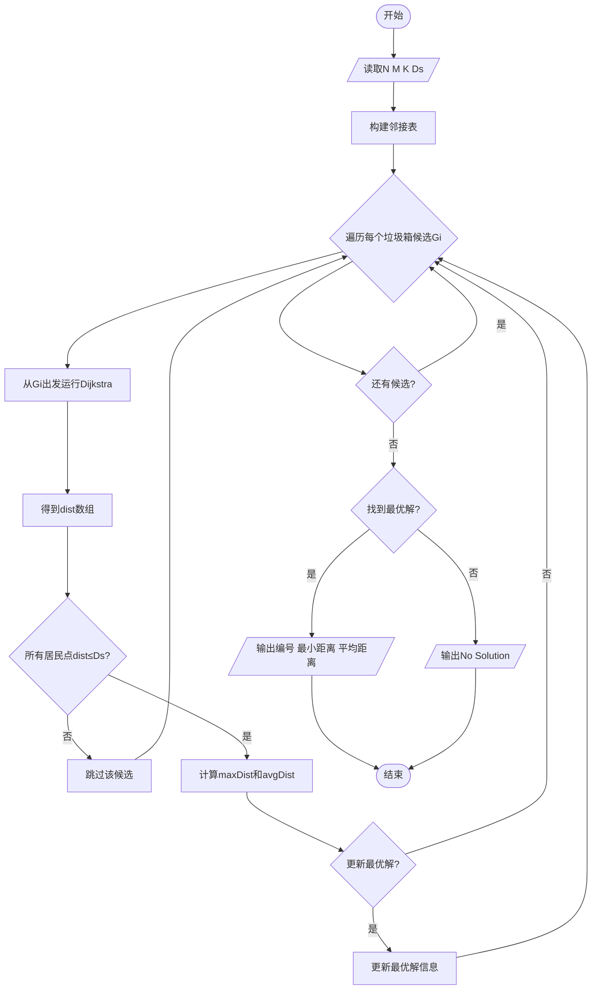
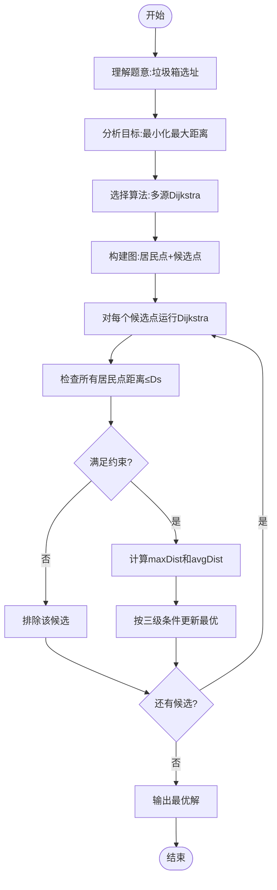

# L3-005 - 垃圾箱分布（30 分）

- **时间限制**: 200 ms
- **内存限制**: 65536 KB
- **代码长度限制**: 16 KB

---

## 题目描述

大家倒垃圾的时候，都希望垃圾箱距离自己比较近，但是谁都不愿意守着垃圾箱住。所以垃圾箱的位置必须选在到所有居民点的最短距离最长的地方，同时还要保证每个居民点都在距离它一个不太远的范围内。

现给定一个居民区的地图，以及若干垃圾箱的候选地点，请你推荐最合适的地点。如果解不唯一，则输出到所有居民点的平均距离最短的那个解。如果这样的解还是不唯一，则输出编号最小的地点。

### 输入格式:

输入第一行给出4个正整数：$$N$$（$$\le 10^3$$）是居民点的个数；$$M$$（$$\le 10$$）是垃圾箱候选地点的个数；$$K$$（$$\le 10^4$$）是居民点和垃圾箱候选地点之间的道路的条数；$$D_S$$是居民点与垃圾箱之间不能超过的最大距离。所有的居民点从1到$$N$$编号，所有的垃圾箱候选地点从$$G1$$到$$GM$$编号。

随后$$K$$行，每行按下列格式描述一条道路：
```
P1 P2 Dist
```
其中`P1`和`P2`是道路两端点的编号，端点可以是居民点，也可以是垃圾箱候选点。`Dist`是道路的长度，是一个正整数。

### 输出格式:

首先在第一行输出最佳候选地点的编号。然后在第二行输出该地点到所有居民点的最小距离和平均距离。数字间以空格分隔，保留小数点后1位。如果解不存在，则输出`No Solution`。

### 输入样例 1：
```in
4 3 11 5
1 2 2
1 4 2
1 G1 4
1 G2 3
2 3 2
2 G2 1
3 4 2
3 G3 2
4 G1 3
G2 G1 1
G3 G2 2
```

### 输出样例 1：
```out
G1
2.0 3.3
```

### 输入样例 2：
```in
2 1 2 10
1 G1 9
2 G1 20
```

### 输出样例 2：
```out
No Solution
```

## 示例

### 示例 1

**输入:**
```
4 3 11 5
1 2 2
1 4 2
1 G1 4
1 G2 3
2 3 2
2 G2 1
3 4 2
3 G3 2
4 G1 3
G2 G1 1
G3 G2 2
```

**输出:**
```
G1
2.0 3.3
```

### 示例 2

**输入:**
```
2 1 2 10
1 G1 9
2 G1 20
```

**输出:**
```
No Solution
```

---

## 题目详解

### 一、解题思路

本题是一个经典的**最短路径选址问题**。需要在M个垃圾箱候选地点中选择最优位置，满足：
1. 所有居民点到该垃圾箱的距离都不超过Ds
2. 到所有居民点的最短距离最长的地方最小（即最小化最大距离）
3. 若并列，选择平均距离最短的
4. 若仍并列，选择编号最小的

核心算法：**Dijkstra最短路径**
- 将居民点和垃圾箱候选点都作为图的节点
- 对每个候选垃圾箱，运行一次Dijkstra计算到所有居民点的最短距离
- 按上述条件筛选最优解

### 二、代码流程说明

1. 读取N（居民点数）、M（垃圾箱候选数）、K（道路数）、Ds（最大允许距离）
2. 构建邻接表存储道路信息，居民点编号1~N，垃圾箱编号N+1~N+M
3. 对每个垃圾箱候选点`Gi`：
4. 从`Gi`出发运行Dijkstra，计算到所有节点的最短距离`dist[]`
5. 检查所有居民点的距离是否都≤Ds
6. 若是，记录最大距离`maxDist`和平均距离`avgDist`
7. 与当前最优解比较：优先选`maxDist`更小的，再选`avgDist`更小的，最后选编号更小的
8. 输出最优垃圾箱编号、最小距离和平均距离；若无解则输出"No Solution"

### 三、代码流程图



### 四、解题流程图


