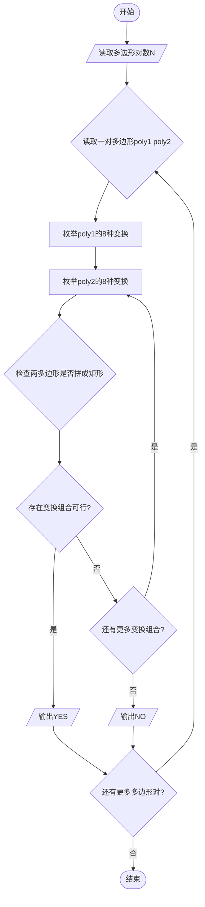
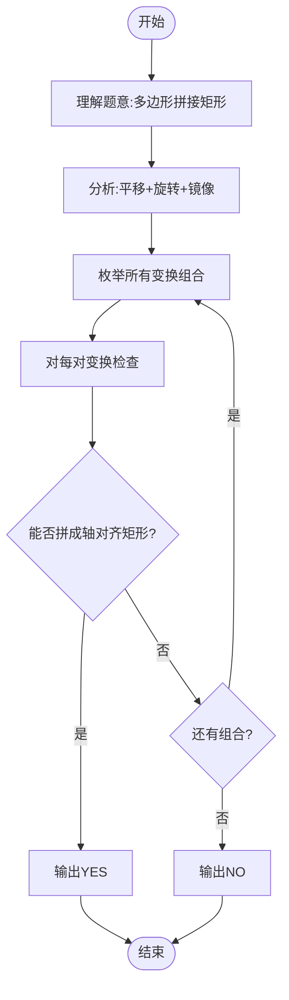

# L3-006 - 迎风一刀斩（30 分）

- **时间限制**: 150 ms
- **内存限制**: 65536 KB
- **代码长度限制**: 16 KB

---

## 题目描述

迎着一面矩形的大旗一刀斩下，如果你的刀够快的话，这笔直一刀可以切出两块多边形的残片。反过来说，如果有人拿着两块残片来吹牛，说这是自己迎风一刀斩落的，你能检查一下这是不是真的吗？

注意摆在你面前的两个多边形可不一定是端端正正摆好的，它们可能被平移、被旋转（逆时针90度、180度、或270度），或者被（镜像）翻面。

这里假设原始大旗的四边都与坐标轴是平行的。

### 输入格式:

输入第一行给出一个正整数$$N$$（$$\le 20$$），随后给出$$N$$对多边形。每个多边形按下列格式给出：

$$k\quad x_1\quad y_1\cdots x_k\quad y_k$$

其中$$k$$（$$2 < k \le 10$$）是多边形顶点个数；$$(x_i, y_i)$$（$$0 \le x_i, y_i \le 10^8$$）是顶点坐标，按照顺时针或逆时针的顺序给出。

注意：题目保证没有多余顶点。即每个多边形的顶点都是不重复的，任意3个相邻顶点不共线。

### 输出格式:

对每一对多边形，输出`YES`或者`NO`。

### 输入样例:
```in
8
3 0 0 1 0 1 1
3 0 0 1 1 0 1
3 0 0 1 0 1 1
3 0 0 1 1 0 2
4 0 4 1 4 1 0 0 0
4 4 0 4 1 0 1 0 0
3 0 0 1 1 0 1
4 2 3 1 4 1 7 2 7
5 10 10 10 12 12 12 14 11 14 10
3 28 35 29 35 29 37
3 7 9 8 11 8 9
5 87 26 92 26 92 23 90 22 87 22
5 0 0 2 0 1 1 1 2 0 2
4 0 0 1 1 2 1 2 0
4 0 0 0 1 1 1 2 0
4 0 0 0 1 1 1 2 0
```

### 输出样例:
```out
YES
NO
YES
YES
YES
YES
NO
YES
```

## 示例

### 示例 1

**输入:**
```
8
3 0 0 1 0 1 1
3 0 0 1 1 0 1
3 0 0 1 0 1 1
3 0 0 1 1 0 2
4 0 4 1 4 1 0 0 0
4 4 0 4 1 0 1 0 0
3 0 0 1 1 0 1
4 2 3 1 4 1 7 2 7
5 10 10 10 12 12 12 14 11 14 10
3 28 35 29 35 29 37
3 7 9 8 11 8 9
5 87 26 92 26 92 23 90 22 87 22
5 0 0 2 0 1 1 1 2 0 2
4 0 0 1 1 2 1 2 0
4 0 0 0 1 1 1 2 0
4 0 0 0 1 1 1 2 0
```

**输出:**
```
YES
NO
YES
YES
YES
YES
NO
YES
```

---

## 题目详解

### 一、解题思路

本题判断两个多边形能否通过"一刀斩"从矩形上切出。即两个多边形经平移、旋转（0°/90°/180°/270°）和镜像翻转后，能否拼成一个边平行于坐标轴的矩形。

核心思路：
1. 对每个多边形，枚举所有可能的变换（平移到原点+4种旋转+镜像共8种变换）
2. 变换后的多边形顶点必须为整数坐标
3. 检查两个多边形是否能恰好拼成一个轴对齐矩形
4. 关键判断：将两个多边形的顶点合并，若能组成矩形且两个多边形无重叠，则为YES

### 二、代码流程说明

1. 读取多边形对数N
2. 对每一对多边形（poly1, poly2）：
3. 枚举poly1的所有变换（平移、旋转、镜像）
4. 枚举poly2的所有变换
5. 对每对变换后的多边形，检查是否能拼成矩形
6. 拼装检查：计算两个多边形的凸包或边界，判断是否为矩形且两多边形互补
7. 若存在任何一种变换组合能拼成矩形，输出YES；否则输出NO

### 三、代码流程图



### 四、解题流程图


