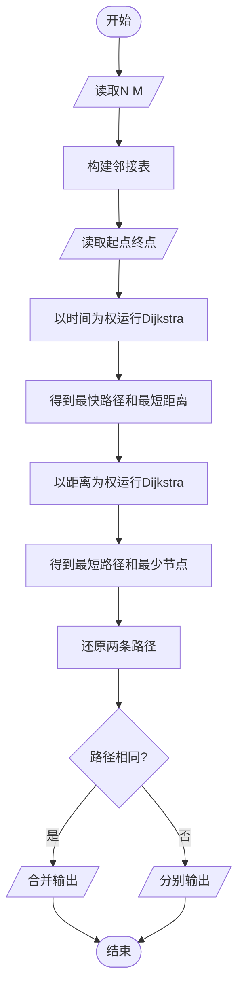
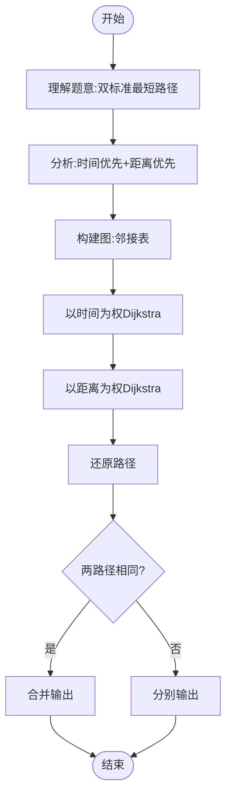

# L3-007 - 天梯地图（30 分）

- **时间限制**: 300 ms
- **内存限制**: 65536 KB
- **代码长度限制**: 16 KB

---

## 题目描述

本题要求你实现一个天梯赛专属在线地图，队员输入自己学校所在地和赛场地点后，该地图应该推荐两条路线：一条是最快到达路线；一条是最短距离的路线。题目保证对任意的查询请求，地图上都至少存在一条可达路线。

### 输入格式:

输入在第一行给出两个正整数`N`（2 $$\le$$ `N` $$\le$$ 500）和`M`，分别为地图中所有标记地点的个数和连接地点的道路条数。随后`M`行，每行按如下格式给出一条道路的信息：

```
V1 V2 one-way length time
```

其中`V1`和`V2`是道路的两个端点的编号（从0到`N`-1）；如果该道路是从`V1`到`V2`的单行线，则`one-way`为1，否则为0；`length`是道路的长度；`time`是通过该路所需要的时间。最后给出一对起点和终点的编号。

### 输出格式:

首先按下列格式输出最快到达的时间`T`和用节点编号表示的路线：

```
Time = T: 起点 => 节点1 => ... => 终点
```

然后在下一行按下列格式输出最短距离`D`和用节点编号表示的路线：

```
Distance = D: 起点 => 节点1 => ... => 终点
```

如果最快到达路线不唯一，则输出几条最快路线中最短的那条，题目保证这条路线是唯一的。而如果最短距离的路线不唯一，则输出途径节点数最少的那条，题目保证这条路线是唯一的。

如果这两条路线是完全一样的，则按下列格式输出：

```
Time = T; Distance = D: 起点 => 节点1 => ... => 终点
```

### 输入样例 1：
```in
10 15
0 1 0 1 1
8 0 0 1 1
4 8 1 1 1
5 4 0 2 3
5 9 1 1 4
0 6 0 1 1
7 3 1 1 2
8 3 1 1 2
2 5 0 2 2
2 1 1 1 1
1 5 0 1 3
1 4 0 1 1
9 7 1 1 3
3 1 0 2 5
6 3 1 2 1
5 3
```

### 输出样例 1：
```out
Time = 6: 5 => 4 => 8 => 3
Distance = 3: 5 => 1 => 3
```

### 输入样例 2：
```in
7 9
0 4 1 1 1
1 6 1 3 1
2 6 1 1 1
2 5 1 2 2
3 0 0 1 1
3 1 1 3 1
3 2 1 2 1
4 5 0 2 2
6 5 1 2 1
3 5
```

### 输出样例 2：
```out
Time = 3; Distance = 4: 3 => 2 => 5
```

## 示例

### 示例 1

**输入:**
```
10 15
0 1 0 1 1
8 0 0 1 1
4 8 1 1 1
5 4 0 2 3
5 9 1 1 4
0 6 0 1 1
7 3 1 1 2
8 3 1 1 2
2 5 0 2 2
2 1 1 1 1
1 5 0 1 3
1 4 0 1 1
9 7 1 1 3
3 1 0 2 5
6 3 1 2 1
5 3
```

**输出:**
```
Time = 6: 5 => 4 => 8 => 3
Distance = 3: 5 => 1 => 3
```

### 示例 2

**输入:**
```
7 9
0 4 1 1 1
1 6 1 3 1
2 6 1 1 1
2 5 1 2 2
3 0 0 1 1
3 1 1 3 1
3 2 1 2 1
4 5 0 2 2
6 5 1 2 1
3 5
```

**输出:**
```
Time = 3; Distance = 4: 3 => 2 => 5
```

---

## 题目详解

### 一、解题思路

本题要求实现天梯赛专属在线地图，需输出两种路线：最快到达（时间最短）和最短距离。核心是**双标准最短路径**问题。

算法思路：
1. 构建图的邻接表，每条道路有长度`length`和时间`time`两个属性，注意单/双向
2. 从起点到终点分别以时间和距离为权重运行Dijkstra
3. **最快路线**：以时间为权重，若时间相同选距离最短的路径
4. **最短路线**：以距离为权重，若距离相同选经过节点最少的路径
5. 若两条路线相同则合并输出

### 二、代码流程说明

1. 读取N（地点数）和M（道路条数）
2. 构建邻接表`graph[u]`存储每个邻居的{节点, 长度, 时间}
3. 对每条道路，若`one-way=1`则只添加u→v，否则添加双向
4. 读取起点`s`和终点`t`
5. 从`s`出发以时间为权重运行Dijkstra，得到`distTime[]`和`distLen[]`以及路径前驱
6. 从`s`出发以距离为权重运行Dijkstra，得到`distLen2[]`和经过节点数以及路径前驱
7. 还原两条路径
8. 若两条路径相同则合并输出，否则分别输出

### 三、代码流程图



### 四、解题流程图



## 示例

### 示例 1

**输入:**
```
10 15
0 1 0 1 1
8 0 0 1 1
4 8 1 1 1
5 4 0 2 3
5 9 1 1 4
0 6 0 1 1
7 3 1 1 2
8 3 1 1 2
2 5 0 2 2
2 1 1 1 1
1 5 0 1 3
1 4 0 1 1
9 7 1 1 3
3 1 0 2 5
6 3 1 2 1
5 3
```

**输出:**
```
Time = 6: 5 => 4 => 8 => 3
Distance = 3: 5 => 1 => 3
```

### 示例 2

**输入:**
```
10 15
0 1 0 1 1
8 0 0 1 1
4 8 1 1 1
5 4 0 2 3
5 9 1 1 4
0 6 0 1 1
7 3 1 1 2
8 3 1 1 2
2 5 0 2 2
2 1 1 1 1
1 5 0 1 3
1 4 0 1 1
9 7 1 1 3
3 1 0 2 5
6 3 1 2 1
5 3
```

**输出:**
```
Time = 6: 5 => 4 => 8 => 3
Distance = 3: 5 => 1 => 3
```
