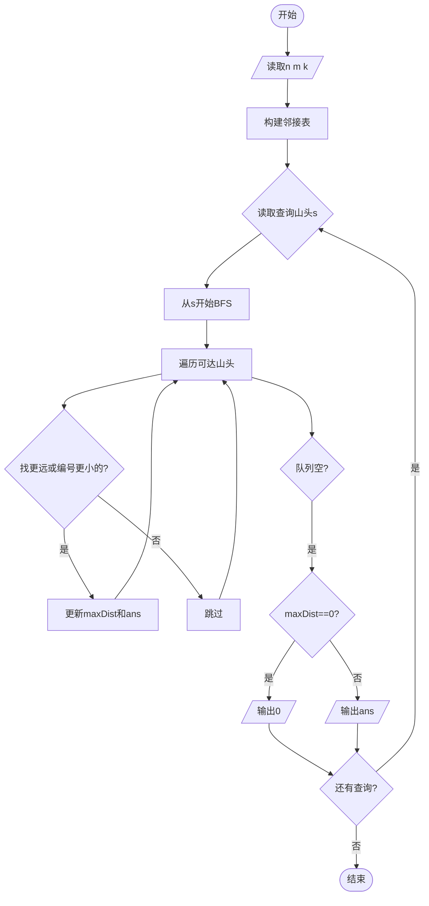
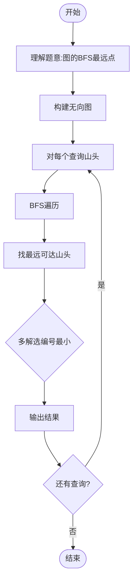

# L3-008 - 喊山（30 分）

- **时间限制**: 150 ms
- **内存限制**: 65536 KB
- **代码长度限制**: 16 KB

---

## 题目描述

喊山，是人双手围在嘴边成喇叭状，对着远方高山发出“喂—喂喂—喂喂喂……”的呼唤。呼唤声通过空气的传递，回荡于深谷之间，传送到人们耳中，发出约定俗成的“讯号”，达到声讯传递交流的目的。原来它是彝族先民用来求援呼救的“讯号”，慢慢地人们在生活实践中发现了它的实用价值，便把它作为一种交流工具世代传袭使用。（图文摘自：http://news.xrxxw.com/newsshow-8018.html）


一个山头呼喊的声音可以被临近的山头同时听到。题目假设每个山头最多有两个能听到它的临近山头。给定任意一个发出原始信号的山头，本题请你找出这个信号最远能传达到的地方。

### 输入格式:

输入第一行给出3个正整数`n`、`m`和`k`，其中`n`（$$\le$$10000）是总的山头数（于是假设每个山头从1到`n`编号）。接下来的`m`行，每行给出2个不超过`n`的正整数，数字间用空格分开，分别代表可以听到彼此的两个山头的编号。这里保证每一对山头只被输入一次，不会有重复的关系输入。最后一行给出`k`（$$\le$$10）个不超过`n`的正整数，数字间用空格分开，代表需要查询的山头的编号。

### 输出格式:

依次对于输入中的每个被查询的山头，在一行中输出其发出的呼喊能够连锁传达到的最远的那个山头。注意：被输出的首先必须是被查询的个山头能连锁传到的。若这样的山头不只一个，则输出编号最小的那个。若此山头的呼喊无法传到任何其他山头，则输出0。

### 输入样例:
```in
7 5 4
1 2
2 3
3 1
4 5
5 6
1 4 5 7
```

### 输出样例:
```out
2
6
4
0
```

## 示例

### 示例 1

**输入:**
```
7 5 4
1 2
2 3
3 1
4 5
5 6
1 4 5 7
```

**输出:**
```
2
6
4
0
```

---

## 题目详解

### 一、解题思路

本题本质上是一个**图的广度优先搜索(BFS)**问题。给定一个无向图（每个山头最多两个临近山头），对每个查询的山头，找出其信号最远能传达到的山头（编号最小的那个）。

核心思路：
1. 将山头和临近关系建模成无向图
2. 对每个被查询的山头`s`，从`s`开始BFS遍历
3. 记录每个可达的山头及距离
4. 找到距离最远的山头（若并列选编号最小的）
5. 若无其他山头可达则输出0

由于每个山头最多两个临近山头，图实际上是由链和环组成的森林结构，BFS效率很高。

### 二、代码流程说明

1. 读取n（山头数）、m（关系数）、k（查询数）
2. 构建邻接表`graph[x]`存储每个山头的临近山头
3. 对每个被查询的山头`s`：
4. 从`s`开始BFS，使用队列存储{节点, 距离}
5. 记录最远可达距离`maxDist`和对应的最小编号`ans`
6. 遍历完成后，若`maxDist==0`（无其他可达山头）输出0，否则输出`ans`
7. 循环处理k个查询

### 三、代码流程图



### 四、解题流程图


