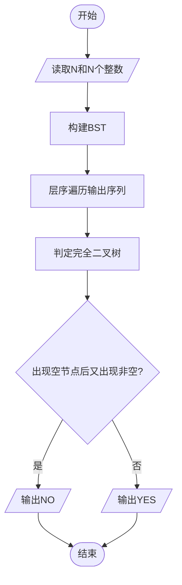
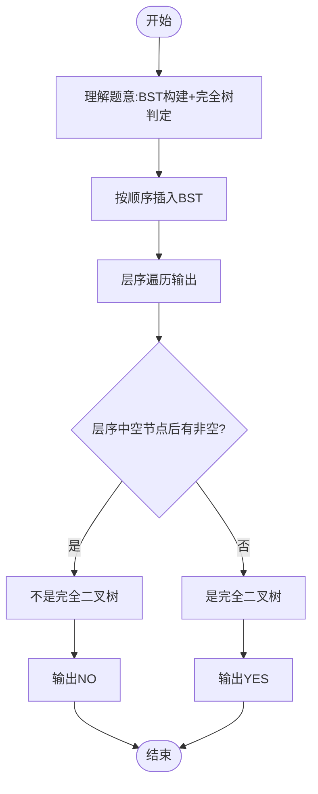

# L3-010 - 是否完全二叉搜索树（30 分）

- **时间限制**: 400 ms
- **内存限制**: 65536 KB
- **代码长度限制**: 16 KB

---

## 题目描述

将一系列给定数字顺序插入一个初始为空的二叉搜索树（定义为左子树键值大，右子树键值小），你需要判断最后的树是否一棵完全二叉树，并且给出其层序遍历的结果。

### 输入格式:

输入第一行给出一个不超过20的正整数`N`；第二行给出`N`个互不相同的正整数，其间以空格分隔。

### 输出格式:

将输入的`N`个正整数顺序插入一个初始为空的二叉搜索树。在第一行中输出结果树的层序遍历结果，数字间以1个空格分隔，行的首尾不得有多余空格。第二行输出`YES`，如果该树是完全二叉树；否则输出`NO`。

### 输入样例 1：
```in
9
38 45 42 24 58 30 67 12 51
```

### 输出样例 1：
```out
38 45 24 58 42 30 12 67 51
YES
```

### 输入样例 2：
```in
8
38 24 12 45 58 67 42 51
```

### 输出样例 2：
```out
38 45 24 58 42 12 67 51
NO
```

## 示例

### 示例 1

**输入:**
```
9
38 45 42 24 58 30 67 12 51
```

**输出:**
```
38 45 24 58 42 30 12 67 51
YES
```

### 示例 2

**输入:**
```
8
38 24 12 45 58 67 42 51
```

**输出:**
```
38 45 24 58 42 12 67 51
NO
```

---

## 题目详解

### 一、解题思路

本题要求将给定数字顺序插入一个初始为空的二叉搜索树（BST），判断结果树是否为完全二叉树，并输出层序遍历结果。注意BST定义为左子树键值大、右子树键值小。

核心步骤：
1. 按顺序将数字插入BST
2. 使用层序遍历（BFS）输出层序序列
3. 判断完全二叉树：层序遍历中不应出现空节点后又有非空节点

完全二叉树判定方法：层序遍历时，一旦遇到空节点（NULL），之后所有节点都必须为空。

### 二、代码流程说明

1. 读取N和N个整数存入数组`nums[]`
2. 初始化BST根节点为`NULL`
3. 对每个数字`nums[i]`：
4. 按BST规则插入：若值大于当前节点则走右子树，否则走左子树
5. 使用队列进行层序遍历，输出层序序列
6. 在层序遍历过程中标记空节点
7. 一旦遇到空节点，设置标志`foundNull=true`
8. 若`foundNull`为true后又遇到非空节点，则不是完全二叉树
9. 根据判定结果输出YES或NO

### 三、代码流程图



### 四、解题流程图


