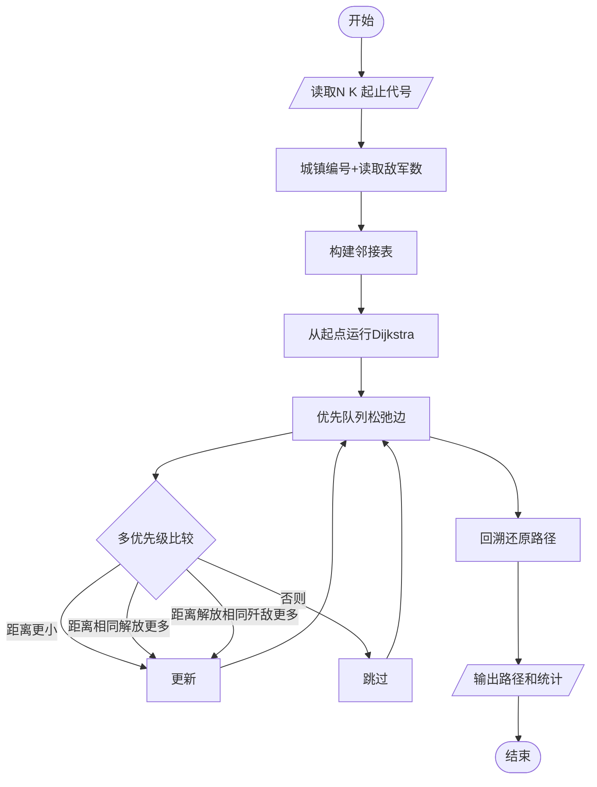
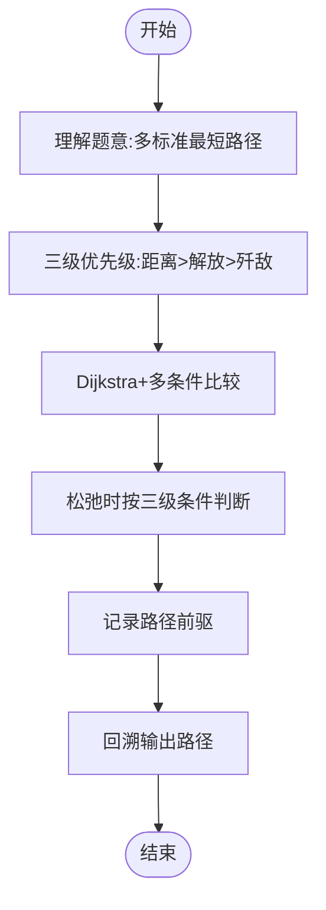

# L3-011 - 直捣黄龙（30 分）

- **时间限制**: 150 ms
- **内存限制**: 65536 KB
- **代码长度限制**: 16 KB

---

## 题目描述

本题是一部战争大片 —— 你需要从己方大本营出发，一路攻城略地杀到敌方大本营。首先时间就是生命，所以你必须选择合适的路径，以最快的速度占领敌方大本营。当这样的路径不唯一时，要求选择可以沿途解放最多城镇的路径。若这样的路径也不唯一，则选择可以有效杀伤最多敌军的路径。

### 输入格式:

输入第一行给出 2 个正整数 N（2 $$\le$$ N $$\le$$ 200，城镇总数）和 K（城镇间道路条数），以及己方大本营和敌方大本营的代号。随后 N-1 行，每行给出除了己方大本营外的一个城镇的代号和驻守的敌军数量，其间以空格分隔。再后面有 K 行，每行按格式`城镇1 城镇2 距离`给出两个城镇之间道路的长度。这里设每个城镇（包括双方大本营）的代号是由 3 个大写英文字母组成的字符串。

### 输出格式:

按照题目要求找到最合适的进攻路径（题目保证速度最快、解放最多、杀伤最强的路径是唯一的），并在第一行按照格式`己方大本营->城镇1->...->敌方大本营`输出。第二行顺序输出最快进攻路径的条数、最短进攻距离、歼敌总数，其间以 1 个空格分隔，行首尾不得有多余空格。

### 输入样例:
```in
10 12 PAT DBY
DBY 100
PTA 20
PDS 90
PMS 40
TAP 50
ATP 200
LNN 80
LAO 30
LON 70
PAT PTA 10
PAT PMS 10
PAT ATP 20
PAT LNN 10
LNN LAO 10
LAO LON 10
LON DBY 10
PMS TAP 10
TAP DBY 10
DBY PDS 10
PDS PTA 10
DBY ATP 10
```

### 输出样例:
```out
PAT->PTA->PDS->DBY
3 30 210
```

## 示例

### 示例 1

**输入:**
```
10 12 PAT DBY
DBY 100
PTA 20
PDS 90
PMS 40
TAP 50
ATP 200
LNN 80
LAO 30
LON 70
PAT PTA 10
PAT PMS 10
PAT ATP 20
PAT LNN 10
LNN LAO 10
LAO LON 10
LON DBY 10
PMS TAP 10
TAP DBY 10
DBY PDS 10
PDS PTA 10
DBY ATP 10
```

**输出:**
```
PAT->PTA->PDS->DBY
3 30 210
```

---

## 题目详解

### 一、解题思路

本题是一个多标准最短路径问题。从己方大本营到敌方大本营，要求：
1. 距离最短（最快到达）
2. 若并列，沿途解放城镇数最多
3. 若仍并列，歼敌总数最多

核心算法：**Dijkstra最短路径 + 多优先级条件**
- 用字符串存储城镇代号，映射为整数编号
- 构建图的邻接表存储道路
- 从己方大本营运行Dijkstra，同时维护距离、解放数、歼敌数
- 使用优先队列，按距离升序、解放数降序、歼敌数降序排列

### 二、代码流程说明

1. 读取N（城镇数）、K（道路数）、己方代号、敌方代号
2. 为城镇编号，读取每个城镇的驻守敌军数
3. 构建邻接表存储道路（双向）
4. 从己方大本营运行Dijkstra：
5. 初始化`dist[start]=0`，`lib[start]=0`，`enemy[start]=0`
6. 使用优先队列存储{距离, -解放数, -歼敌数, 节点}
7. 对每个弹出的节点，松弛所有邻接边
8. 松弛时比较新路径与当前最优：距离更小优先；距离相同解放数更多优先；仍相同歼敌数更多优先
9. 用`pre[]`数组记录路径前驱
10. 从敌方大本营回溯`pre[]`还原路径
11. 输出路径和3条统计数据

### 三、代码流程图



### 四、解题流程图


