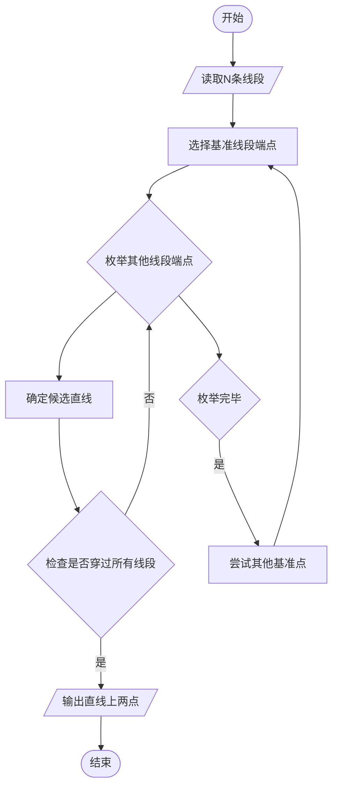
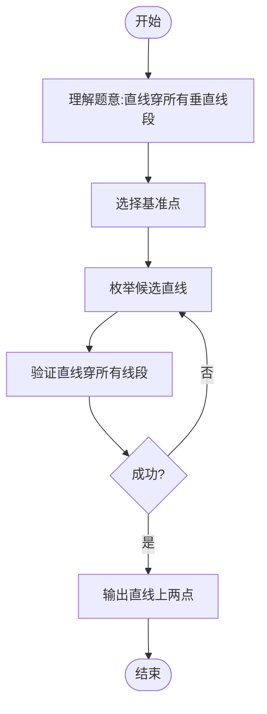

# L3-012 - 水果忍者（30 分）

- **时间限制**: 250 ms
- **内存限制**: 65536 KB
- **代码长度限制**: 16 KB

---

## 题目描述

2010年风靡全球的“水果忍者”游戏，想必大家肯定都玩过吧？（没玩过也没关系啦~）在游戏当中，画面里会随机地弹射出一系列的水果与炸弹，玩家尽可能砍掉所有的水果而避免砍中炸弹，就可以完成游戏规定的任务。如果玩家可以一刀砍下画面当中一连串的水果，则会有额外的奖励，如图1所示。


**图 1**

现在假如你是“水果忍者”游戏的玩家，你要做的一件事情就是，将画面当中的水果一刀砍下。这个问题看上去有些复杂，让我们把问题简化一些。我们将游戏世界想象成一个二维的平面。游戏当中的每个水果被简化成一条一条的垂直于水平线的竖直线段。而一刀砍下我们也仅考虑成能否找到一条直线，使之可以穿过所有代表水果的线段。


**图 2**

如图2所示，其中绿色的垂直线段表示的就是一个一个的水果；灰色的虚线即表示穿过所有线段的某一条直线。可以从上图当中看出，对于这样一组线段的排列，我们是可以找到一刀切开所有水果的方案的。

另外，我们约定，如果某条直线恰好穿过了线段的端点也表示它砍中了这个线段所表示的水果。假如你是这样一个功能的开发者，你要如何来找到一条穿过它们的直线呢？

### 输入格式:

输入在第一行给出一个正整数`N`（$$\le 10^4$$），表示水果的个数。随后`N`行，每行给出三个整数$$x$$、$$y_1$$、$$y_2$$，其间以空格分隔，表示一条端点为$$(x, y_1)$$和$$(x, y_2)$$的水果，其中$$y_1 > y_2$$。注意：给出的水果输入集合一定存在一条可以将其全部穿过的直线，不需考虑不存在的情况。坐标为区间 $$[-10^6, 10^6)$$ 内的整数。

### 输出格式:

在一行中输出穿过所有线段的直线上具有**整数**坐标的任意两点$$p_1(x_1, y_1)$$和$$p_2(x_2, y_2)$$，格式为 $$x_1\quad y_1\quad x_2\quad y_2$$。注意：本题答案不唯一，由特殊裁判程序判定，但一定存在四个坐标全是整数的解。

### 输入样例:
```in
5
-30 -52 -84
38 22 -49
-99 -22 -99
48 59 -18
-36 -50 -72
```

### 输出样例:
```out
-99 -99 -30 -52
```

## 示例

### 示例 1

**输入:**
```
5
-30 -52 -84
38 22 -49
-99 -22 -99
48 59 -18
-36 -50 -72
```

**输出:**
```
-99 -99 -30 -52
```

---

## 题目详解

### 一、解题思路

本题要求找到一条直线穿过所有垂直于x轴的线段（水果）。每条线段的端点为(x, y1)和(x, y2)，其中y1 > y2。

核心思路：将问题转化为**直线与线段相交**问题。一条直线由两点确定，若能选择合适的两点使得直线穿过所有线段即可。

关键观察：
1. 由于所有线段都是垂直的（x固定），问题简化为：找一条直线y = kx + b，使得对每条线段(xi, y1, y2)，有y2 ≤ k*xi + b ≤ y1
2. 可以选择第一条线段的一个端点作为直线的一点
3. 然后遍历其他线段，看是否存在满足条件的直线
4. 特殊情况：若直线恰好穿过线段端点也算穿过

### 二、代码流程说明

1. 读取水果数N
2. 读取N条线段的(x, y1, y2)存入数组`segments[]`
3. 以第一条线段的端点为基准点
4. 遍历其他线段的端点，尝试确定直线
5. 对每条候选直线，检查是否穿过所有线段
6. 若找到满足条件的直线，输出直线上两个整数坐标点
7. 由于保证有解，可以选择特殊点简化计算

### 三、代码流程图



### 四、解题流程图


