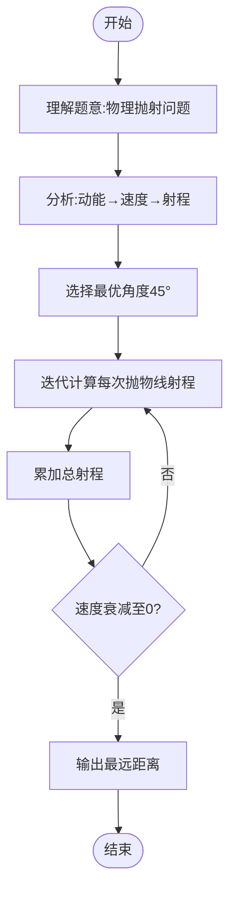

# L3-013 - 非常弹的球（30 分）

- **时间限制**: 150 ms
- **内存限制**: 65536 KB
- **代码长度限制**: 16 KB

---

## 题目描述

刚上高一的森森为了学好物理，买了一个“非常弹”的球。虽然说是非常弹的球，其实也就是一般的弹力球而已。森森玩了一会儿弹力球后突然想到，假如他在地上用力弹球，球最远能弹到多远去呢？他不太会，你能帮他解决吗？当然为了刚学习物理的森森，我们对环境做一些简化：

- 假设森森是一个质点，以森森为原点设立坐标轴，则森森位于(0, 0)点。
- 小球质量为$$w/100$$ 千克（kg），重力加速度为9.8米/秒平方（$$m/s^2$$）。
- 森森在地上用力弹球的过程可简化为球从(0, 0)点以某个森森选择的角度$$ang$$ ($$0 < ang < \pi/2$$) 向第一象限抛出，抛出时假设动能为1000 焦耳（J）。
- 小球在空中仅受重力作用，球纵坐标为0时可视作落地，落地时损失$$p\%$$动能并反弹。
- 地面可视为刚体，忽略小球形状、空气阻力及摩擦阻力等。

森森为你准备的公式：

- 动能公式：$$E = m\times v^2 / 2$$
- 牛顿力学公式：$$F = m\times a$$
- 重力：$$G = m\times g$$

其中：

- $$E$$ - 动能，单位为“焦耳”
- $$m$$ - 质量，单位为“千克”
- $$v$$ - 速度，单位为“米/秒”
- $$a$$ - 加速度，单位为“米/秒平方”
- $$g$$ - 重力加速度

### 输入格式:

输入在一行中给出两个整数：$$1 \le w \le 1000$$ 和 $$1 \le p \le 100$$，分别表示放大100倍的小球质量、以及损失动力的百分比$$p$$。

### 输出格式:

在一行输出最远的投掷距离，保留3位小数。

### 输入样例:
```in
100 90
```

### 输出样例:
```out
226.757
```

## 示例

### 示例 1

**输入:**
```
100 90
```

**输出:**
```
226.757
```

---

## 题目详解

### 一、解题思路

本题是一道物理数学题，要求计算弹力球从(0,0)点以最优角度抛出后，经过多次落地反弹能达到的最远距离。

核心物理分析：
1. 小球质量m = w/100 kg，重力加速度g = 9.8 m/s²
2. 初始动能E = 1000 J，由E = mv²/2得初始速度v = √(2E/m)
3. 最优抛射角度为45°（理论上最远射程）
4. 每次落地损失p%动能，即反弹后动能为原来的(1-p/100)
5. 每次反弹后速度v' = v × √(1-p/100)
6. 小球做抛物线运动，每次落地的水平距离为v²×sin(2θ)/g

关键公式推导：
- 每次抛物线射程：R = v² × sin(2θ) / g
- 总射程：R_total = Σ(v_i² × sin(2θ) / g)，其中v_i是第i次抛物线的初速度
- 由于动能按比例损失，v_i = v_0 × (1-p/100)^(i/2)

### 二、代码流程说明

1. 读取w（质量×100）和p（动能损失百分比）
2. 计算质量m = w / 100.0
3. 计算初始速度v = sqrt(2 × 1000 / m)
4. 重力加速度g = 9.8
5. 初始角度θ = π/4（45°时射程最远）
6. 计算sin(2θ) = sin(π/2) = 1.0
7. 初始化总射程totalRange = 0
8. 迭代计算每次抛物线射程，直到速度衰减到接近0
9. 每次迭代：R = v² × sin(2θ) / g，累加到totalRange
10. 更新速度：v = v × sqrt(1 - p/100.0)
11. 当v < 0.001时停止
12. 输出totalRange保留3位小数

### 三、代码流程图

```mermaid
flowchart TD
    A([开始]) --> B[/读取w p/]
    B --> C[计算质量m=w/100]
    C --> D[计算初始速度v]
    D --> E[初始化θ=π/4 g=9.8]
    E --> F[初始化totalRange=0]
    F --> G{v>0.001?}
    G -- 是 --> H[计算本次射程R]
    H --> I[totalRange+=R]
    I --> J[更新速度v=v*sqrt(1-p/100)]
    J --> G
    G -- 否 --> K[/输出totalRange保留3位小数/]
    K --> L([结束])
```

### 四、解题流程图


