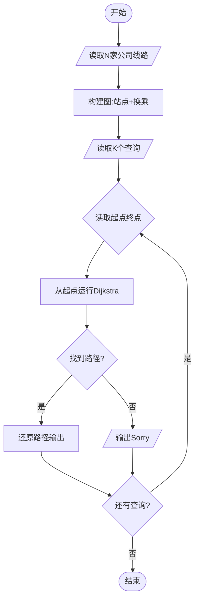
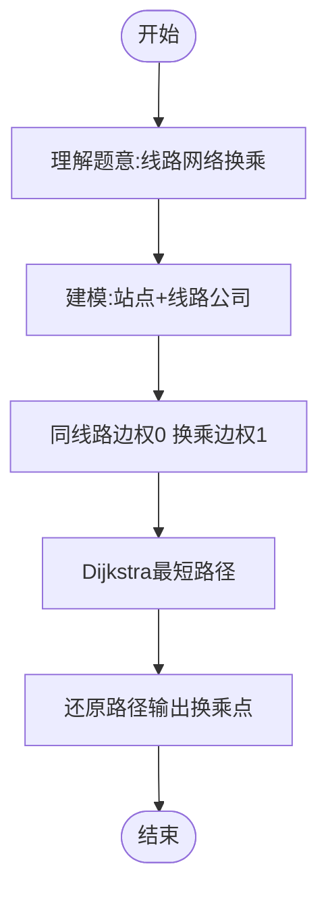

# L3-014 - 周游世界（30 分）

- **时间限制**: 200 ms
- **内存限制**: 65536 KB
- **代码长度限制**: 16 KB

---

## 题目描述

周游世界是件浪漫事，但规划旅行路线就不一定了…… 全世界有成千上万条航线、铁路线、大巴线，令人眼花缭乱。所以旅行社会选择部分运输公司组成联盟，每家公司提供一条线路，然后帮助客户规划由联盟内企业支持的旅行路线。本题就要求你帮旅行社实现一个自动规划路线的程序，使得对任何给定的起点和终点，可以找出最顺畅的路线。所谓“最顺畅”，首先是指中途经停站最少；如果经停站一样多，则取需要换乘线路次数最少的路线。

### 输入格式:

输入在第一行给出一个正整数$$N$$（$$\le 100$$），即联盟公司的数量。接下来有$$N$$行，第$$i$$行（$$i=1, \cdots , N$$）描述了第$$i$$家公司所提供的线路。格式为：

$$M$$ S[1] S[2] $$\cdots$$ S[$$M$$]

其中$$M$$（$$\le 100$$）是经停站的数量，S[$$i$$]（$$i=1, \cdots , M$$）是经停站的编号（由4位0-9的数字组成）。这里假设每条线路都是简单的一条可以双向运行的链路，并且输入保证是按照正确的经停顺序给出的 —— 也就是说，任意一对相邻的S[$$i$$]和S[$$i+1$$]（$$i=1, \cdots , M-1$$）之间都不存在其他经停站点。我们称相邻站点之间的线路为一个运营区间，每个运营区间只承包给一家公司。环线是有可能存在的，但不会不经停任何中间站点就从出发地回到出发地。当然，不同公司的线路是可能在某些站点有交叉的，这些站点就是客户的换乘点，我们假设任意换乘点涉及的不同公司的线路都不超过5条。

在描述了联盟线路之后，题目将给出一个正整数$$K$$（$$\le 10$$），随后$$K$$行，每行给出一位客户的需求，即始发地的编号和目的地的编号，中间以一空格分隔。

### 输出格式:

处理每一位客户的需求。如果没有现成的线路可以使其到达目的地，就在一行中输出“Sorry, no line is available.”；如果目的地可达，则首先在一行中输出最顺畅路线的经停站数量（始发地和目的地不包括在内），然后按下列格式给出旅行路线：

```
Go by the line of company #X1 from S1 to S2.
Go by the line of company #X2 from S2 to S3.
......
```

其中`Xi`是线路承包公司的编号，`Si`是经停站的编号。但必须只输出始发地、换乘点和目的地，不能输出中间的经停站。题目保证满足要求的路线是唯一的。

### 输入样例:
```in
4
7 1001 3212 1003 1204 1005 1306 7797
9 9988 2333 1204 2006 2005 2004 2003 2302 2001
13 3011 3812 3013 3001 1306 3003 2333 3066 3212 3008 2302 3010 3011
4 6666 8432 4011 1306
4
3011 3013
6666 2001
2004 3001
2222 6666
```

### 输出样例:
```out
2
Go by the line of company #3 from 3011 to 3013.
10
Go by the line of company #4 from 6666 to 1306.
Go by the line of company #3 from 1306 to 2302.
Go by the line of company #2 from 2302 to 2001.
6
Go by the line of company #2 from 2004 to 1204.
Go by the line of company #1 from 1204 to 1306.
Go by the line of company #3 from 1306 to 3001.
Sorry, no line is available.
```

## 示例

### 示例 1

**输入:**
```
4
7 1001 3212 1003 1204 1005 1306 7797
9 9988 2333 1204 2006 2005 2004 2003 2302 2001
13 3011 3812 3013 3001 1306 3003 2333 3066 3212 3008 2302 3010 3011
4 6666 8432 4011 1306
4
3011 3013
6666 2001
2004 3001
2222 6666
```

**输出:**
```
2
Go by the line of company #3 from 3011 to 3013.
10
Go by the line of company #4 from 6666 to 1306.
Go by the line of company #3 from 1306 to 2302.
Go by the line of company #2 from 2302 to 2001.
6
Go by the line of company #2 from 2004 to 1204.
Go by the line of company #1 from 1204 to 1306.
Go by the line of company #3 from 1306 to 3001.
Sorry, no line is available.
```

---

## 题目详解

### 一、解题思路

本题是一个**图的最短路径问题**，要求在多家公司的线路网络中规划最顺畅的路线。"最顺畅"定义为：中途经停站最少，若并列则换乘次数最少。

核心算法：
1. 将所有站点视为图的节点，不同线路在同一站点的换乘需要代价
2. 建模方法：将每个站点拆分为多个节点（每家公司一条线路一个节点），同站点不同公司的节点间连边权1（换乘），同线路相邻站点间连边权0
3. 使用Dijkstra从起点所属公司的节点出发，到终点所属公司的节点
4. 路径还原时只输出换乘点（包括始发站和终点站）

### 二、代码流程说明

1. 读取N（公司数）
2. 对每家公司，读取线路的M个经停站
3. 建图：同线路相邻站点间连权0边，不同线路在同一站点间连权1边
4. 读取K（查询数）
5. 对每个查询的起点和终点：
6. 找到起点所属的所有线路公司，分别作为起点运行Dijkstra
7. 找到最短路径（经停站数最少，其次换乘次数最少）
8. 还原路径，只输出始发站、换乘点和终点站
9. 若无可达路线输出"Sorry, no line is available."

### 三、代码流程图



### 四、解题流程图


