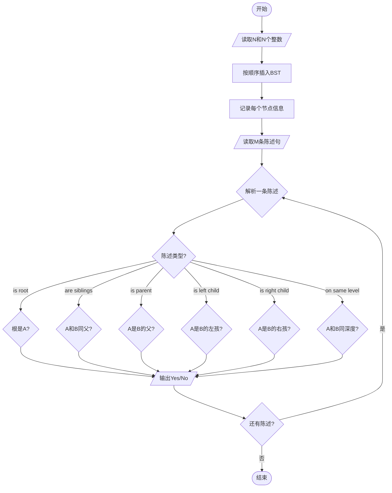
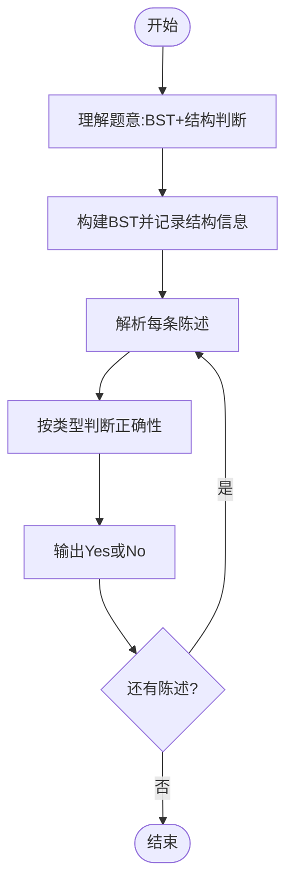

# L3-016 - 二叉搜索树的结构（30 分）

- **时间限制**: 400 ms
- **内存限制**: 65536 KB
- **代码长度限制**: 16 KB

---

## 题目描述

二叉搜索树或者是一棵空树，或者是具有下列性质的二叉树： 若它的左子树不空，则左子树上所有结点的值均小于它的根结点的值；若它的右子树不空，则右子树上所有结点的值均大于它的根结点的值；它的左、右子树也分别为二叉搜索树。（摘自百度百科）

给定一系列互不相等的整数，将它们顺次插入一棵初始为空的二叉搜索树，然后对结果树的结构进行描述。你需要能判断给定的描述是否正确。例如将{ 2 4 1 3 0 }插入后，得到一棵二叉搜索树，则陈述句如“2是树的根”、“1和4是兄弟结点”、“3和0在同一层上”（指自顶向下的深度相同）、“2是4的双亲结点”、“3是4的左孩子”都是正确的；而“4是2的左孩子”、“1和3是兄弟结点”都是不正确的。

### 输入格式:

输入在第一行给出一个正整数$$N$$（$$\le 100$$），随后一行给出$$N$$个互不相同的整数，数字间以空格分隔，要求将之顺次插入一棵初始为空的二叉搜索树。之后给出一个正整数$$M$$（$$\le 100$$），随后$$M$$行，每行给出一句待判断的陈述句。陈述句有以下6种：

- `A is the root`，即"`A`是树的根"；
- `A and B are siblings`，即"`A`和`B`是兄弟结点"；
- `A is the parent of B`，即"`A`是`B`的双亲结点"；
- `A is the left child of B`，即"`A`是`B`的左孩子"；
- `A is the right child of B`，即"`A`是`B`的右孩子"；
- `A and B are on the same level`，即"`A`和`B`在同一层上"。

题目保证所有给定的整数都在整型范围内。

### 输出格式:

对每句陈述，如果正确则输出`Yes`，否则输出`No`，每句占一行。

### 输入样例:
```in
5
2 4 1 3 0
8
2 is the root
1 and 4 are siblings
3 and 0 are on the same level
2 is the parent of 4
3 is the left child of 4
1 is the right child of 2
4 and 0 are on the same level
100 is the right child of 3
```

### 输出样例:
```out
Yes
Yes
Yes
Yes
Yes
No
No
No
```

## 示例

### 示例 1

**输入:**
```
5
2 4 1 3 0
8
2 is the root
1 and 4 are siblings
3 and 0 are on the same level
2 is the parent of 4
3 is the left child of 4
1 is the right child of 2
4 and 0 are on the same level
100 is the right child of 3
```

**输出:**
```
Yes
Yes
Yes
Yes
Yes
No
No
No
```

---

## 题目详解

### 一、解题思路

本题要求将一系列整数顺次插入一棵初始为空的二叉搜索树（BST），然后判断关于该树结构的6种陈述句是否正确。

核心思路：
1. 按给定顺序插入BST
2. 使用结构体存储每个节点的父节点、左右孩子、所在深度
3. 对每种陈述句进行对应判断：
   - "A is the root"：判断根节点值是否为A
   - "A and B are siblings"：判断A和B是否有相同父节点
   - "A is the parent of B"：判断A是否为B的父节点
   - "A is the left child of B"：判断A是否为B的左孩子
   - "A is the right child of B"：判断A是否为B的右孩子
   - "A and B are on the same level"：判断A和B的深度是否相同

### 二、代码流程说明

1. 读取N和N个整数
2. 构建BST：按顺序插入每个整数
3. 使用map存储每个值对应的节点指针，方便查找
4. 对每个节点记录其父节点、左孩子、右孩子和深度
5. 读取M和M条陈述句
6. 对每条句子解析出类型和参数
7. 按类型进行相应判断并输出Yes或No
8. 重复处理所有句子

### 三、代码流程图



### 四、解题流程图


