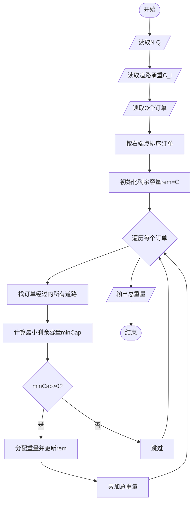
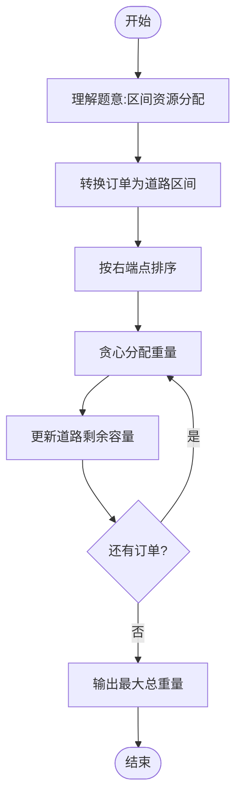

# L3-017 - 森森快递（30 分）

- **时间限制**: 400 ms
- **内存限制**: 65536 KB
- **代码长度限制**: 16 KB

---

## 题目描述

森森开了一家快递公司，叫森森快递。因为公司刚刚开张，所以业务路线很简单，可以认为是一条直线上的$$N$$个城市，这些城市从左到右依次从0到$$(N-1)$$编号。由于道路限制，第$$i$$号城市（$$i=0, \cdots , N-2$$）与第$$(i+1)$$号城市中间往返的运输货物重量在同一时刻不能超过$$C_i$$公斤。

公司开张后很快接到了$$Q$$张订单，其中$$j$$张订单描述了某些指定的货物要从$$S_j$$号城市运输到$$T_j$$号城市。这里我们简单地假设所有货物都有无限货源，森森会不定时地挑选其中一部分货物进行运输。安全起见，这些货物不会在中途卸货。

为了让公司整体效益更佳，森森想知道如何安排订单的运输，能使得运输的货物重量最大且符合道路的限制？要注意的是，发货时间有可能是任何时刻，所以我们安排订单的时候，必须保证共用同一条道路的所有货车的总重量不超载。例如我们安排1号城市到4号城市以及2号城市到4号城市两张订单的运输，则这两张订单的运输同时受2-3以及3-4两条道路的限制，因为两张订单的货物可能会同时在这些道路上运输。

### 输入格式:

输入在第一行给出两个正整数$$N$$和$$Q$$（$$2 \le N \le 10^5$$, $$1 \le Q \le 10^5$$），表示总共的城市数以及订单数量。

第二行给出$$(N-1)$$个数，顺次表示相邻两城市间的道路允许的最大运货重量$$C_i$$（$$i=0, \cdots , N-2$$）。题目保证每个$$C_i$$是不超过$$2^{31}$$的非负整数。

接下来$$Q$$行，每行给出一张订单的起始及终止运输城市编号。题目保证所有编号合法，并且不存在起点和终点重合的情况。

### 输出格式:

在一行中输出可运输货物的最大重量。

### 输入样例:
```in
10 6
0 7 8 5 2 3 1 9 10
0 9
1 8
2 7
6 3
4 5
4 2
```

### 输出样例:
```out
7
```

## 示例

### 示例 1

**输入:**
```
10 6
0 7 8 5 2 3 1 9 10
0 9
1 8
2 7
6 3
4 5
4 2
```

**输出:**
```
7
```

---

## 题目详解

### 一、解题思路

本题是一个区间资源分配问题。N个城市排成一条直线，城市i和i+1之间的道路有最大承重C_i。有Q个订单，每个订单从城市S_j运到T_j。要求在道路承重限制下，最大化总运输重量。

核心思路：将问题建模为**区间调度问题**
1. 每个订单j对应一个区间[S_j, T_j-1]（使用的道路段）
2. 选择一组订单，分配重量w_j，使得每条道路i上所有经过该道路的订单重量和≤C_i
3. 最大化Σw_j

关键技巧：按订单的右端点排序，贪心选择。对每个订单，其重量受限于它所经过的所有道路的剩余容量最小值。

### 二、代码流程说明

1. 读取N和Q
2. 读取N-1条道路的最大承重C_i
3. 读取Q个订单的[S_j, T_j]，转换为区间[S_j, T_j-1]
4. 按区间右端点升序排序
5. 初始化所有道路剩余容量rem[i] = C_i
6. 遍历每个订单：
7. 找到该订单经过的所有道路
8. 计算这些道路的最小剩余容量minCap
9. 若minCap > 0，则将minCap分配给该订单，更新所有经过道路的剩余容量
10. 累加总重量
11. 输出总重量

### 三、代码流程图



### 四、解题流程图


