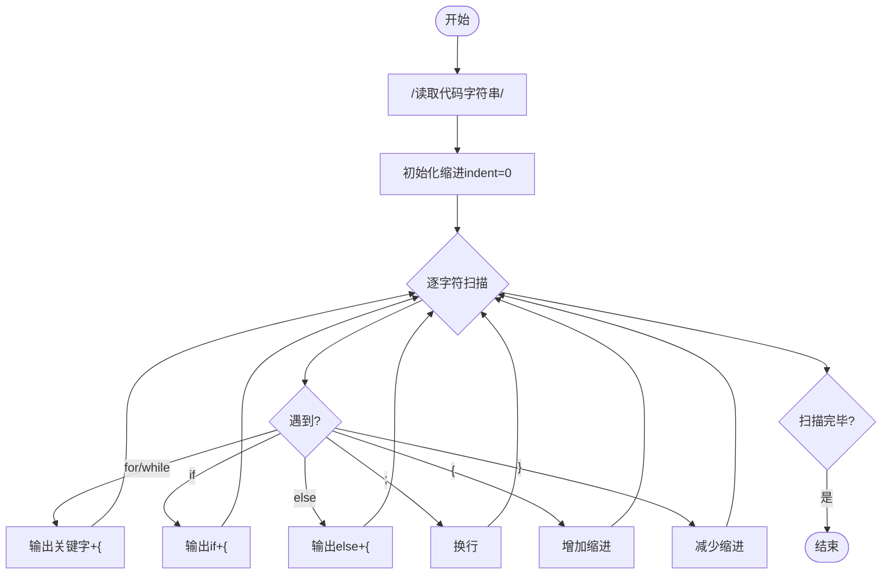
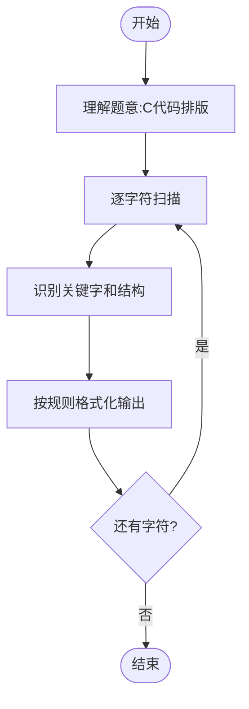

# L3-019 - 代码排版（30 分）

- **时间限制**: 150 ms
- **内存限制**: 65536 KB
- **代码长度限制**: 16 KB

---

## 题目描述

某编程大赛中设计有一个挑战环节，选手可以查看其他选手的代码，发现错误后，提交一组测试数据将对手挑落马下。为了减小被挑战的几率，有些选手会故意将代码写得很难看懂，比如把所有回车去掉，提交所有内容都在一行的程序，令挑战者望而生畏。

为了对付这种选手，现请你编写一个代码排版程序，将写成一行的程序重新排版。当然要写一个完美的排版程序可太难了，这里只简单地要求处理C语言里的for、while、if-else这三种特殊结构，而将其他所有句子都当成顺序执行的语句处理。输出的要求如下：

- 默认程序起始没有缩进；每一级缩进是 2 个空格；
- 每行开头除了规定的缩进空格外，不输出多余的空格；
- 顺序执行的程序体是以分号“;”结尾的，遇到分号就换行；
- 在一对大括号“{”和“}”中的程序体输出时，两端的大括号单独占一行，内部程序体每行加一级缩进，即：

```
{
  程序体
}
```

- for的格式为：

```
for (条件) {
  程序体
}
```

- while的格式为：

```
while (条件) {
  程序体
}
```

- if-else的格式为：

```
if (条件) {
  程序体
}
else {
  程序体
}
```

### 输入格式:

输入在一行中给出不超过 331 个字符的非空字符串，以回车结束。题目保证输入的是一个语法正确、可以正常编译运行的 main 函数模块。

### 输出格式:

按题面要求的格式，输出排版后的程序。

### 输入样例:
```in
int main()  {int n, i;  scanf("%d", &n);if( n>0)n++;else if (n<0) n--; else while(n<10)n++; for(i=0;  i<n; i++ ){ printf("n=%d\n", n);}return  0; }
```

### 输出样例:
```out
int main()
{
  int n, i;
  scanf("%d", &n);
  if ( n>0) {
    n++;
  }
  else {
    if (n<0) {
      n--;
    }
    else {
      while (n<10) {
        n++;
      }
    }
  }
  for (i=0;  i<n; i++ ) {
    printf("n=%d\n", n);
  }
  return  0;
}
```

## 示例

### 示例 1

**输入:**
```
int main()  {int n, i;  scanf("%d", &n);if( n>0)n++;else if (n<0) n--; else while(n<10)n++; for(i=0;  i<n; i++ ){ printf("n=%d\n", n);}return  0; }
```

**输出:**
```
int main()
{
  int n, i;
  scanf("%d", &n);
  if ( n>0) {
    n++;
  }
  else {
    if (n<0) {
      n--;
    }
    else {
      while (n<10) {
        n++;
      }
    }
  }
  for (i=0;  i<n; i++ ) {
    printf("n=%d\n", n);
  }
  return  0;
}
```

---

## 题目详解

### 一、解题思路

本题要求将写成一行的C语言代码重新排版，处理for、while、if-else三种特殊结构。核心是**字符串解析和格式化**。

排版规则：
1. 默认无缩进，每级缩进2个空格
2. 分号结尾换行
3. 大括号单独占一行，内部加一级缩进
4. for/while格式：`for (条件) {\n  程序体\n}`
5. if-else格式：`if (条件) {\n  程序体\n}\nelse {\n  程序体\n}`

实现关键：逐字符扫描，识别关键字和结构，按规则输出。

### 二、代码流程说明

1. 读取输入字符串`code`
2. 初始化缩进级别`indent=0`
3. 使用指针`i`逐字符扫描：
4. 跳过空格和制表符
5. 识别关键字`for`、`while`、`if`、`else`
6. 若为`for`或`while`：输出`关键字 (条件) {`，缩进+1，处理程序体，遇到`}`缩进-1
7. 若为`if`：输出`if (条件) {`，缩进+1，处理程序体
8. 若为`else if`或`else`：输出`else {`或`else if (条件) {`
9. 遇到`;`：输出分号并换行
10. 遇到`{`：换行输出`{`并增加缩进
11. 遇到`}`：减少缩进，换行输出`}`
12. 循环处理直到字符串结束

### 三、代码流程图



### 四、解题流程图


