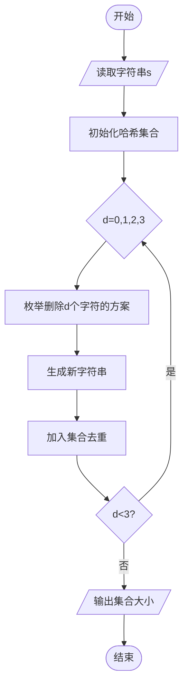
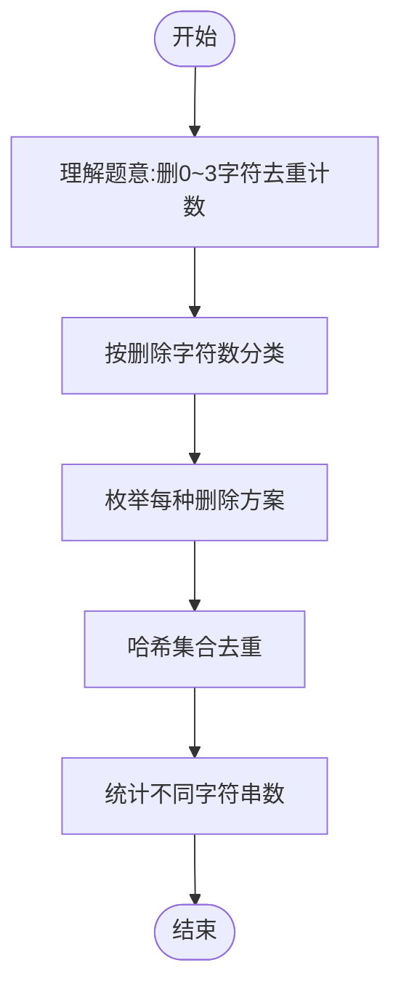

# L3-020 - 至多删三个字符（30 分）

- **时间限制**: 400 ms
- **内存限制**: 65536 KB
- **代码长度限制**: 16 KB

---

## 题目描述

给定一个全部由小写英文字母组成的字符串，允许你至多删掉其中 3 个字符，结果可能有多少种不同的字符串？

### 输入格式:

输入在一行中给出全部由小写英文字母组成的、长度在区间 [4, $$10^6$$] 内的字符串。

### 输出格式:

在一行中输出至多删掉其中 3 个字符后不同字符串的个数。

### 输入样例:
```in
ababcc
```

### 输出样例:
```out
25
```

## 示例

### 示例 1

**输入:**
```
ababcc
```

**输出:**
```
25
```

---

## 题目详解

### 一、解题思路

本题要求统计一个字符串至多删除3个字符后能得到的不同字符串个数。字符串长度可达10^6，不能暴力枚举所有可能。

核心思路：利用**组合计数**思想
1. 删除0个字符：原字符串本身，1种
2. 删除1个字符：n种（删除每个位置的字符），但需要去重
3. 删除2个字符：C(n,2)种，需要去重
4. 删除3个字符：C(n,3)种，需要去重

关键去重方法：
- 使用哈希集合存储所有可能的字符串
- 由于n较大（10^6），但只删3个字符，可以用组合方法
- 对删除d个字符的情况，枚举所有C(n,d)种删除方案
- 使用哈希集合去重后统计数量

注意：n≤10^6但删3个字符的方案数为C(n,3)≈n³/6，当n=10^6时约10^18，无法暴力。需要用数学方法或更高效的去重策略。

实际做法：对于删除1、2、3个字符，分别枚举所有可能的删除位置组合，用unordered_set去重。由于实际不同字符串数量远小于C(n,d)，哈希集合可以高效处理。

### 二、代码流程说明

1. 读取字符串`s`，长度为n
2. 初始化哈希集合`set<string>`存储所有可能
3. 对d=0：将原字符串加入集合
4. 对d=1：遍历每个位置i，删除s[i]后加入集合
5. 对d=2：遍历所有i<j，删除s[i]和s[j]后加入集合
6. 对d=3：遍历所有i<j<k，删除s[i]、s[j]、s[k]后加入集合
7. 输出集合大小

### 三、代码流程图



### 四、解题流程图


