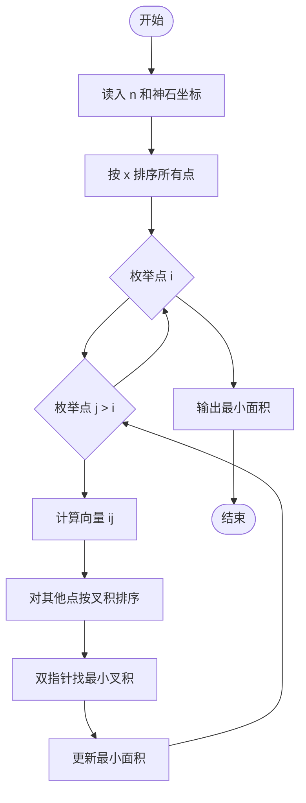

# L3-021 - 神坛（30 分）

- **时间限制**: 8000 ms
- **内存限制**: 65536 KB
- **代码长度限制**: 16 KB

---

## 题目描述

在古老的迈瑞城，巍然屹立着 n 块神石。长老们商议，选取 3 块神石围成一个神坛。因为神坛的能量强度与它的面积成反比，因此神坛的面积越小越好。特殊地，如果有两块神石坐标相同，或者三块神石共线，神坛的面积为 `0.000`。

长老们发现这个问题没有那么简单，于是委托你编程解决这个难题。

### 输入格式:

输入在第一行给出一个正整数 n（3 $$\le$$ n $$\le$$ 5000）。随后 n 行，每行有两个整数，分别表示神石的横坐标、纵坐标（$$-10^9 \le$$ 横坐标、纵坐标 $$< 10^9$$）。

### 输出格式:

在一行中输出神坛的最小面积，四舍五入保留 3 位小数。

### 输入样例:
```in
8
3 4
2 4
1 1
4 1
0 3
3 0
1 3
4 2
```

### 输出样例:
```out
0.500
```

## 示例

### 示例 1

**输入:**
```
8
3 4
2 4
1 1
4 1
0 3
3 0
1 3
4 2
```

**输出:**
```
0.500
```

---

## 题目详解

### 一、解题思路

给定 n 个神石坐标，选取 3 个神石构成三角形，求最小面积。三角形面积公式为 S = |(x2-x1)*(y3-y1) - (x3-x1)*(y2-y1)| / 2。当有重复坐标或三点共线时面积为 0。

由于 n 最大 5000，O(n^3) 暴力枚举会超时，需采用 O(n^2 log n) 的优化算法。关键思想：对每个点作为基准点，将其他点按极角排序，利用叉积的单调性或旋转直线法高效寻找最小面积三角形。具体做法：枚举每条边作为底边，将其他点按与该边的叉积值排序，利用单调性快速找到使面积最小的第三个点。

### 二、代码流程说明

1. 读入 n 和所有神石坐标，存储为数组 points
2. 对 points 按 x 坐标排序
3. 枚举每个点 i 作为三角形的第一个顶点
4. 枚举点 j (j > i) 作为第二个顶点，计算向量边
5. 对所有其他点 k，计算叉积 cross(i,j,k)
6. 利用双指针或二分查找叉积绝对值最小的点
7. 更新最小面积 ans = min(ans, |cross| / 2)
8. 输出 ans 保留 3 位小数

### 三、代码流程图



### 四、解题流程图

```mermaid
flowchart TD
    A([分析题目<br>n 个点求最小三角形面积]) --> B[选择底边<br>枚举两点确定一条边]
    B --> C[极角排序<br>将其他点按相对底边的位置排序]
    C --> D{利用单调性<br>移动第三个顶点}
    D --> E[计算叉积<br>cross = x1*y2-x2*y1]
    E --> F{叉积是否为 0?}
    F -->|是| G[面积为 0<br>更新答案]
    F -->|否| H[计算面积<br>S = |cross| / 2]
    G --> I[更新最小面积]
    H --> I
    I --> D
```
