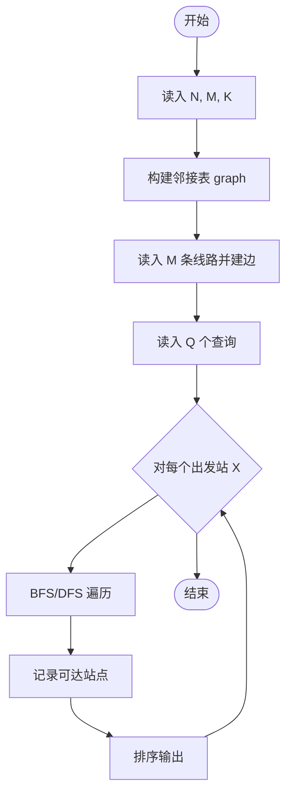
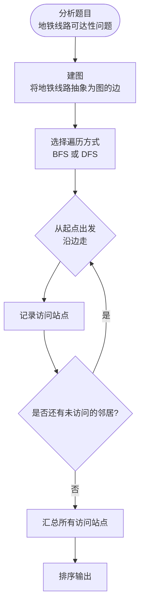

# L3-022 - 地铁一日游（30 分）

- **时间限制**: 550 ms
- **内存限制**: 65536 KB
- **代码长度限制**: 16 KB

---

## 题目描述

森森喜欢坐地铁。这个假期，他终于来到了传说中的地铁之城——魔都，打算好好过一把坐地铁的瘾！

魔都地铁的计价规则是：起步价 2 元，出发站与到达站的最短距离（即**计费距离**）每 K 公里增加 1 元车费。

例如取 **K** = 10，动安寺站离魔都绿桥站为 40 公里，则车费为 2 + 4 = 6 元。

为了获得最大的满足感，森森决定用以下的方式坐地铁：在某一站上车（不妨设为地铁站 **A**），则对于所有车费相同的到达站，森森只会在计费距离最远的站或线路末端站点出站，然后用森森美图 App 在站点外拍一张认证照，再按同样的方式前往下一个站点。

坐着坐着，森森突然好奇起来：在给定出发站的情况下（在出发时森森也会拍一张照），他的整个旅程中能够留下哪些站点的认证照？

地铁是铁路运输的一种形式，指在地下运行为主的城市轨道交通系统。一般来说，地铁由若干个站点组成，并有多条不同的线路双向行驶，可类比公交车，当两条或更多条线路经过同一个站点时，可进行**换乘**，更换自己所乘坐的线路。举例来说，魔都 1 号线和 2 号线都经过人民广场站，则乘坐 1 号线到达人民广场时就可以换乘到 2 号线前往 2 号线的各个站点。换乘不需出站（也拍不到认证照），因此森森乘坐地铁时换乘不受限制。

### 输入格式:

输入第一行是三个正整数 **N**、**M** 和 **K**，表示魔都地铁有 **N** 个车站 (1 &leq; **N** &leq; 200)，**M** 条线路 (1 &leq; **M** &leq; 1500)，最短距离每超过 **K** 公里 (1 &leq; **K** &leq; 10<sup>6</sup>)，加 1 元车费。

接下来 **M** 行，每行由以下格式组成：

<站点1><空格><距离><空格><站点2><空格><距离><空格><站点3> ... <站点X-1><空格><距离><空格><站点X>

其中站点是一个 1 到 **N** 的编号；两个站点编号之间的距离指两个站在该线路上的距离。两站之间距离是一个不大于 10<sup>6</sup> 的正整数。一条线路上的站点互不相同。

**注意**：两个站之间可能有多条直接连接的线路，且距离不一定相等。

再接下来有一个正整数 **Q** (1 &leq; **Q** &leq; 200)，表示森森尝试从 **Q** 个站点出发。

最后有 **Q** 行，每行一个正整数 **X<sub>i</sub>**，表示森森尝试从编号为 **X<sub>i</sub>** 的站点出发。

### 输出格式:

对于森森每个尝试的站点，输出一行若干个整数，表示能够到达的站点编号。站点编号从小到大排序。

### 输入样例:
```in
6 2 6
1 6 2 4 3 1 4
5 6 2 6 6
4
2
3
4
5
```

### 输出样例:
```out
1 2 4 5 6
1 2 3 4 5 6
1 2 4 5 6
1 2 4 5 6
```

## 示例

### 示例 1

**输入:**
```
6 2 6
1 6 2 4 3 1 4
5 6 2 6 6
4
2
3
4
5
```

**输出:**
```
1 2 4 5 6
1 2 3 4 5 6
1 2 4 5 6
1 2 4 5 6
```

---

## 题目详解

### 一、解题思路

本题核心是构建地铁线路图，从给定出发站计算能到达的所有站点。地铁线路构成一个图，换乘（不同线路经过同一站点）不需出站。计价规则：起步 2 元，每 K 公里加 1 元。关键在于：对于同一车费的到达站，森森只在计费距离最远的站或线路末端出站。

算法分两步：
1. **建图**：将每条线路上的站点依次连接，构建邻接表。同一站点出现在不同线路上自然形成换乘。
2. **BFS/DFS 求可达**：从出发站出发，沿线路进行广度优先或深度优先搜索，经过所有能到达的站点。搜索过程中记录各站点的最短距离（计费距离）。

由于需要输出所有能到达的站点（包括中间换乘站），本质上是求从起点出发通过图遍历能到达的所有节点。

### 二、代码流程说明

1. 读入 N（站点数）、M（线路数）、K（每 K 公里加 1 元）
2. 构建邻接表 graph[N+1]，存储线路上相邻站点及距离
3. 读入 M 条线路，每条线路上的相邻站点依次连边
4. 读入 Q 个查询出发站
5. 对每个出发站 X：从 X 开始 BFS/DFS，访问所有可达站点
6. 用集合记录所有访问过的站点
7. 将集合中的站点编号排序后输出

### 三、代码流程图



### 四、解题流程图


