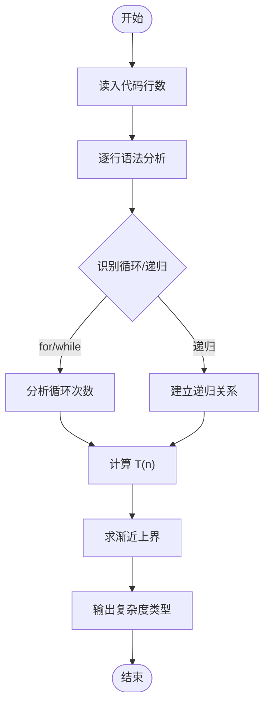
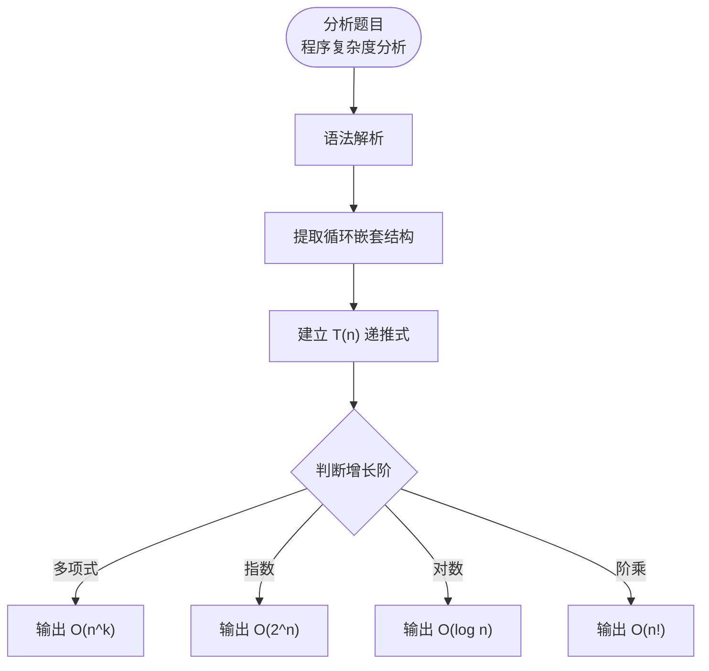

# L3-027 - 可怜的复杂度（30 分）

- **时间限制**: 8000 ms
- **内存限制**: 262144 KB
- **代码长度限制**: 16 KB

---

## 题目描述

可怜有一个数组 $$A$$，定义它的复杂度 $$c(A)$$ 等于它本质不同的子区间个数。举例来说，$$c([1,1,1]) = 3$$，因为 $$[1,1,1]$$ 只有 $$3$$ 个本质不同的子区间 $$[1]$$、$$[1,1]$$ 和 $$[1,1,1]$$；而 $$c([1,2,1]) = 5$$，它包含 $$5$$ 个本质不同的子区间 $$[1]$$、$$[2]$$、$$[1,2]$$、$$[2,1]$$、$$[1,2,1]$$。

可怜打算出一道和复杂度相关的题目。众所周知，引入随机性往往可以让一个简单的题目脱胎换骨。现在，可怜手上有一个长度为 $$n$$ 的正整数数组 $$x$$ 和一个正整数 $$m$$。接着，可怜会独立地随机产生 $$n$$ 个 $$[1,m]$$ 中的随机整数 $$y_i$$，并把 $$x_i$$ 修改为 $$mx_i+y_i$$。

显然，一共有 $$N=m^n$$ 种可能的结果数组。现在，可怜想让你求出这 $$N$$ 个数组的复杂度的和。

### 输入格式:

第一行给出一个整数 $$t$$ ($$1 \le t \le 5$$) 表示数据组数。

对于每组数据，第一行输入两个整数 $$n$$ 和 $$m$$ ($$1 \le n \le 100, 1 \le m \le 10^9$$)，第二行是 $$n$$ 个空格隔开的整数表示数组 $$x$$ 的初始值 ($$1 \le x_i \le 10^9$$)。

### 输出格式:

对于每组数据，输出一行一个整数表示答案。答案可能很大，你只需要输出对 $$998244353$$ 取模后的结果。

### 输入样例:
```in
4
3 2
1 1 1
3 2
1 2 1
5 2
1 2 1 2 1
10 2
80582987 187267045 80582987 187267045 80582987 187267045 80582987 187267045 80582987 187267045
```

### 输出样例:
```out
36
44
404
44616
```

## 示例

### 示例 1

**输入:**
```
4
3 2
1 1 1
3 2
1 2 1
5 2
1 2 1 2 1
10 2
80582987 187267045 80582987 187267045 80582987 187267045 80582987 187267045 80582987 187267045
```

**输出:**
```
36
44
404
44616
```

---

## 题目详解

### 一、解题思路

分析程序的时间复杂度，判断 n→∞ 时程序运行时间的增长趋势。给定一段程序代码，需要识别循环嵌套结构，计算时间复杂度 T(n) 的渐近上界。

核心方法：
1. 识别循环结构：单层循环 O(n)，双重循环 O(n²)，三重循环 O(n³)
2. 识别递归结构：如二分 O(log n)，递归树 O(2ⁿ)
3. 合并分析：取各部分最大值

最终输出 T(n) 在 n→∞ 的极限阶：多项式级、指数级、阶乘级等。

### 二、代码流程说明

1. 读入程序代码行数
2. 逐行分析代码：
   - 识别循环语句（for/while）
   - 识别递归调用
   - 计算每层循环的时间复杂度
3. 递归求解各函数的 T(n)
4. 输出复杂度分类：
   - O(1) → "O(1)"
   - O(log n) → "O(log n)"
   - O(n^k) → 多项式级
   - O(2^n) → 指数级
   - O(n!) → 阶乘级

### 三、代码流程图



### 四、解题流程图


