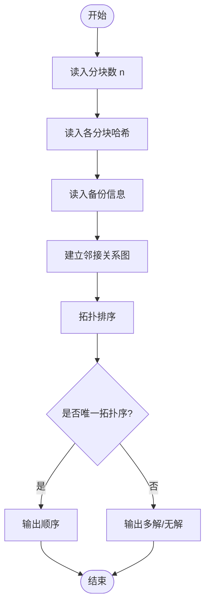
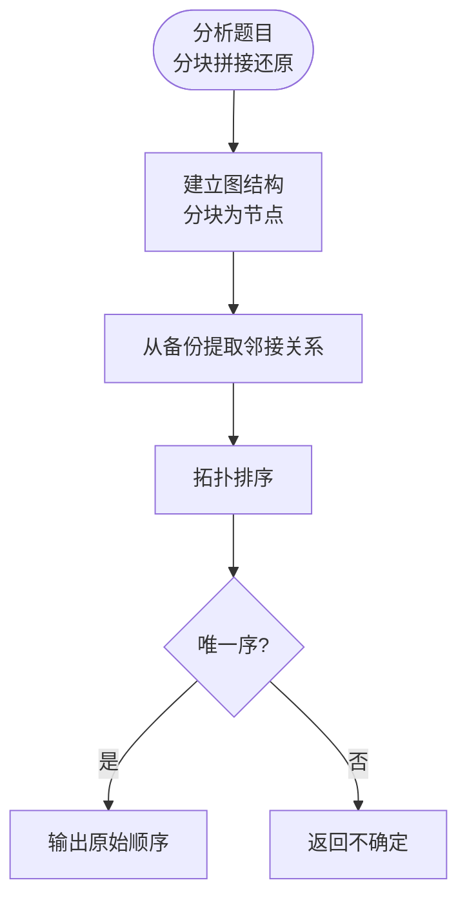

# L3-029 - 还原文件（30 分）

- **时间限制**: 200 ms
- **内存限制**: 65536 KB
- **代码长度限制**: 16 KB

---

## 题目描述

一份重要文件被撕成两半，其中一半还被送进了碎纸机。我们将碎纸机里找到的纸条进行编号，如图 1 所示。然后根据断口的折线形状跟没有切碎的半张纸进行匹配，最后还原成图 2 的样子。要求你输出还原后纸条的正确拼接顺序。


图1 纸条编号


图2 还原结果

### 输入格式:

输入首先在第一行中给出一个正整数 $$N$$（$$1 < N \le 10^5$$），为没有切碎的半张纸上断口折线角点的个数；随后一行给出从左到右 $$N$$ 个折线角点的高度值（均为不超过 100 的非负整数）。

随后一行给出一个正整数 $$M$$（$$\le 100$$），为碎纸机里的纸条数量。接下去有 $$M$$ 行，其中第 $$i$$ 行给出编号为 $$i$$（$$1\le i \le M$$）的纸条的断口信息，格式为：

```
K h[1] h[2] ... h[K]
```

其中 `K` 是断口折线角点的个数（不超过 $$10^4 +1$$），后面是从左到右 `K` 个折线角点的高度值。为简单起见，这个“高度”跟没有切碎的半张纸上断口折线角点的高度是一致的。

### 输出格式:

在一行中输出还原后纸条的正确拼接顺序。纸条编号间以一个空格分隔，行首尾不得有多余空格。

题目数据保证存在唯一解。

### 输入样例:
```in
17
95 70 80 97 97 68 58 58 80 72 88 81 81 68 68 60 80
6
4 68 58 58 80
3 81 68 68
3 95 70 80
3 68 60 80
5 80 72 88 81 81
4 80 97 97 68
```

### 输出样例:
```out
3 6 1 5 2 4
```

## 示例

### 示例 1

**输入:**
```
17
95 70 80 97 97 68 58 58 80 72 88 81 81 68 68 60 80
6
4 68 58 58 80
3 81 68 68
3 95 70 80
3 68 60 80
5 80 72 88 81 81
4 80 97 97 68
```

**输出:**
```
3 6 1 5 2 4
```

---

## 题目详解

### 一、解题思路

给定一个文件的多种分块备份，需要确定这些分块的原始拼接顺序。每个备份将文件分成若干块并按一定顺序存储。

核心思路：从分块间的邻接关系反推原始顺序。
1. 将每个分块视为节点
2. 根据备份中相邻分块的顺序建立有向边
3. 通过拓扑排序确定唯一的拼接顺序

### 二、代码流程说明

1. 读入分块总数 n
2. 读入各分块的哈希值
3. 读入备份数 m 及每个备份的分块顺序
4. 建立分块间的邻接关系图
5. 拓扑排序确定唯一顺序
6. 输出原始文件的分块顺序

### 三、代码流程图



### 四、解题流程图


