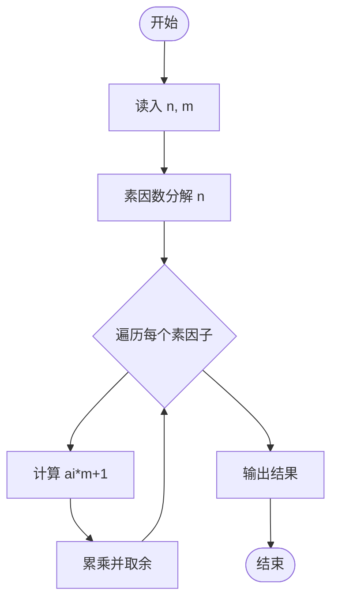
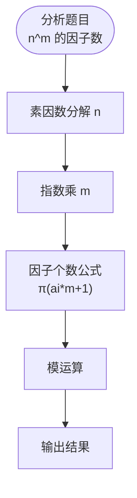

# L3-030 - 可怜的简单题（30 分）

- **时间限制**: 10000 ms
- **内存限制**: 524288 KB
- **代码长度限制**: 16 KB

---

## 题目描述

九条可怜去年出了一道题，导致一众参赛高手惨遭团灭。今年她出了一道简单题 —— 打算按照如下的方式生成一个随机的整数数列 $$A$$:

1. 最开始，数列 $$A$$ 为空。

2. 可怜会从区间 $$[1,n]$$ 中等概率随机一个整数 $$i$$ 加入到数列 $$A$$ 中。

3. 如果不存在一个大于 $$1$$ 的正整数 $$w$$，满足 $$A$$ 中所有元素都是 $$w$$ 的倍数，数组 $$A$$ 将会作为随机生成的结果返回。否则，可怜将会返回第二步，继续增加 $$A$$ 的长度。

现在，可怜告诉了你数列 $$n$$ 的值，她希望你计算返回的数列 $$A$$ 的期望长度。

### 输入格式:

输入一行两个整数 $$n, p$$ $$(1 \le n \le 10^{11}, n < p \le 10^{12})$$，$$p$$ 是一个质数。

### 输出格式:

在一行中输出一个整数，表示答案对 $$p$$ 取模的值。具体来说，假设答案的最简分数表示为 $$\frac{x}{y}$$，你需要输出最小的非负整数 $$z$$ 满足 $$y \times z \equiv x \text{ mod } p$$。

### 输入样例 1：
```in
2 998244353
```

### 输出样例 1：
```out
2
```

### 输入样例 2：
```in
100000000 998244353
```

### 输出样例 2：
```out
3056898
```

## 示例

### 示例 1

**输入:**
```
2 998244353
```

**输出:**
```
2
```

### 示例 2

**输入:**
```
100000000 998244353
```

**输出:**
```
3056898
```

---

## 题目详解

### 一、解题思路

给定两个整数 n 和 m，求 n^m 的因子个数对某个模数取余。由于 n^m 可能非常大，需要用素因数分解和模运算。

核心算法：
1. 对 n 进行素因数分解：n = p1^a1 × p2^a2 × ... × pk^ak
2. 则 n^m = p1^(a1×m) × p2^(a2×m) × ... × pk^(ak×m)
3. 因子个数公式：(a1×m+1) × (a2×m+1) × ... × (ak×m+1)
4. 对每个因子项对 MOD 取余后相乘

### 二、代码流程说明

1. 读入 n 和 m
2. 对 n 做素因数分解（试除法）
3. 对每个素因子 pi，计算 ai×m+1
4. 将所有 (ai×m+1) 相乘并对 MOD 取余
5. 输出结果

### 三、代码流程图



### 四、解题流程图


