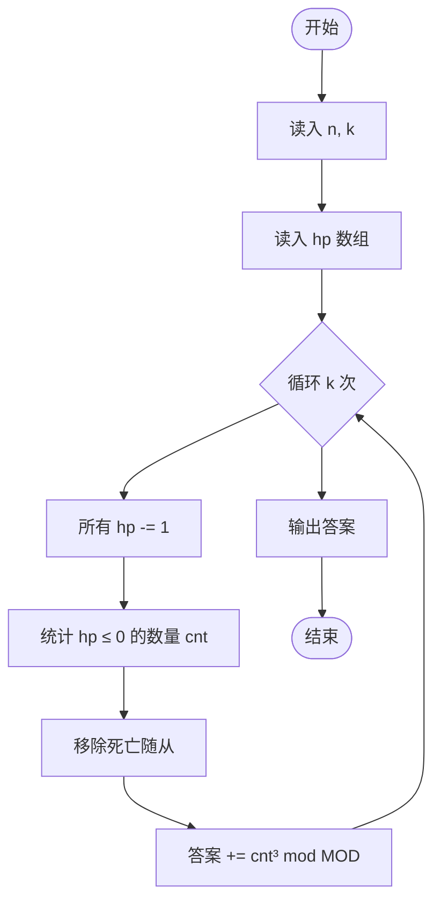
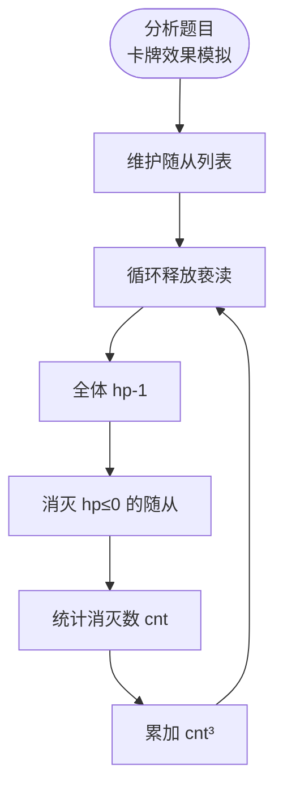

# L3-033 - 教科书般的亵渎（30 分）

- **时间限制**: 2000 ms
- **内存限制**: 262144 KB
- **代码长度限制**: 16 KB

---

## 题目描述

九条可怜最近在玩一款卡牌游戏。在每一局游戏中，可怜都要使用抽到的卡牌来消灭一些敌人。每一名敌人都有一个初始血量，而当血量降低到 $$0$$ 及以下的时候，这名敌人就会立即被消灭并从场上消失。

现在，可怜面前有 $$n$$ 个敌人，其中第 $$i$$ 名敌人的血量是 $$a_i$$，而可怜手上只有如下两张手牌：

1. 如果场上还有敌人，等概率随机选中一个敌人并对它造成一点伤害（即血量减 $$1$$），重复 $$K$$ 次。

2. 对所有敌人造成一点伤害，重复该效果直到没有新的敌人被消灭。

下面是这两张手牌效果的一些示例：

1. 假设存在两名敌人，他们的血量分别是 $$1, 2$$ 且 $$K = 2$$。那么在可怜打出第一张手牌后，可能会发生如下情况：

- 第一轮中，两名敌人各有 $$0.5$$ 的概率被选中。假设第一名敌人被选中，那么它会被造成一点伤害。这时它的血量变成了 $$0$$，因此它被消灭并消失了。
- 第二轮中，因为场上只剩下了第二名敌人，所以它一定会被选中并被造成一点伤害。这时它剩下的血量为 $$1$$。

2. 同样假设存在两名敌人且血量分别为 $$1, 2$$。那么在可怜打出第二张手牌后，会发生如下情况：

- 第一轮中，所有敌人被造成了一点伤害。这时第一名敌人被消灭了，因此卡牌效果会被重复一遍。
- 第二轮中，所有敌人（此时只剩下第二名敌人了）被造成了一点伤害。这时第二名敌人也被消灭了，因此卡牌效果会被再重复一遍。
- 第三轮中，所有敌人（此时没有敌人剩下了）被造成了一点伤害。因为没有新的敌人被消灭了，所以卡牌效果结束。

3. 如果面对的是四名血量分别为 $$1,2,2,4$$ 的敌人，那么在可怜打出第二张手牌后，只有第四名敌人还会存活，且它的剩余血量为 $$1$$。

现在，可怜先打出了第一张手牌，再打出了第二张手牌。她发现，在第一张手牌效果结束后，没有任何一名敌人被消灭，但是在第二张手牌的效果结束后，所有敌人都被消灭了。

可怜想让你计算一下这种情况发生的概率是多少。

### 输入格式:

第一行输入两个整数 $$n, K(1 \le n, K \le 50)$$，分别表示敌人的数量以及第一张卡牌效果的发动次数。

第二行输入 $$n$$ 个由空格隔开的整数 $$a_i (1 \le a_i \le 50)$$，表示每个敌人的初始血量。

### 输出格式:

在一行中输出一个整数，表示发生概率对 $$998244353$$ 取模后的结果。

具体来说，如果概率的最简分数表示为 $$a/b (a \ge 0, b \ge 1, \gcd(a,b) = 1)$$，那么你需要输出 

$$a \times b^{998244351} \mod 998244353$$。

### 输入样例 1：
```in
3 2
2 3 3
```

### 输出样例 1：
```out
665496236
```

### 输入样例 2：
```in
3 3
2 3 3
```

### 输出样例 2：
```out
776412275
```

### 输入样例 3：
```in
5 3
1 4 4 2 5
```

### 输出样例 3：
```out
367353922
```

### 输入样例 4：
```in
12 12
1 2 3 4 5 6 7 8 9 10 11 12
```

### 输出样例 4：
```out
452061016
```

## 示例

### 示例 1

**输入:**
```
3 2
2 3 3
```

**输出:**
```
665496236
```

### 示例 2

**输入:**
```
3 3
2 3 3
```

**输出:**
```
776412275
```

### 示例 3

**输入:**
```
5 3
1 4 4 2 5
```

**输出:**
```
367353922
```

### 示例 4

**输入:**
```
12 12
1 2 3 4 5 6 7 8 9 10 11 12
```

**输出:**
```
452061016
```

---

## 题目详解

### 一、解题思路

本题模拟炉石传说中"教科书般的亵渎"卡牌的效果。对 N 个随从依次释放亵渎：每次使所有随从生命值减 1，消灭生命值归零的随从，新召唤的随从会再次触发亵渎。

核心算法：
1. 用数组/列表维护随从生命值
2. 循环释放亵渎：所有随从 hp -= 1
3. 生命值为 0 的随从被消灭，从列表中移除
4. 统计各回合消灭的随从数量
5. 计算所有消灭数的立方和对 10^9+7 取模

### 二、代码流程说明

1. 读入随从数 n 和亵渎次数 k
2. 读入各随从的生命值 hp[]
3. 循环 k 次亵渎：
   - 所有随从 hp -= 1
   - 检查 hp ≤ 0 的随从，统计数量 cnt
   - 从列表中移除已死亡随从
   - 累加 cnt³ 到答案
4. 输出答案 mod 10^9+7

### 三、代码流程图



### 四、解题流程图


