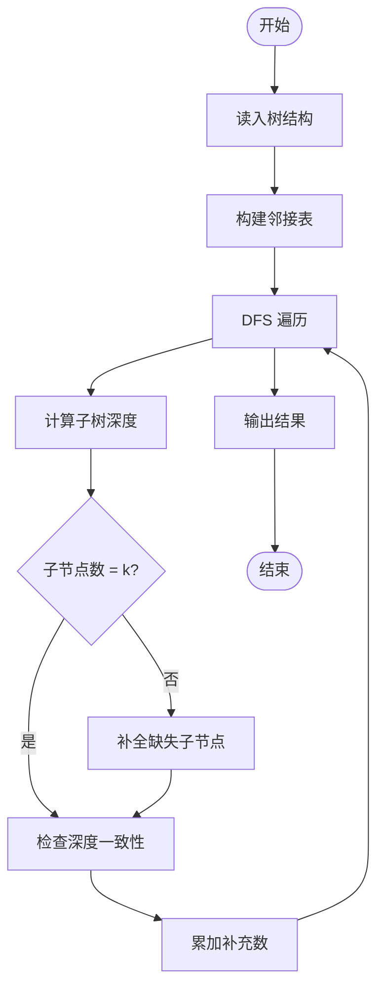
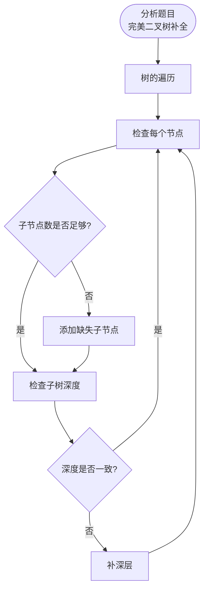

# L3-035 - 完美树（30 分）

- **时间限制**: 400 ms
- **内存限制**: 262144 KB
- **代码长度限制**: 16 KB

---

## 题目描述

给定一棵有 $N$ 个结点的树（树中结点从 $1$ 到 $N$ 编号，根结点编号为 $1$）。每个结点有一种颜色，或为黑，或为白。

称以结点 $u$ 为根的子树是 **好的**，若子树中黑色结点与白色结点的数量之差的绝对值不超过 $1$。称整棵树是 **完美树**，若对于所有 $1 \le i \le N$，以结点 $i$ 为根的子树都是好的。

你需要将整棵树变成完美树，为此你可以进行以下操作任意次（包括零次）：选择任意一个结点 $i$  ($1 \le i \le N$)，改变结点 $i$ 的颜色（若结点 $i$ 目前是黑色则将其改为白色，若结点 $i$ 目前是白色则将其改为黑色）。这次操作的代价为 $P_i$。

求将给定的树变为完美树的最小代价。

注：以结点 $i$ 为根的子树，由结点 $i$ 以及结点 $i$ 的所有后代结点组成。

### 输入格式:

输入第一行为一个数 $N$ ($1 \le N \le 10^5$)，表示树的结点个数。

接下来的 $N$ 行，第 $i$ 行的前三个数为 $C_i, P_i, K_i$ ($1 \le P_i \le 10^4, 0 \le K_i \le N$)，分别表示树上编号为 $i$ 的结点的初始颜色（$0$ 为白色，$1$ 为黑色）、变换颜色的代价及孩子结点的数量。紧跟着有 $K_i$ 个数，为孩子结点的编号。数字均用一个空格隔开，所有的编号保证在 $1$ 到 $N$ 里，且不会有环。

数据中只包含一棵树。

### 输出格式:

输出一行一个数，表示将树 $T$ 变为完美树的最小代价。

### 输入样例:
```in
10
1 100 3 2 3 4
0 20 1 7
0 5 2 5 6
0 8 1 10
0 7 0
0 2 0
1 1 2 8 9
0 15 0
0 13 0
1 8 0
```

### 输出样例:
```out
15
```

## 示例

### 示例 1

**输入:**
```
10
1 100 3 2 3 4
0 20 1 7
0 5 2 5 6
0 8 1 10
0 7 0
0 2 0
1 1 2 8 9
0 15 0
0 13 0
1 8 0
```

**输出:**
```
15
```

---

## 题目详解

### 一、解题思路

给定一棵 N 叉树，需要添加最少的节点使其成为"完美二叉树"（所有叶子在同一深度，每个非叶节点恰好有 2 个子节点）。

核心思路：
1. 用数组/邻接表表示树结构
2. 深度优先遍历计算各节点子树的深度
3. 对不满足完美树条件的子树，需要补全缺失的子节点
4. 累加需要添加的节点数

### 二、代码流程说明

1. 读入节点数 N 和最大叉数 k
2. 读入每个节点的类型（叶/非叶）和子节点信息
3. 构建树的邻接表
4. 从根节点 DFS：
   - 计算每个节点子树的最大深度
   - 检查是否有 k 个子节点
   - 不足则补全，累加补充数量
5. 输出最少需要添加的节点数

### 三、代码流程图



### 四、解题流程图


