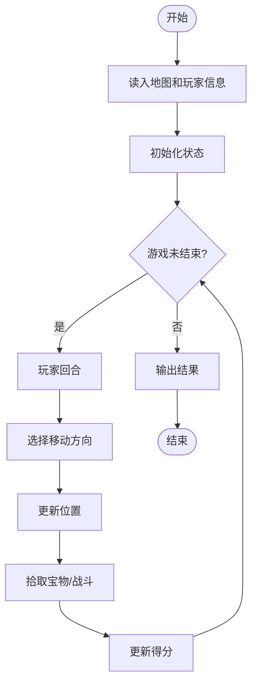
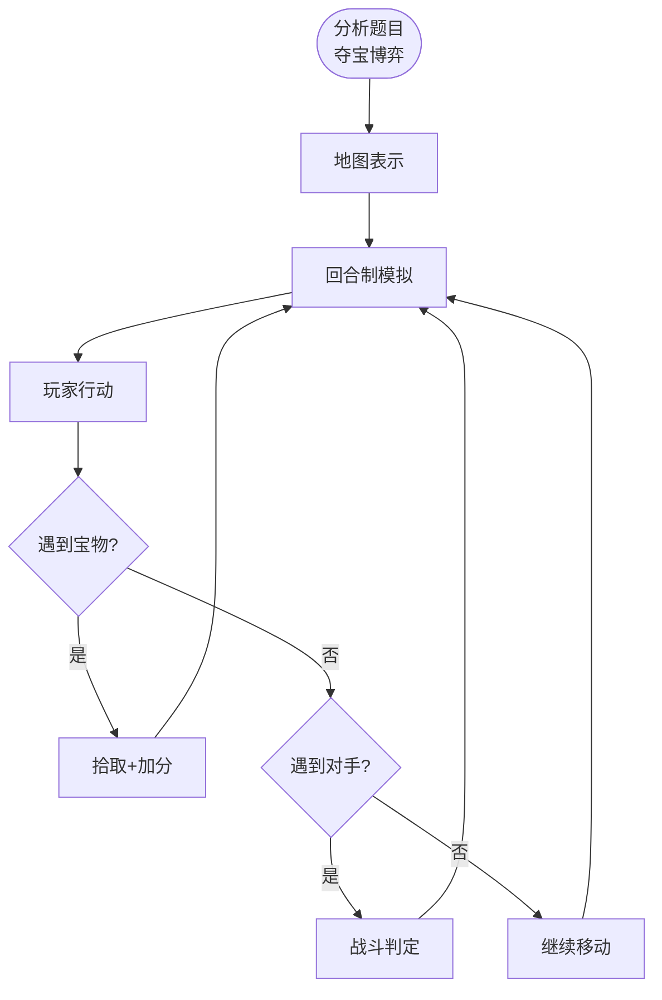

# L3-037 - 夺宝大赛（30 分）

- **时间限制**: 400 ms
- **内存限制**: 65536 KB
- **代码长度限制**: 16 KB

---

## 题目描述

夺宝大赛的地图是一个由 $n\times m$ 个方格子组成的长方形，主办方在地图上标明了所有障碍、以及大本营宝藏的位置。参赛的队伍一开始被随机投放在地图的各个方格里，同时开始向大本营进发。所有参赛队从一个方格移动到另一个无障碍的相邻方格（“相邻”是指两个方格有一条公共边）所花的时间都是 1 个单位时间。但当有多支队伍同时进入大本营时，必将发生火拼，造成参与火拼的所有队伍无法继续比赛。大赛规定：最先到达大本营并能活着夺宝的队伍获得胜利。
假设所有队伍都将以最快速度冲向大本营，请你判断哪个队伍将获得最后的胜利。

### 输入格式:

输入首先在第一行给出两个正整数 $m$ 和 $n$（$2< m,n\le 100$），随后 $m$ 行，每行给出 $n$ 个数字，表示地图上对应方格的状态：$1$ 表示方格可通过；$0$ 表示该方格有障碍物，不可通行；$2$ 表示该方格是大本营。题目保证只有 1 个大本营。
接下来是参赛队伍信息。首先在一行中给出正整数 $k$（$0<k<m\times n/2$），随后 $k$ 行，第 $i$（$1\le i \le k$）行给出编号为 $i$ 的参赛队的初始落脚点的坐标，格式为 `x y`。这里规定地图左上角坐标为 `1 1`，右下角坐标为 `n m`，其中 `n` 为列数，`m` 为行数。注意参赛队只能在地图范围内移动，不得走出地图。题目保证没有参赛队一开始就落在有障碍的方格里。

### 输出格式:

在一行中输出获胜的队伍编号和其到达大本营所用的单位时间数量，数字间以 1 个空格分隔，行首尾不得有多余空格。若没有队伍能获胜，则在一行中输出 `No winner.`

### 输入样例 1：
```in
5 7
1 1 1 1 1 0 1
1 1 1 1 1 0 0
1 1 0 2 1 1 1
1 1 0 0 1 1 1
1 1 1 1 1 1 1
7
1 5
7 1
1 1
5 5
3 1
3 5
1 4
```

### 输出样例 1：
```out
7 6
```

### 输入样例 2：
```in
5 7
1 1 1 1 1 0 1
1 1 1 1 1 0 0
1 1 0 2 1 1 1
1 1 0 0 1 1 1
1 1 1 1 1 1 1
7
7 5
1 3
7 1
1 1
5 5
3 1
3 5
```

### 输出样例 2：
```out
No winner.
```

## 示例

### 示例 1

**输入:**
```
5 7
1 1 1 1 1 0 1
1 1 1 1 1 0 0
1 1 0 2 1 1 1
1 1 0 0 1 1 1
1 1 1 1 1 1 1
7
1 5
7 1
1 1
5 5
3 1
3 5
1 4
```

**输出:**
```
7 6
```

### 示例 2

**输入:**
```
5 7
1 1 1 1 1 0 1
1 1 1 1 1 0 0
1 1 0 2 1 1 1
1 1 0 0 1 1 1
1 1 1 1 1 1 1
7
7 5
1 3
7 1
1 1
5 5
3 1
3 5
```

**输出:**
```
No winner.
```

---

## 题目详解

### 一、解题思路

夺宝大赛是一个多步骤的博弈模拟问题。玩家在网格地图上移动、拾取宝物、与对手竞争。

核心算法：
1. 网格地图表示：用二维数组记录地形和宝物
2. 模拟每个玩家的行动：移动/拾取/战斗
3. 回合制：每个玩家依次行动
4. 胜负判定：比较最终得分

### 二、代码流程说明

1. 读入地图尺寸 n×m
2. 读入每个格子的地形类型
3. 读入宝物数量和位置
4. 读入玩家起始位置
5. 模拟游戏回合：
   - 玩家选择方向移动
   - 检查是否拾取宝物
   - 检查是否遇到对手
6. 输出最终结果

### 三、代码流程图



### 四、解题流程图


