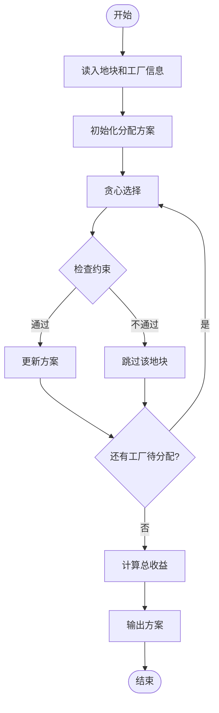
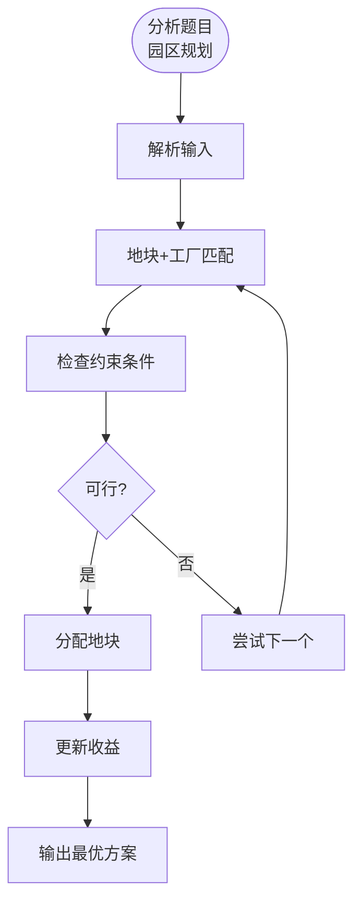

# L3-038 - 工业园区建设（30 分）

- **时间限制**: 800 ms
- **内存限制**: 65536 KB
- **代码长度限制**: 16 KB

---

## 题目描述

某工业园区要进行建设，共有 $N$ 块工业用地排成一条直线，其中上面已经有若干块用地建设起了工厂，其他地方为空地。

现在工业园区计划在空地上建设至多 $M$ 个新工厂以及一个仓库，希望在完成计划后，仓库离最近的 $k$ 个工厂的距离之和尽可能小。

两块用地的距离等于他们的编号的差；即 1 号用地与 2 号用地的距离为 1。一个空地上只能建设一个工厂，仓库可以跟工厂建在一起。

### 输入格式:

数据的第一行是一个正整数 $T$，表示数据的组数。

每组数据的输入第一行为三个整数 $N, M, k$ ($1 \le N \le 2\times10^5, 0 \le M \le N, 1 \le k \le N$)，表示有 $N$ 块用地，最多可以新建 $M$ 个新工厂，仓库离最近的 $k$ 个工厂距离之和需要尽可能小。

接下来的一行是一个只由 $0,1$ 组成的长度为 $N$ 的字符串 $S$，第 $i$ 个字符 $S_i$ 为 $0$ 表示第 $i$ 块地块为空地，$1$ 表示第 $i$ 块地块上已建工厂。地块编号从 1 开始。 

数据约定：

设 $F_S$ 为 $S$ 对应的已建工厂的地块数量，则有 $k \le M + F_S \le N$。给定的数据有 $\sum{N}\le5\times10^5$。

### 输出格式:

输出 $N$ 个整数，表示仓库建在第 $i$ 块用地时，离最近的 $k$ 个工厂的最小的距离之和是多少。

### 输入样例:
```in
3
5 1 3
10110
10 3 5
1001001010
2 1 2
10
```

### 输出样例:
```out
3 2 2 2 3
10 7 6 7 6 6 6 6 7 10
1 1
```

## 示例

### 示例 1

**输入:**
```
3
5 1 3
10110
10 3 5
1001001010
2 1 2
10
```

**输出:**
```
3 2 2 2 3
10 7 6 7 6 6 6 6 7 10
1 1
```

---

## 题目详解

### 一、解题思路

工业园区建设涉及在给定地块上规划工厂位置以最大化收益。需要考虑地形限制、工厂间距离等约束。

核心算法：
1. 地图表示：用二进制字符串表示地块可用性
2. 动态规划/贪心：选择工厂建设位置
3. 约束检查：距离、地形匹配
4. 收益计算：根据建设方案计算总收益

### 二、代码流程说明

1. 读入地块数量 N 和工厂类型
2. 读入各地块的地形信息（二进制）
3. 读入各工厂的参数（收益、占地面积等）
4. 贪心选择地块分配给工厂
5. 检查约束条件（距离、匹配）
6. 输出建设方案和总收益

### 三、代码流程图



### 四、解题流程图


